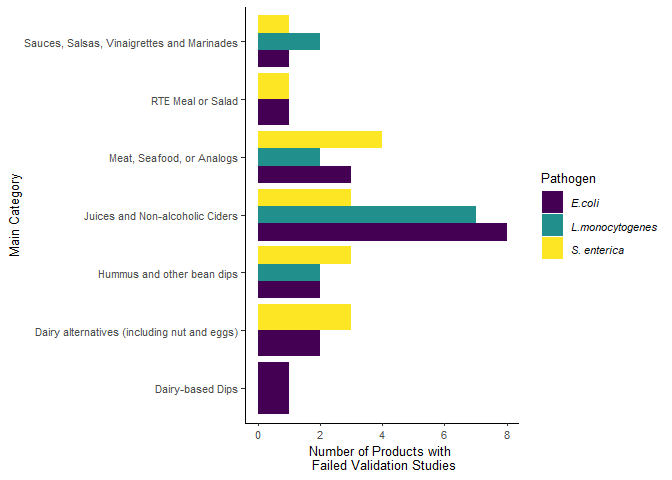
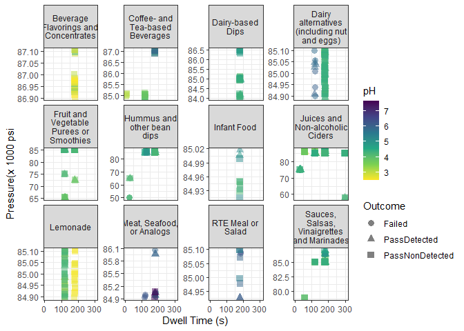

HPP Modeling Project Report
================
Luke Qian & Beau Galasong
2023-07-13

# 1. Load packages for data preprocessing

``` r
library(tidyverse)
```

    ## ── Attaching packages ─────────────────────────────────────── tidyverse 1.3.1 ──

    ## ✔ ggplot2 3.4.2     ✔ purrr   1.0.1
    ## ✔ tibble  3.2.1     ✔ dplyr   1.1.2
    ## ✔ tidyr   1.3.0     ✔ stringr 1.5.0
    ## ✔ readr   2.1.2     ✔ forcats 1.0.0

    ## Warning: package 'ggplot2' was built under R version 4.2.3

    ## Warning: package 'tibble' was built under R version 4.2.3

    ## Warning: package 'dplyr' was built under R version 4.2.3

    ## Warning: package 'forcats' was built under R version 4.2.3

    ## ── Conflicts ────────────────────────────────────────── tidyverse_conflicts() ──
    ## ✖ dplyr::filter() masks stats::filter()
    ## ✖ dplyr::lag()    masks stats::lag()

``` r
library(readr)
```

# 2. Load data

``` r
hpp_df <- read_csv("validation.csv", na = "empty", col_types = cols(
  pH = col_double(), 
  WaterActivity = col_double(), 
  Brix = col_double(), 
  Date = col_date(format = "%m/%d/%Y")))
```

    ## Warning: One or more parsing issues, see `problems()` for details

Check product category distribution

``` r
# check the data structure
skimr::skim(hpp_df)
```

|                                                  |        |
|:-------------------------------------------------|:-------|
| Name                                             | hpp_df |
| Number of rows                                   | 1999   |
| Number of columns                                | 20     |
| \_\_\_\_\_\_\_\_\_\_\_\_\_\_\_\_\_\_\_\_\_\_\_   |        |
| Column type frequency:                           |        |
| character                                        | 4      |
| Date                                             | 1      |
| numeric                                          | 15     |
| \_\_\_\_\_\_\_\_\_\_\_\_\_\_\_\_\_\_\_\_\_\_\_\_ |        |
| Group variables                                  | None   |

Data summary

**Variable type: character**

| skim_variable | n_missing | complete_rate | min | max | empty | n_unique | whitespace |
|:--------------|----------:|--------------:|----:|----:|------:|---------:|-----------:|
| Category      |         0 |             1 |   5 |  33 |     0 |       46 |          0 |
| Product       |         0 |             1 |   2 |  50 |     0 |      287 |          0 |
| Ingredients   |         0 |             1 |   0 |  79 |    10 |       98 |          0 |
| Time          |         0 |             1 |   5 |   9 |     0 |      145 |          0 |

**Variable type: Date**

| skim_variable | n_missing | complete_rate | min        | max        | median     | n_unique |
|:--------------|----------:|--------------:|:-----------|:-----------|:-----------|---------:|
| Date          |        13 |          0.99 | 1931-01-30 | 2022-03-02 | 2019-10-22 |      567 |

**Variable type: numeric**

| skim_variable          | n_missing | complete_rate |     mean |      sd |       p0 |      p25 |      p50 |      p75 |     p100 | hist  |
|:-----------------------|----------:|--------------:|---------:|--------:|---------:|---------:|---------:|---------:|---------:|:------|
| Pressure(psi)          |         0 |          1.00 | 84574.85 | 3363.74 | 50000.00 | 85000.00 | 85000.00 | 85000.00 | 87000.00 | ▁▁▁▁▇ |
| DwellTime(s)           |         0 |          1.00 |   157.45 |   46.68 |    10.00 |   120.00 |   180.00 |   180.00 |   300.00 | ▁▅▇▁▁ |
| ProcessingTemp(degC)   |         0 |          1.00 |     6.88 |    3.23 |     5.00 |     5.00 |     5.00 |     9.00 |    30.00 | ▇▁▁▁▁ |
| pH                     |        21 |          0.99 |     4.17 |    0.54 |     2.50 |     3.98 |     4.26 |     4.42 |     7.66 | ▁▇▁▁▁ |
| WaterActivity          |       205 |          0.90 |     0.99 |    0.02 |     0.83 |     0.99 |     0.99 |     1.00 |     1.01 | ▁▁▁▁▇ |
| Brix                   |       170 |          0.91 |    10.98 |   10.34 |     0.10 |     5.60 |     8.40 |    12.20 |    70.30 | ▇▁▁▁▁ |
| LogReductionEcoli      |         0 |          1.00 |     7.08 |    0.82 |     1.55 |     6.83 |     7.23 |     7.55 |     8.04 | ▁▁▁▁▇ |
| LogReductionSalmonella |         0 |          1.00 |     7.61 |    4.80 |     0.00 |     7.33 |     7.56 |     7.79 |    87.00 | ▇▁▁▁▁ |
| LogReductionLmono      |         0 |          1.00 |     6.60 |    1.09 |     0.00 |     6.11 |     6.83 |     7.37 |     8.03 | ▁▁▁▃▇ |
| Ecoli                  |         0 |          1.00 |     1.14 |    2.59 |     0.00 |     0.00 |     0.00 |     0.00 |     8.04 | ▇▁▁▁▂ |
| Salmonella             |         0 |          1.00 |     1.23 |    3.31 |     0.00 |     0.00 |     0.00 |     0.00 |    87.00 | ▇▁▁▁▁ |
| Lmonocytogenes         |         3 |          1.00 |     1.44 |    2.48 |     0.00 |     0.00 |     0.00 |     1.40 |     9.00 | ▇▁▁▁▁ |
| PassEcoli              |         0 |          1.00 |     0.97 |    0.17 |     0.00 |     1.00 |     1.00 |     1.00 |     1.00 | ▁▁▁▁▇ |
| PassSalmonella         |         0 |          1.00 |     0.98 |    0.14 |     0.00 |     1.00 |     1.00 |     1.00 |     1.00 | ▁▁▁▁▇ |
| PassLmono              |         0 |          1.00 |     0.96 |    0.20 |     0.00 |     1.00 |     1.00 |     1.00 |     1.00 | ▁▁▁▁▇ |

``` r
# summarize the number of data points for each product
product_freq <- hpp_df %>% 
   group_by(Product, Category) %>% 
   summarise(n_data_points = n()) 
```

    ## `summarise()` has grouped output by 'Product'. You can override using the
    ## `.groups` argument.

``` r
# summarize category frequency
category_freq <- data.frame(table(product_freq$Category)) %>%
  mutate(Frequency = Freq/sum(Freq)) %>%
  rename(Category = Var1, Count = Freq)

category_freq
```

    ##                             Category Count   Frequency
    ## 1                        almond milk     2 0.006968641
    ## 2        apple cider (non-alcoholic)     3 0.010452962
    ## 3                        apple juice     1 0.003484321
    ## 4                     barbeque sauce     1 0.003484321
    ## 5                      bean (cooked)     2 0.006968641
    ## 6               beverage concentrate     6 0.020905923
    ## 7                       celery juice     1 0.003484321
    ## 8                       cherry juice     1 0.003484321
    ## 9                       citrus juice     1 0.003484321
    ## 10                     coconut water     1 0.003484321
    ## 11                   coffee beverage     1 0.003484321
    ## 12                 crabmeat (cooked)     1 0.003484321
    ## 13                       dip (dairy)    11 0.038327526
    ## 14                    dip (nondairy)     9 0.031358885
    ## 15    fruit or fruit-vegetable puree     1 0.003484321
    ## 16                       fruit puree     2 0.006968641
    ## 17                       fruit salad     1 0.003484321
    ## 18                   fruit smoothies     9 0.031358885
    ## 19                          gazpacho     1 0.003484321
    ## 20                       grape juice     1 0.003484321
    ## 21                  grapefruit juice     1 0.003484321
    ## 22               harissa chili paste     2 0.006968641
    ## 23  herbs, vegetables and oil sauces     5 0.017421603
    ## 24                            hummus    16 0.055749129
    ## 25                    indian chutney     1 0.003484321
    ## 26              infant food (pureed)     1 0.003484321
    ## 27   lactose-free non-dairy beverage    19 0.066202091
    ## 28                          lemonade    15 0.052264808
    ## 29                mango food product     2 0.006968641
    ## 30                    marinara sauce     1 0.003484321
    ## 31           meal (ready-to-consume)     1 0.003484321
    ## 32                      meat (cured)     2 0.006968641
    ## 33  mixed fruit and vegetable juices   122 0.425087108
    ## 34                      orange juice     5 0.017421603
    ## 35                          pancetta     1 0.003484321
    ## 36                       pesto sauce     6 0.020905923
    ## 37   plant based meat product analog     1 0.003484321
    ## 38              prepared pasta salad     1 0.003484321
    ## 39                             salsa     6 0.020905923
    ## 40                             sauce     7 0.024390244
    ## 41    seasoning (citrus juice based)     1 0.003484321
    ## 42        tea based beverage product     6 0.020905923
    ## 43                        tuna salad     1 0.003484321
    ## 44    vegetable and meat infant food     2 0.006968641
    ## 45 vinaigrette dressing food product     1 0.003484321
    ## 46                  watermelon juice     5 0.017421603

Takeaway: Categories should be combined before modeling.

# 3. Data preprocessing

``` r
# Prepare dataset for logistic regression
# Make sure that package MASS is not loaded while doing this.
# If MASS is loaded, the function select() would not work.
hpp_df_logis <- hpp_df %>% 
  select(!(Date)) %>%
  filter(Time %in% c("BeforeHPP", "AfterHPP")) %>%
  pivot_wider(names_from = Time, 
              values_from = c(Ecoli, Salmonella, Lmonocytogenes)) %>%
  mutate(LR_Ecoli = Ecoli_BeforeHPP-Ecoli_AfterHPP,
         LR_Salmonella = Salmonella_BeforeHPP-Salmonella_AfterHPP,
         LR_Lmonocytogenes = Lmonocytogenes_BeforeHPP - Lmonocytogenes_AfterHPP) %>%
  
  # Further categorize post-HPP plate counts to 
      #1) nondetects (recorded as 0) - "passed"
      #2) detected with 5 log reduction achieved 
      #3) detected with 5 log reduction NOT achieved - "failed"
  mutate(
    PassLmono = case_when(
    Lmonocytogenes_AfterHPP == 0 ~ "PassNonDetected",
    eval(LR_Lmonocytogenes < 5) ~ "Failed",
    .default = "PassDetected")) %>%
  mutate(
    PassEcoli = case_when(
    Ecoli_AfterHPP == 0 ~ "PassNonDetected",
    LR_Ecoli < 5 ~ "Failed",
    .default = "PassDetected")) %>%
  mutate(
    PassSalmonella = case_when(
    Salmonella_AfterHPP == 0 ~ "PassNonDetected",
    LR_Salmonella < 5 ~ "Failed",
    .default = "PassDetected")) %>%

  # Convert Dwell Time & Processing Temp to categorical variables
  # because the validation center is usually specific about these   # two parameters. Pressure remains a numercial variable because
  # the center ran more diverse temperature than time & temp.
  mutate(DwellTimeRange = case_when(
    `DwellTime(s)`< 90 ~ "Under 90 s",
    `DwellTime(s)`>=90 & `DwellTime(s)`<180 ~ "Between 90-179 s",
    `DwellTime(s)`== 180 ~ " 180 s",
    `DwellTime(s)`> 180 ~ " Over 180 s"),
  #, ProcessingTemperature = case_when(
  #   `ProcessingTemp(degC)` == 5 ~ "5 degrees C",
  #   `ProcessingTemp(degC)`> 5 & `ProcessingTemp(degC)`<= 10 ~ "Between 5-10 degrees C",
  #   `ProcessingTemp(degC)`>10 ~ "Above 10 degrees C"),
  # Pressure = case_when(
  #   `Pressure(psi)`<= 80000 ~ "Between 50,000 to 80,000 psi",
  #   `Pressure(psi)` > 80000 ~ "Between 80,0001 to 87,000 psi"),
   .keep = "unused") %>%
    mutate(MainCategory = case_when(
    Category == "almond milk" | Category == "lactose-free non-dairy beverage" ~ "Dairy alternatives (including nut and eggs)",
    # Combine sub-categories 
    Category == "apple cider (non-alcoholic)" | Category == "apple juice" | Category == "celery juice" |
    Category == "cherry juice" |
    Category == "citrus juice" |
    Category == "coconut water" |
    Category == "grape juice" |
    Category == "grapefruit juice" |
    Category == "mixed fruit and vegetable juices" |
    Category == "orange juice" |
    Category == "watermelon juice" ~ "Juices and Non-alcoholic Ciders",
    Category == "gazpacho" |
    Category == "fruit or fruit-vegetable puree" |
    Category == "fruit puree" |
    Category == "fruit smoothies" |
    Category == "mango food product" |
    Category == "fruit salad" ~ "Fruit and Vegetable Purees or Smoothies",
    Category == "barbeque sauce" |
     Category == "harissa chili paste"|
     Category == "herbs, vegetables and oil sauces" |
     Category == "salsa" |
     Category == "indian chutney" |
     Category == "marinara sauce" |
     Category == "pesto sauce" |
     Category == "sauce" |
     Category == "seasoning (citrus juice based)" |
     Category == "vinaigrette dressing food product" ~ "Sauces, Salsas, Vinaigrettes and Marinades",
Category == "bean (cooked)" |
Category == "dip (nondairy)" |
Category == "hummus"  ~ "Hummus and other bean dips",
Category == "coffee beverage"|
Category == "tea based beverage product" ~ "Coffee- and Tea-based Beverages",
Category =="crabmeat (cooked)" | 
  Category == "meat (cured)"|
  Category == "pancetta"|
  Category == "plant based meat product analog" ~ "Meat, Seafood, or Analogs",
Category == "tuna salad"| 
  Category == "prepared pasta salad"|
  Category == "meal (ready-to-consume)" ~ "RTE Meal or Salad",
Category == "vegetable and meat infant food" | 
Category == "infant food (pureed)"~ "Infant Food",
Category == "dip (dairy)" ~ "Dairy-based Dips",
Category == "lemonade" ~ "Lemonade",
Category == "beverage concentrate" ~ "Beverage Flavorings and Concentrates",
.default = as.character(Category)), 
.keep = "all") %>%
  # impute missing values for pH, Brix, and aw with category average
  group_by(MainCategory) %>%   
  mutate(pH = ifelse(is.na(pH),  
                     mean(pH, na.rm = T), 
                     pH),
         Brix = ifelse(is.na(Brix),  
                       mean(Brix, na.rm = T), 
                       Brix),
         WaterActivity = ifelse(is.na(WaterActivity),
                                mean(WaterActivity, na.rm = T),
                                WaterActivity)) %>% 
  ungroup()
```

# 4. Multinomial logistic regression

``` r
# Load the modeling packages
library(nnet)
library(caret)
```

    ## Warning: package 'caret' was built under R version 4.2.3

    ## Loading required package: lattice

    ## 
    ## Attaching package: 'caret'

    ## The following object is masked from 'package:purrr':
    ## 
    ##     lift

``` r
# Load packages for creating model summary and descriptive statistics summary
library(gtsummary)
```

    ## Warning: package 'gtsummary' was built under R version 4.2.3

``` r
library(kableExtra)
```

    ## Warning: package 'kableExtra' was built under R version 4.2.3

    ## Warning in !is.null(rmarkdown::metadata$output) && rmarkdown::metadata$output
    ## %in% : 'length(x) = 3 > 1' in coercion to 'logical(1)'

    ## 
    ## Attaching package: 'kableExtra'

    ## The following object is masked from 'package:dplyr':
    ## 
    ##     group_rows

# 4.1 Multinomial logistic regression: Ecoli

``` r
# Check the structure of data
str(hpp_df_logis)
```

    ## tibble [290 × 25] (S3: tbl_df/tbl/data.frame)
    ##  $ Category                : chr [1:290] "mixed fruit and vegetable juices" "fruit puree" "fruit puree" "fruit or fruit-vegetable puree" ...
    ##  $ Product                 : chr [1:290] "Activated Beauty" "Agrana Apple Fruit Preparation" "Strawberry Fruit Preparation-3" "Applelini" ...
    ##  $ Ingredients             : chr [1:290] "na" "apple" "strawberry" "apple;zucchini;cinnamon" ...
    ##  $ Pressure(psi)           : num [1:290] 85000 85000 85000 85000 85000 85000 85000 85000 85000 85000 ...
    ##  $ ProcessingTemp(degC)    : num [1:290] 5 5 5 5 5 5 5 5 5 5 ...
    ##  $ pH                      : num [1:290] 3.72 3.7 3.68 3.89 4.16 3.75 3.53 4.5 4.85 4.5 ...
    ##  $ WaterActivity           : num [1:290] 0.985 0.982 0.982 0.998 0.992 ...
    ##  $ Brix                    : num [1:290] 8.8 19.3 19.2 11.4 5.4 ...
    ##  $ LogReductionEcoli       : num [1:290] 7.21 6.68 6.65 7.88 7.89 ...
    ##  $ LogReductionSalmonella  : num [1:290] 7.26 6.65 6.88 8.2 7.74 ...
    ##  $ LogReductionLmono       : num [1:290] 7.14 6.33 6.47 7.79 7.42 ...
    ##  $ PassEcoli               : chr [1:290] "PassNonDetected" "PassDetected" "PassDetected" "PassNonDetected" ...
    ##  $ PassSalmonella          : chr [1:290] "PassNonDetected" "PassDetected" "PassDetected" "PassNonDetected" ...
    ##  $ PassLmono               : chr [1:290] "PassNonDetected" "PassDetected" "PassDetected" "PassNonDetected" ...
    ##  $ Ecoli_BeforeHPP         : num [1:290] 7.21 7.68 7.65 7.88 7.89 ...
    ##  $ Ecoli_AfterHPP          : num [1:290] 0 1 1 0 0 0 0 0 0 1.3 ...
    ##  $ Salmonella_BeforeHPP    : num [1:290] 7.26 7.65 7.88 8.2 7.74 ...
    ##  $ Salmonella_AfterHPP     : num [1:290] 0 1 1 0 0 0 0 0 0 2.41 ...
    ##  $ Lmonocytogenes_BeforeHPP: num [1:290] 7.14 7.33 7.47 7.79 7.42 ...
    ##  $ Lmonocytogenes_AfterHPP : num [1:290] 0 1 1 0 0 ...
    ##  $ LR_Ecoli                : num [1:290] 7.21 6.68 6.65 7.88 7.89 ...
    ##  $ LR_Salmonella           : num [1:290] 7.26 6.65 6.88 8.2 7.74 ...
    ##  $ LR_Lmonocytogenes       : num [1:290] 7.14 6.33 6.47 7.79 7.42 ...
    ##  $ DwellTimeRange          : chr [1:290] "Between 90-179 s" "Between 90-179 s" "Between 90-179 s" " 180 s" ...
    ##  $ MainCategory            : chr [1:290] "Juices and Non-alcoholic Ciders" "Fruit and Vegetable Purees or Smoothies" "Fruit and Vegetable Purees or Smoothies" "Fruit and Vegetable Purees or Smoothies" ...

``` r
# Convert categorical variables to factors

# hpp_df_logis$MainCategory <- as.factor(hpp_df_logis$MainCategory)
# hpp_df_logis$DwellTimeRange <- as.factor(hpp_df_logis$DwellTimeRange)
# hpp_df_logis$ProcessingTemperature <- as.factor(hpp_df_logis$ProcessingTemperature)
# hpp_df_logis$Pressure <- as.factor(hpp_df_logis$Pressure)

# Keep only the predictors and E.coli outcome

hpp_df_logis$PassEcoli <- factor(hpp_df_logis$PassEcoli)

# hpp_df_logis_Ecoli <-
#   hpp_df_logis %>% select(c(MainCategory, Pressure,DwellTimeRange,ProcessingTemperature, pH, WaterActivity, Brix, PassEcoli)) %>%

hpp_df_logis_Ecoli <-
  hpp_df_logis %>% select(c(MainCategory, `Pressure(psi)`,DwellTimeRange,`ProcessingTemp(degC)`, pH, WaterActivity, Brix, PassEcoli)) %>%

  # Scaling pressure, water activity and pH so that the 
  # coefficients are more easily interpreted.
  mutate(Pressure_kpsi = `Pressure(psi)`/1000,
         WaterActivity_scaled = WaterActivity*10, 
         pH_scaled = pH*10, 
         .keep = "unused")

#Split data into train and test set at 70:30 ratio

set.seed(111)
index <- createDataPartition(hpp_df_logis_Ecoli$PassEcoli, p = .7, list = FALSE)

# Train set
trainEcoli <- hpp_df_logis_Ecoli[index,]

# Test set
testEcoli <- hpp_df_logis_Ecoli[-index,]

# Setting the baseline outcome

trainEcoli$PassEcoli <- relevel(trainEcoli$PassEcoli, ref = "PassDetected")

# Run the base model with every predictor

base_Ecoli <- multinom(PassEcoli ~., data = trainEcoli)
```

    ## # weights:  60 (38 variable)
    ## initial  value 219.722458 
    ## iter  10 value 63.015680
    ## iter  20 value 41.320087
    ## iter  30 value 37.034850
    ## iter  40 value 36.199139
    ## iter  50 value 33.820997
    ## iter  60 value 33.633683
    ## iter  70 value 33.562862
    ## iter  80 value 33.551388
    ## iter  90 value 33.548358
    ## iter 100 value 33.504205
    ## final  value 33.504205 
    ## stopped after 100 iterations

``` r
base_Ecoli$AIC
```

    ## [1] 143.0084

``` r
base_Ecoli$deviance
```

    ## [1] 67.00841

``` r
# Output model summary
tbl_regression(base_Ecoli)
```

    ## Warning in sqrt(diag(vc)): NaNs produced

    ## Warning in sqrt(diag(vcov(object))): NaNs produced

    ## ℹ Multinomial models have a different underlying structure than the models
    ## gtsummary was designed for. Other gtsummary functions designed to work with
    ## tbl_regression objects may yield unexpected results.

<div id="gpinespqps" style="padding-left:0px;padding-right:0px;padding-top:10px;padding-bottom:10px;overflow-x:auto;overflow-y:auto;width:auto;height:auto;">
<style>#gpinespqps table {
  font-family: system-ui, 'Segoe UI', Roboto, Helvetica, Arial, sans-serif, 'Apple Color Emoji', 'Segoe UI Emoji', 'Segoe UI Symbol', 'Noto Color Emoji';
  -webkit-font-smoothing: antialiased;
  -moz-osx-font-smoothing: grayscale;
}
&#10;#gpinespqps thead, #gpinespqps tbody, #gpinespqps tfoot, #gpinespqps tr, #gpinespqps td, #gpinespqps th {
  border-style: none;
}
&#10;#gpinespqps p {
  margin: 0;
  padding: 0;
}
&#10;#gpinespqps .gt_table {
  display: table;
  border-collapse: collapse;
  line-height: normal;
  margin-left: auto;
  margin-right: auto;
  color: #333333;
  font-size: 16px;
  font-weight: normal;
  font-style: normal;
  background-color: #FFFFFF;
  width: auto;
  border-top-style: solid;
  border-top-width: 2px;
  border-top-color: #A8A8A8;
  border-right-style: none;
  border-right-width: 2px;
  border-right-color: #D3D3D3;
  border-bottom-style: solid;
  border-bottom-width: 2px;
  border-bottom-color: #A8A8A8;
  border-left-style: none;
  border-left-width: 2px;
  border-left-color: #D3D3D3;
}
&#10;#gpinespqps .gt_caption {
  padding-top: 4px;
  padding-bottom: 4px;
}
&#10;#gpinespqps .gt_title {
  color: #333333;
  font-size: 125%;
  font-weight: initial;
  padding-top: 4px;
  padding-bottom: 4px;
  padding-left: 5px;
  padding-right: 5px;
  border-bottom-color: #FFFFFF;
  border-bottom-width: 0;
}
&#10;#gpinespqps .gt_subtitle {
  color: #333333;
  font-size: 85%;
  font-weight: initial;
  padding-top: 3px;
  padding-bottom: 5px;
  padding-left: 5px;
  padding-right: 5px;
  border-top-color: #FFFFFF;
  border-top-width: 0;
}
&#10;#gpinespqps .gt_heading {
  background-color: #FFFFFF;
  text-align: center;
  border-bottom-color: #FFFFFF;
  border-left-style: none;
  border-left-width: 1px;
  border-left-color: #D3D3D3;
  border-right-style: none;
  border-right-width: 1px;
  border-right-color: #D3D3D3;
}
&#10;#gpinespqps .gt_bottom_border {
  border-bottom-style: solid;
  border-bottom-width: 2px;
  border-bottom-color: #D3D3D3;
}
&#10;#gpinespqps .gt_col_headings {
  border-top-style: solid;
  border-top-width: 2px;
  border-top-color: #D3D3D3;
  border-bottom-style: solid;
  border-bottom-width: 2px;
  border-bottom-color: #D3D3D3;
  border-left-style: none;
  border-left-width: 1px;
  border-left-color: #D3D3D3;
  border-right-style: none;
  border-right-width: 1px;
  border-right-color: #D3D3D3;
}
&#10;#gpinespqps .gt_col_heading {
  color: #333333;
  background-color: #FFFFFF;
  font-size: 100%;
  font-weight: normal;
  text-transform: inherit;
  border-left-style: none;
  border-left-width: 1px;
  border-left-color: #D3D3D3;
  border-right-style: none;
  border-right-width: 1px;
  border-right-color: #D3D3D3;
  vertical-align: bottom;
  padding-top: 5px;
  padding-bottom: 6px;
  padding-left: 5px;
  padding-right: 5px;
  overflow-x: hidden;
}
&#10;#gpinespqps .gt_column_spanner_outer {
  color: #333333;
  background-color: #FFFFFF;
  font-size: 100%;
  font-weight: normal;
  text-transform: inherit;
  padding-top: 0;
  padding-bottom: 0;
  padding-left: 4px;
  padding-right: 4px;
}
&#10;#gpinespqps .gt_column_spanner_outer:first-child {
  padding-left: 0;
}
&#10;#gpinespqps .gt_column_spanner_outer:last-child {
  padding-right: 0;
}
&#10;#gpinespqps .gt_column_spanner {
  border-bottom-style: solid;
  border-bottom-width: 2px;
  border-bottom-color: #D3D3D3;
  vertical-align: bottom;
  padding-top: 5px;
  padding-bottom: 5px;
  overflow-x: hidden;
  display: inline-block;
  width: 100%;
}
&#10;#gpinespqps .gt_spanner_row {
  border-bottom-style: hidden;
}
&#10;#gpinespqps .gt_group_heading {
  padding-top: 8px;
  padding-bottom: 8px;
  padding-left: 5px;
  padding-right: 5px;
  color: #333333;
  background-color: #FFFFFF;
  font-size: 100%;
  font-weight: initial;
  text-transform: inherit;
  border-top-style: solid;
  border-top-width: 2px;
  border-top-color: #D3D3D3;
  border-bottom-style: solid;
  border-bottom-width: 2px;
  border-bottom-color: #D3D3D3;
  border-left-style: none;
  border-left-width: 1px;
  border-left-color: #D3D3D3;
  border-right-style: none;
  border-right-width: 1px;
  border-right-color: #D3D3D3;
  vertical-align: middle;
  text-align: left;
}
&#10;#gpinespqps .gt_empty_group_heading {
  padding: 0.5px;
  color: #333333;
  background-color: #FFFFFF;
  font-size: 100%;
  font-weight: initial;
  border-top-style: solid;
  border-top-width: 2px;
  border-top-color: #D3D3D3;
  border-bottom-style: solid;
  border-bottom-width: 2px;
  border-bottom-color: #D3D3D3;
  vertical-align: middle;
}
&#10;#gpinespqps .gt_from_md > :first-child {
  margin-top: 0;
}
&#10;#gpinespqps .gt_from_md > :last-child {
  margin-bottom: 0;
}
&#10;#gpinespqps .gt_row {
  padding-top: 8px;
  padding-bottom: 8px;
  padding-left: 5px;
  padding-right: 5px;
  margin: 10px;
  border-top-style: solid;
  border-top-width: 1px;
  border-top-color: #D3D3D3;
  border-left-style: none;
  border-left-width: 1px;
  border-left-color: #D3D3D3;
  border-right-style: none;
  border-right-width: 1px;
  border-right-color: #D3D3D3;
  vertical-align: middle;
  overflow-x: hidden;
}
&#10;#gpinespqps .gt_stub {
  color: #333333;
  background-color: #FFFFFF;
  font-size: 100%;
  font-weight: initial;
  text-transform: inherit;
  border-right-style: solid;
  border-right-width: 2px;
  border-right-color: #D3D3D3;
  padding-left: 5px;
  padding-right: 5px;
}
&#10;#gpinespqps .gt_stub_row_group {
  color: #333333;
  background-color: #FFFFFF;
  font-size: 100%;
  font-weight: initial;
  text-transform: inherit;
  border-right-style: solid;
  border-right-width: 2px;
  border-right-color: #D3D3D3;
  padding-left: 5px;
  padding-right: 5px;
  vertical-align: top;
}
&#10;#gpinespqps .gt_row_group_first td {
  border-top-width: 2px;
}
&#10;#gpinespqps .gt_row_group_first th {
  border-top-width: 2px;
}
&#10;#gpinespqps .gt_summary_row {
  color: #333333;
  background-color: #FFFFFF;
  text-transform: inherit;
  padding-top: 8px;
  padding-bottom: 8px;
  padding-left: 5px;
  padding-right: 5px;
}
&#10;#gpinespqps .gt_first_summary_row {
  border-top-style: solid;
  border-top-color: #D3D3D3;
}
&#10;#gpinespqps .gt_first_summary_row.thick {
  border-top-width: 2px;
}
&#10;#gpinespqps .gt_last_summary_row {
  padding-top: 8px;
  padding-bottom: 8px;
  padding-left: 5px;
  padding-right: 5px;
  border-bottom-style: solid;
  border-bottom-width: 2px;
  border-bottom-color: #D3D3D3;
}
&#10;#gpinespqps .gt_grand_summary_row {
  color: #333333;
  background-color: #FFFFFF;
  text-transform: inherit;
  padding-top: 8px;
  padding-bottom: 8px;
  padding-left: 5px;
  padding-right: 5px;
}
&#10;#gpinespqps .gt_first_grand_summary_row {
  padding-top: 8px;
  padding-bottom: 8px;
  padding-left: 5px;
  padding-right: 5px;
  border-top-style: double;
  border-top-width: 6px;
  border-top-color: #D3D3D3;
}
&#10;#gpinespqps .gt_last_grand_summary_row_top {
  padding-top: 8px;
  padding-bottom: 8px;
  padding-left: 5px;
  padding-right: 5px;
  border-bottom-style: double;
  border-bottom-width: 6px;
  border-bottom-color: #D3D3D3;
}
&#10;#gpinespqps .gt_striped {
  background-color: rgba(128, 128, 128, 0.05);
}
&#10;#gpinespqps .gt_table_body {
  border-top-style: solid;
  border-top-width: 2px;
  border-top-color: #D3D3D3;
  border-bottom-style: solid;
  border-bottom-width: 2px;
  border-bottom-color: #D3D3D3;
}
&#10;#gpinespqps .gt_footnotes {
  color: #333333;
  background-color: #FFFFFF;
  border-bottom-style: none;
  border-bottom-width: 2px;
  border-bottom-color: #D3D3D3;
  border-left-style: none;
  border-left-width: 2px;
  border-left-color: #D3D3D3;
  border-right-style: none;
  border-right-width: 2px;
  border-right-color: #D3D3D3;
}
&#10;#gpinespqps .gt_footnote {
  margin: 0px;
  font-size: 90%;
  padding-top: 4px;
  padding-bottom: 4px;
  padding-left: 5px;
  padding-right: 5px;
}
&#10;#gpinespqps .gt_sourcenotes {
  color: #333333;
  background-color: #FFFFFF;
  border-bottom-style: none;
  border-bottom-width: 2px;
  border-bottom-color: #D3D3D3;
  border-left-style: none;
  border-left-width: 2px;
  border-left-color: #D3D3D3;
  border-right-style: none;
  border-right-width: 2px;
  border-right-color: #D3D3D3;
}
&#10;#gpinespqps .gt_sourcenote {
  font-size: 90%;
  padding-top: 4px;
  padding-bottom: 4px;
  padding-left: 5px;
  padding-right: 5px;
}
&#10;#gpinespqps .gt_left {
  text-align: left;
}
&#10;#gpinespqps .gt_center {
  text-align: center;
}
&#10;#gpinespqps .gt_right {
  text-align: right;
  font-variant-numeric: tabular-nums;
}
&#10;#gpinespqps .gt_font_normal {
  font-weight: normal;
}
&#10;#gpinespqps .gt_font_bold {
  font-weight: bold;
}
&#10;#gpinespqps .gt_font_italic {
  font-style: italic;
}
&#10;#gpinespqps .gt_super {
  font-size: 65%;
}
&#10;#gpinespqps .gt_footnote_marks {
  font-size: 75%;
  vertical-align: 0.4em;
  position: initial;
}
&#10;#gpinespqps .gt_asterisk {
  font-size: 100%;
  vertical-align: 0;
}
&#10;#gpinespqps .gt_indent_1 {
  text-indent: 5px;
}
&#10;#gpinespqps .gt_indent_2 {
  text-indent: 10px;
}
&#10;#gpinespqps .gt_indent_3 {
  text-indent: 15px;
}
&#10;#gpinespqps .gt_indent_4 {
  text-indent: 20px;
}
&#10;#gpinespqps .gt_indent_5 {
  text-indent: 25px;
}
</style>
<table class="gt_table" data-quarto-disable-processing="false" data-quarto-bootstrap="false">
  <thead>
    &#10;    <tr class="gt_col_headings">
      <th class="gt_col_heading gt_columns_bottom_border gt_left" rowspan="1" colspan="1" scope="col" id="&lt;strong&gt;Characteristic&lt;/strong&gt;"><strong>Characteristic</strong></th>
      <th class="gt_col_heading gt_columns_bottom_border gt_center" rowspan="1" colspan="1" scope="col" id="&lt;strong&gt;log(OR)&lt;/strong&gt;&lt;span class=&quot;gt_footnote_marks&quot; style=&quot;white-space:nowrap;font-style:italic;font-weight:normal;&quot;&gt;&lt;sup&gt;1&lt;/sup&gt;&lt;/span&gt;"><strong>log(OR)</strong><span class="gt_footnote_marks" style="white-space:nowrap;font-style:italic;font-weight:normal;"><sup>1</sup></span></th>
      <th class="gt_col_heading gt_columns_bottom_border gt_center" rowspan="1" colspan="1" scope="col" id="&lt;strong&gt;95% CI&lt;/strong&gt;&lt;span class=&quot;gt_footnote_marks&quot; style=&quot;white-space:nowrap;font-style:italic;font-weight:normal;&quot;&gt;&lt;sup&gt;1&lt;/sup&gt;&lt;/span&gt;"><strong>95% CI</strong><span class="gt_footnote_marks" style="white-space:nowrap;font-style:italic;font-weight:normal;"><sup>1</sup></span></th>
      <th class="gt_col_heading gt_columns_bottom_border gt_center" rowspan="1" colspan="1" scope="col" id="&lt;strong&gt;p-value&lt;/strong&gt;"><strong>p-value</strong></th>
    </tr>
  </thead>
  <tbody class="gt_table_body">
    <tr class="gt_group_heading_row">
      <th colspan="4" class="gt_group_heading" scope="colgroup" id="Failed">Failed</th>
    </tr>
    <tr class="gt_row_group_first"><td headers="Failed  label" class="gt_row gt_left">MainCategory</td>
<td headers="Failed  estimate" class="gt_row gt_center"></td>
<td headers="Failed  ci" class="gt_row gt_center"></td>
<td headers="Failed  p.value" class="gt_row gt_center"></td></tr>
    <tr><td headers="Failed  label" class="gt_row gt_left">    Beverage Flavorings and Concentrates</td>
<td headers="Failed  estimate" class="gt_row gt_center">—</td>
<td headers="Failed  ci" class="gt_row gt_center">—</td>
<td headers="Failed  p.value" class="gt_row gt_center"></td></tr>
    <tr><td headers="Failed  label" class="gt_row gt_left">    Coffee- and Tea-based Beverages</td>
<td headers="Failed  estimate" class="gt_row gt_center">-85</td>
<td headers="Failed  ci" class="gt_row gt_center">-85, -85</td>
<td headers="Failed  p.value" class="gt_row gt_center"><0.001</td></tr>
    <tr><td headers="Failed  label" class="gt_row gt_left">    Dairy-based Dips</td>
<td headers="Failed  estimate" class="gt_row gt_center">20</td>
<td headers="Failed  ci" class="gt_row gt_center">20, 20</td>
<td headers="Failed  p.value" class="gt_row gt_center"><0.001</td></tr>
    <tr><td headers="Failed  label" class="gt_row gt_left">    Dairy alternatives (including nut and eggs)</td>
<td headers="Failed  estimate" class="gt_row gt_center">-223</td>
<td headers="Failed  ci" class="gt_row gt_center"></td>
<td headers="Failed  p.value" class="gt_row gt_center"></td></tr>
    <tr><td headers="Failed  label" class="gt_row gt_left">    Fruit and Vegetable Purees or Smoothies</td>
<td headers="Failed  estimate" class="gt_row gt_center">-23</td>
<td headers="Failed  ci" class="gt_row gt_center">-23, -23</td>
<td headers="Failed  p.value" class="gt_row gt_center"><0.001</td></tr>
    <tr><td headers="Failed  label" class="gt_row gt_left">    Hummus and other bean dips</td>
<td headers="Failed  estimate" class="gt_row gt_center">79</td>
<td headers="Failed  ci" class="gt_row gt_center">75, 82</td>
<td headers="Failed  p.value" class="gt_row gt_center"><0.001</td></tr>
    <tr><td headers="Failed  label" class="gt_row gt_left">    Infant Food</td>
<td headers="Failed  estimate" class="gt_row gt_center">8.0</td>
<td headers="Failed  ci" class="gt_row gt_center">8.0, 8.0</td>
<td headers="Failed  p.value" class="gt_row gt_center"><0.001</td></tr>
    <tr><td headers="Failed  label" class="gt_row gt_left">    Juices and Non-alcoholic Ciders</td>
<td headers="Failed  estimate" class="gt_row gt_center">131</td>
<td headers="Failed  ci" class="gt_row gt_center">127, 134</td>
<td headers="Failed  p.value" class="gt_row gt_center"><0.001</td></tr>
    <tr><td headers="Failed  label" class="gt_row gt_left">    Lemonade</td>
<td headers="Failed  estimate" class="gt_row gt_center">104</td>
<td headers="Failed  ci" class="gt_row gt_center">104, 104</td>
<td headers="Failed  p.value" class="gt_row gt_center"><0.001</td></tr>
    <tr><td headers="Failed  label" class="gt_row gt_left">    RTE Meal or Salad</td>
<td headers="Failed  estimate" class="gt_row gt_center">-42</td>
<td headers="Failed  ci" class="gt_row gt_center"></td>
<td headers="Failed  p.value" class="gt_row gt_center"></td></tr>
    <tr><td headers="Failed  label" class="gt_row gt_left">    Sauces, Salsas, Vinaigrettes and Marinades</td>
<td headers="Failed  estimate" class="gt_row gt_center">24</td>
<td headers="Failed  ci" class="gt_row gt_center">23, 25</td>
<td headers="Failed  p.value" class="gt_row gt_center"><0.001</td></tr>
    <tr><td headers="Failed  label" class="gt_row gt_left">DwellTimeRange</td>
<td headers="Failed  estimate" class="gt_row gt_center"></td>
<td headers="Failed  ci" class="gt_row gt_center"></td>
<td headers="Failed  p.value" class="gt_row gt_center"></td></tr>
    <tr><td headers="Failed  label" class="gt_row gt_left">     180 s</td>
<td headers="Failed  estimate" class="gt_row gt_center">—</td>
<td headers="Failed  ci" class="gt_row gt_center">—</td>
<td headers="Failed  p.value" class="gt_row gt_center"></td></tr>
    <tr><td headers="Failed  label" class="gt_row gt_left">     Over 180 s</td>
<td headers="Failed  estimate" class="gt_row gt_center">-6.8</td>
<td headers="Failed  ci" class="gt_row gt_center">-6.8, -6.8</td>
<td headers="Failed  p.value" class="gt_row gt_center"><0.001</td></tr>
    <tr><td headers="Failed  label" class="gt_row gt_left">    Between 90-179 s</td>
<td headers="Failed  estimate" class="gt_row gt_center">-23</td>
<td headers="Failed  ci" class="gt_row gt_center">-26, -20</td>
<td headers="Failed  p.value" class="gt_row gt_center"><0.001</td></tr>
    <tr><td headers="Failed  label" class="gt_row gt_left">    Under 90 s</td>
<td headers="Failed  estimate" class="gt_row gt_center">50</td>
<td headers="Failed  ci" class="gt_row gt_center">46, 53</td>
<td headers="Failed  p.value" class="gt_row gt_center"><0.001</td></tr>
    <tr><td headers="Failed  label" class="gt_row gt_left">ProcessingTemp(degC)</td>
<td headers="Failed  estimate" class="gt_row gt_center">5.2</td>
<td headers="Failed  ci" class="gt_row gt_center">-0.57, 11</td>
<td headers="Failed  p.value" class="gt_row gt_center">0.077</td></tr>
    <tr><td headers="Failed  label" class="gt_row gt_left">Brix</td>
<td headers="Failed  estimate" class="gt_row gt_center">0.20</td>
<td headers="Failed  ci" class="gt_row gt_center">-0.22, 0.62</td>
<td headers="Failed  p.value" class="gt_row gt_center">0.4</td></tr>
    <tr><td headers="Failed  label" class="gt_row gt_left">Pressure_kpsi</td>
<td headers="Failed  estimate" class="gt_row gt_center">-3.3</td>
<td headers="Failed  ci" class="gt_row gt_center">-4.9, -1.7</td>
<td headers="Failed  p.value" class="gt_row gt_center"><0.001</td></tr>
    <tr><td headers="Failed  label" class="gt_row gt_left">WaterActivity_scaled</td>
<td headers="Failed  estimate" class="gt_row gt_center">-97</td>
<td headers="Failed  ci" class="gt_row gt_center">-102, -92</td>
<td headers="Failed  p.value" class="gt_row gt_center"><0.001</td></tr>
    <tr><td headers="Failed  label" class="gt_row gt_left">pH_scaled</td>
<td headers="Failed  estimate" class="gt_row gt_center">22</td>
<td headers="Failed  ci" class="gt_row gt_center">19, 25</td>
<td headers="Failed  p.value" class="gt_row gt_center"><0.001</td></tr>
    <tr class="gt_group_heading_row">
      <th colspan="4" class="gt_group_heading" scope="colgroup" id="PassNonDetected">PassNonDetected</th>
    </tr>
    <tr class="gt_row_group_first"><td headers="PassNonDetected  label" class="gt_row gt_left">MainCategory</td>
<td headers="PassNonDetected  estimate" class="gt_row gt_center"></td>
<td headers="PassNonDetected  ci" class="gt_row gt_center"></td>
<td headers="PassNonDetected  p.value" class="gt_row gt_center"></td></tr>
    <tr><td headers="PassNonDetected  label" class="gt_row gt_left">    Beverage Flavorings and Concentrates</td>
<td headers="PassNonDetected  estimate" class="gt_row gt_center">—</td>
<td headers="PassNonDetected  ci" class="gt_row gt_center">—</td>
<td headers="PassNonDetected  p.value" class="gt_row gt_center"></td></tr>
    <tr><td headers="PassNonDetected  label" class="gt_row gt_left">    Coffee- and Tea-based Beverages</td>
<td headers="PassNonDetected  estimate" class="gt_row gt_center">105</td>
<td headers="PassNonDetected  ci" class="gt_row gt_center">105, 105</td>
<td headers="PassNonDetected  p.value" class="gt_row gt_center"><0.001</td></tr>
    <tr><td headers="PassNonDetected  label" class="gt_row gt_left">    Dairy-based Dips</td>
<td headers="PassNonDetected  estimate" class="gt_row gt_center">34</td>
<td headers="PassNonDetected  ci" class="gt_row gt_center">34, 34</td>
<td headers="PassNonDetected  p.value" class="gt_row gt_center"><0.001</td></tr>
    <tr><td headers="PassNonDetected  label" class="gt_row gt_left">    Dairy alternatives (including nut and eggs)</td>
<td headers="PassNonDetected  estimate" class="gt_row gt_center">-98</td>
<td headers="PassNonDetected  ci" class="gt_row gt_center">-100, -96</td>
<td headers="PassNonDetected  p.value" class="gt_row gt_center"><0.001</td></tr>
    <tr><td headers="PassNonDetected  label" class="gt_row gt_left">    Fruit and Vegetable Purees or Smoothies</td>
<td headers="PassNonDetected  estimate" class="gt_row gt_center">-99</td>
<td headers="PassNonDetected  ci" class="gt_row gt_center">-101, -97</td>
<td headers="PassNonDetected  p.value" class="gt_row gt_center"><0.001</td></tr>
    <tr><td headers="PassNonDetected  label" class="gt_row gt_left">    Hummus and other bean dips</td>
<td headers="PassNonDetected  estimate" class="gt_row gt_center">-95</td>
<td headers="PassNonDetected  ci" class="gt_row gt_center">-97, -93</td>
<td headers="PassNonDetected  p.value" class="gt_row gt_center"><0.001</td></tr>
    <tr><td headers="PassNonDetected  label" class="gt_row gt_left">    Infant Food</td>
<td headers="PassNonDetected  estimate" class="gt_row gt_center">14</td>
<td headers="PassNonDetected  ci" class="gt_row gt_center">14, 14</td>
<td headers="PassNonDetected  p.value" class="gt_row gt_center"><0.001</td></tr>
    <tr><td headers="PassNonDetected  label" class="gt_row gt_left">    Juices and Non-alcoholic Ciders</td>
<td headers="PassNonDetected  estimate" class="gt_row gt_center">-97</td>
<td headers="PassNonDetected  ci" class="gt_row gt_center">-99, -96</td>
<td headers="PassNonDetected  p.value" class="gt_row gt_center"><0.001</td></tr>
    <tr><td headers="PassNonDetected  label" class="gt_row gt_left">    Lemonade</td>
<td headers="PassNonDetected  estimate" class="gt_row gt_center">-17</td>
<td headers="PassNonDetected  ci" class="gt_row gt_center">-17, -17</td>
<td headers="PassNonDetected  p.value" class="gt_row gt_center"><0.001</td></tr>
    <tr><td headers="PassNonDetected  label" class="gt_row gt_left">    RTE Meal or Salad</td>
<td headers="PassNonDetected  estimate" class="gt_row gt_center">75</td>
<td headers="PassNonDetected  ci" class="gt_row gt_center">75, 75</td>
<td headers="PassNonDetected  p.value" class="gt_row gt_center"><0.001</td></tr>
    <tr><td headers="PassNonDetected  label" class="gt_row gt_left">    Sauces, Salsas, Vinaigrettes and Marinades</td>
<td headers="PassNonDetected  estimate" class="gt_row gt_center">-95</td>
<td headers="PassNonDetected  ci" class="gt_row gt_center">-97, -93</td>
<td headers="PassNonDetected  p.value" class="gt_row gt_center"><0.001</td></tr>
    <tr><td headers="PassNonDetected  label" class="gt_row gt_left">DwellTimeRange</td>
<td headers="PassNonDetected  estimate" class="gt_row gt_center"></td>
<td headers="PassNonDetected  ci" class="gt_row gt_center"></td>
<td headers="PassNonDetected  p.value" class="gt_row gt_center"></td></tr>
    <tr><td headers="PassNonDetected  label" class="gt_row gt_left">     180 s</td>
<td headers="PassNonDetected  estimate" class="gt_row gt_center">—</td>
<td headers="PassNonDetected  ci" class="gt_row gt_center">—</td>
<td headers="PassNonDetected  p.value" class="gt_row gt_center"></td></tr>
    <tr><td headers="PassNonDetected  label" class="gt_row gt_left">     Over 180 s</td>
<td headers="PassNonDetected  estimate" class="gt_row gt_center">74</td>
<td headers="PassNonDetected  ci" class="gt_row gt_center">74, 74</td>
<td headers="PassNonDetected  p.value" class="gt_row gt_center"><0.001</td></tr>
    <tr><td headers="PassNonDetected  label" class="gt_row gt_left">    Between 90-179 s</td>
<td headers="PassNonDetected  estimate" class="gt_row gt_center">-0.53</td>
<td headers="PassNonDetected  ci" class="gt_row gt_center">-2.1, 1.1</td>
<td headers="PassNonDetected  p.value" class="gt_row gt_center">0.5</td></tr>
    <tr><td headers="PassNonDetected  label" class="gt_row gt_left">    Under 90 s</td>
<td headers="PassNonDetected  estimate" class="gt_row gt_center">-4.0</td>
<td headers="PassNonDetected  ci" class="gt_row gt_center">-6.7, -1.3</td>
<td headers="PassNonDetected  p.value" class="gt_row gt_center">0.003</td></tr>
    <tr><td headers="PassNonDetected  label" class="gt_row gt_left">ProcessingTemp(degC)</td>
<td headers="PassNonDetected  estimate" class="gt_row gt_center">0.09</td>
<td headers="PassNonDetected  ci" class="gt_row gt_center">-0.23, 0.41</td>
<td headers="PassNonDetected  p.value" class="gt_row gt_center">0.6</td></tr>
    <tr><td headers="PassNonDetected  label" class="gt_row gt_left">Brix</td>
<td headers="PassNonDetected  estimate" class="gt_row gt_center">0.00</td>
<td headers="PassNonDetected  ci" class="gt_row gt_center">-0.06, 0.07</td>
<td headers="PassNonDetected  p.value" class="gt_row gt_center">>0.9</td></tr>
    <tr><td headers="PassNonDetected  label" class="gt_row gt_left">Pressure_kpsi</td>
<td headers="PassNonDetected  estimate" class="gt_row gt_center">0.04</td>
<td headers="PassNonDetected  ci" class="gt_row gt_center">-0.11, 0.18</td>
<td headers="PassNonDetected  p.value" class="gt_row gt_center">0.6</td></tr>
    <tr><td headers="PassNonDetected  label" class="gt_row gt_left">WaterActivity_scaled</td>
<td headers="PassNonDetected  estimate" class="gt_row gt_center">19</td>
<td headers="PassNonDetected  ci" class="gt_row gt_center">17, 20</td>
<td headers="PassNonDetected  p.value" class="gt_row gt_center"><0.001</td></tr>
    <tr><td headers="PassNonDetected  label" class="gt_row gt_left">pH_scaled</td>
<td headers="PassNonDetected  estimate" class="gt_row gt_center">-0.04</td>
<td headers="PassNonDetected  ci" class="gt_row gt_center">-0.21, 0.12</td>
<td headers="PassNonDetected  p.value" class="gt_row gt_center">0.6</td></tr>
  </tbody>
  &#10;  <tfoot class="gt_footnotes">
    <tr>
      <td class="gt_footnote" colspan="4"><span class="gt_footnote_marks" style="white-space:nowrap;font-style:italic;font-weight:normal;"><sup>1</sup></span> OR = Odds Ratio, CI = Confidence Interval</td>
    </tr>
  </tfoot>
</table>
</div>

The base model for E.coli has AIC = 143.0084101 and residual deviance =
67.0084101. Will adding interaction terms improve it ?

``` r
new_Ecoli <- multinom(PassEcoli ~  pH_scaled*WaterActivity_scaled*Brix + Pressure_kpsi*DwellTimeRange, data = trainEcoli)
```

    ## # weights:  48 (30 variable)
    ## initial  value 219.722458 
    ## iter  10 value 61.609049
    ## iter  20 value 51.360785
    ## iter  30 value 41.407788
    ## iter  40 value 40.082550
    ## iter  50 value 38.142860
    ## iter  60 value 37.100703
    ## iter  70 value 37.017804
    ## iter  80 value 36.760355
    ## iter  90 value 35.760457
    ## iter 100 value 33.734145
    ## final  value 33.734145 
    ## stopped after 100 iterations

``` r
new_Ecoli$AIC
```

    ## [1] 127.4683

``` r
new_Ecoli$deviance
```

    ## [1] 67.46829

``` r
# Output model summary
tbl_regression(new_Ecoli)
```

    ## Warning in sqrt(diag(vc)): NaNs produced

    ## Warning in sqrt(diag(vcov(object))): NaNs produced

    ## ℹ Multinomial models have a different underlying structure than the models
    ## gtsummary was designed for. Other gtsummary functions designed to work with
    ## tbl_regression objects may yield unexpected results.

<div id="sjcxbfekyl" style="padding-left:0px;padding-right:0px;padding-top:10px;padding-bottom:10px;overflow-x:auto;overflow-y:auto;width:auto;height:auto;">
<style>#sjcxbfekyl table {
  font-family: system-ui, 'Segoe UI', Roboto, Helvetica, Arial, sans-serif, 'Apple Color Emoji', 'Segoe UI Emoji', 'Segoe UI Symbol', 'Noto Color Emoji';
  -webkit-font-smoothing: antialiased;
  -moz-osx-font-smoothing: grayscale;
}
&#10;#sjcxbfekyl thead, #sjcxbfekyl tbody, #sjcxbfekyl tfoot, #sjcxbfekyl tr, #sjcxbfekyl td, #sjcxbfekyl th {
  border-style: none;
}
&#10;#sjcxbfekyl p {
  margin: 0;
  padding: 0;
}
&#10;#sjcxbfekyl .gt_table {
  display: table;
  border-collapse: collapse;
  line-height: normal;
  margin-left: auto;
  margin-right: auto;
  color: #333333;
  font-size: 16px;
  font-weight: normal;
  font-style: normal;
  background-color: #FFFFFF;
  width: auto;
  border-top-style: solid;
  border-top-width: 2px;
  border-top-color: #A8A8A8;
  border-right-style: none;
  border-right-width: 2px;
  border-right-color: #D3D3D3;
  border-bottom-style: solid;
  border-bottom-width: 2px;
  border-bottom-color: #A8A8A8;
  border-left-style: none;
  border-left-width: 2px;
  border-left-color: #D3D3D3;
}
&#10;#sjcxbfekyl .gt_caption {
  padding-top: 4px;
  padding-bottom: 4px;
}
&#10;#sjcxbfekyl .gt_title {
  color: #333333;
  font-size: 125%;
  font-weight: initial;
  padding-top: 4px;
  padding-bottom: 4px;
  padding-left: 5px;
  padding-right: 5px;
  border-bottom-color: #FFFFFF;
  border-bottom-width: 0;
}
&#10;#sjcxbfekyl .gt_subtitle {
  color: #333333;
  font-size: 85%;
  font-weight: initial;
  padding-top: 3px;
  padding-bottom: 5px;
  padding-left: 5px;
  padding-right: 5px;
  border-top-color: #FFFFFF;
  border-top-width: 0;
}
&#10;#sjcxbfekyl .gt_heading {
  background-color: #FFFFFF;
  text-align: center;
  border-bottom-color: #FFFFFF;
  border-left-style: none;
  border-left-width: 1px;
  border-left-color: #D3D3D3;
  border-right-style: none;
  border-right-width: 1px;
  border-right-color: #D3D3D3;
}
&#10;#sjcxbfekyl .gt_bottom_border {
  border-bottom-style: solid;
  border-bottom-width: 2px;
  border-bottom-color: #D3D3D3;
}
&#10;#sjcxbfekyl .gt_col_headings {
  border-top-style: solid;
  border-top-width: 2px;
  border-top-color: #D3D3D3;
  border-bottom-style: solid;
  border-bottom-width: 2px;
  border-bottom-color: #D3D3D3;
  border-left-style: none;
  border-left-width: 1px;
  border-left-color: #D3D3D3;
  border-right-style: none;
  border-right-width: 1px;
  border-right-color: #D3D3D3;
}
&#10;#sjcxbfekyl .gt_col_heading {
  color: #333333;
  background-color: #FFFFFF;
  font-size: 100%;
  font-weight: normal;
  text-transform: inherit;
  border-left-style: none;
  border-left-width: 1px;
  border-left-color: #D3D3D3;
  border-right-style: none;
  border-right-width: 1px;
  border-right-color: #D3D3D3;
  vertical-align: bottom;
  padding-top: 5px;
  padding-bottom: 6px;
  padding-left: 5px;
  padding-right: 5px;
  overflow-x: hidden;
}
&#10;#sjcxbfekyl .gt_column_spanner_outer {
  color: #333333;
  background-color: #FFFFFF;
  font-size: 100%;
  font-weight: normal;
  text-transform: inherit;
  padding-top: 0;
  padding-bottom: 0;
  padding-left: 4px;
  padding-right: 4px;
}
&#10;#sjcxbfekyl .gt_column_spanner_outer:first-child {
  padding-left: 0;
}
&#10;#sjcxbfekyl .gt_column_spanner_outer:last-child {
  padding-right: 0;
}
&#10;#sjcxbfekyl .gt_column_spanner {
  border-bottom-style: solid;
  border-bottom-width: 2px;
  border-bottom-color: #D3D3D3;
  vertical-align: bottom;
  padding-top: 5px;
  padding-bottom: 5px;
  overflow-x: hidden;
  display: inline-block;
  width: 100%;
}
&#10;#sjcxbfekyl .gt_spanner_row {
  border-bottom-style: hidden;
}
&#10;#sjcxbfekyl .gt_group_heading {
  padding-top: 8px;
  padding-bottom: 8px;
  padding-left: 5px;
  padding-right: 5px;
  color: #333333;
  background-color: #FFFFFF;
  font-size: 100%;
  font-weight: initial;
  text-transform: inherit;
  border-top-style: solid;
  border-top-width: 2px;
  border-top-color: #D3D3D3;
  border-bottom-style: solid;
  border-bottom-width: 2px;
  border-bottom-color: #D3D3D3;
  border-left-style: none;
  border-left-width: 1px;
  border-left-color: #D3D3D3;
  border-right-style: none;
  border-right-width: 1px;
  border-right-color: #D3D3D3;
  vertical-align: middle;
  text-align: left;
}
&#10;#sjcxbfekyl .gt_empty_group_heading {
  padding: 0.5px;
  color: #333333;
  background-color: #FFFFFF;
  font-size: 100%;
  font-weight: initial;
  border-top-style: solid;
  border-top-width: 2px;
  border-top-color: #D3D3D3;
  border-bottom-style: solid;
  border-bottom-width: 2px;
  border-bottom-color: #D3D3D3;
  vertical-align: middle;
}
&#10;#sjcxbfekyl .gt_from_md > :first-child {
  margin-top: 0;
}
&#10;#sjcxbfekyl .gt_from_md > :last-child {
  margin-bottom: 0;
}
&#10;#sjcxbfekyl .gt_row {
  padding-top: 8px;
  padding-bottom: 8px;
  padding-left: 5px;
  padding-right: 5px;
  margin: 10px;
  border-top-style: solid;
  border-top-width: 1px;
  border-top-color: #D3D3D3;
  border-left-style: none;
  border-left-width: 1px;
  border-left-color: #D3D3D3;
  border-right-style: none;
  border-right-width: 1px;
  border-right-color: #D3D3D3;
  vertical-align: middle;
  overflow-x: hidden;
}
&#10;#sjcxbfekyl .gt_stub {
  color: #333333;
  background-color: #FFFFFF;
  font-size: 100%;
  font-weight: initial;
  text-transform: inherit;
  border-right-style: solid;
  border-right-width: 2px;
  border-right-color: #D3D3D3;
  padding-left: 5px;
  padding-right: 5px;
}
&#10;#sjcxbfekyl .gt_stub_row_group {
  color: #333333;
  background-color: #FFFFFF;
  font-size: 100%;
  font-weight: initial;
  text-transform: inherit;
  border-right-style: solid;
  border-right-width: 2px;
  border-right-color: #D3D3D3;
  padding-left: 5px;
  padding-right: 5px;
  vertical-align: top;
}
&#10;#sjcxbfekyl .gt_row_group_first td {
  border-top-width: 2px;
}
&#10;#sjcxbfekyl .gt_row_group_first th {
  border-top-width: 2px;
}
&#10;#sjcxbfekyl .gt_summary_row {
  color: #333333;
  background-color: #FFFFFF;
  text-transform: inherit;
  padding-top: 8px;
  padding-bottom: 8px;
  padding-left: 5px;
  padding-right: 5px;
}
&#10;#sjcxbfekyl .gt_first_summary_row {
  border-top-style: solid;
  border-top-color: #D3D3D3;
}
&#10;#sjcxbfekyl .gt_first_summary_row.thick {
  border-top-width: 2px;
}
&#10;#sjcxbfekyl .gt_last_summary_row {
  padding-top: 8px;
  padding-bottom: 8px;
  padding-left: 5px;
  padding-right: 5px;
  border-bottom-style: solid;
  border-bottom-width: 2px;
  border-bottom-color: #D3D3D3;
}
&#10;#sjcxbfekyl .gt_grand_summary_row {
  color: #333333;
  background-color: #FFFFFF;
  text-transform: inherit;
  padding-top: 8px;
  padding-bottom: 8px;
  padding-left: 5px;
  padding-right: 5px;
}
&#10;#sjcxbfekyl .gt_first_grand_summary_row {
  padding-top: 8px;
  padding-bottom: 8px;
  padding-left: 5px;
  padding-right: 5px;
  border-top-style: double;
  border-top-width: 6px;
  border-top-color: #D3D3D3;
}
&#10;#sjcxbfekyl .gt_last_grand_summary_row_top {
  padding-top: 8px;
  padding-bottom: 8px;
  padding-left: 5px;
  padding-right: 5px;
  border-bottom-style: double;
  border-bottom-width: 6px;
  border-bottom-color: #D3D3D3;
}
&#10;#sjcxbfekyl .gt_striped {
  background-color: rgba(128, 128, 128, 0.05);
}
&#10;#sjcxbfekyl .gt_table_body {
  border-top-style: solid;
  border-top-width: 2px;
  border-top-color: #D3D3D3;
  border-bottom-style: solid;
  border-bottom-width: 2px;
  border-bottom-color: #D3D3D3;
}
&#10;#sjcxbfekyl .gt_footnotes {
  color: #333333;
  background-color: #FFFFFF;
  border-bottom-style: none;
  border-bottom-width: 2px;
  border-bottom-color: #D3D3D3;
  border-left-style: none;
  border-left-width: 2px;
  border-left-color: #D3D3D3;
  border-right-style: none;
  border-right-width: 2px;
  border-right-color: #D3D3D3;
}
&#10;#sjcxbfekyl .gt_footnote {
  margin: 0px;
  font-size: 90%;
  padding-top: 4px;
  padding-bottom: 4px;
  padding-left: 5px;
  padding-right: 5px;
}
&#10;#sjcxbfekyl .gt_sourcenotes {
  color: #333333;
  background-color: #FFFFFF;
  border-bottom-style: none;
  border-bottom-width: 2px;
  border-bottom-color: #D3D3D3;
  border-left-style: none;
  border-left-width: 2px;
  border-left-color: #D3D3D3;
  border-right-style: none;
  border-right-width: 2px;
  border-right-color: #D3D3D3;
}
&#10;#sjcxbfekyl .gt_sourcenote {
  font-size: 90%;
  padding-top: 4px;
  padding-bottom: 4px;
  padding-left: 5px;
  padding-right: 5px;
}
&#10;#sjcxbfekyl .gt_left {
  text-align: left;
}
&#10;#sjcxbfekyl .gt_center {
  text-align: center;
}
&#10;#sjcxbfekyl .gt_right {
  text-align: right;
  font-variant-numeric: tabular-nums;
}
&#10;#sjcxbfekyl .gt_font_normal {
  font-weight: normal;
}
&#10;#sjcxbfekyl .gt_font_bold {
  font-weight: bold;
}
&#10;#sjcxbfekyl .gt_font_italic {
  font-style: italic;
}
&#10;#sjcxbfekyl .gt_super {
  font-size: 65%;
}
&#10;#sjcxbfekyl .gt_footnote_marks {
  font-size: 75%;
  vertical-align: 0.4em;
  position: initial;
}
&#10;#sjcxbfekyl .gt_asterisk {
  font-size: 100%;
  vertical-align: 0;
}
&#10;#sjcxbfekyl .gt_indent_1 {
  text-indent: 5px;
}
&#10;#sjcxbfekyl .gt_indent_2 {
  text-indent: 10px;
}
&#10;#sjcxbfekyl .gt_indent_3 {
  text-indent: 15px;
}
&#10;#sjcxbfekyl .gt_indent_4 {
  text-indent: 20px;
}
&#10;#sjcxbfekyl .gt_indent_5 {
  text-indent: 25px;
}
</style>
<table class="gt_table" data-quarto-disable-processing="false" data-quarto-bootstrap="false">
  <thead>
    &#10;    <tr class="gt_col_headings">
      <th class="gt_col_heading gt_columns_bottom_border gt_left" rowspan="1" colspan="1" scope="col" id="&lt;strong&gt;Characteristic&lt;/strong&gt;"><strong>Characteristic</strong></th>
      <th class="gt_col_heading gt_columns_bottom_border gt_center" rowspan="1" colspan="1" scope="col" id="&lt;strong&gt;log(OR)&lt;/strong&gt;&lt;span class=&quot;gt_footnote_marks&quot; style=&quot;white-space:nowrap;font-style:italic;font-weight:normal;&quot;&gt;&lt;sup&gt;1&lt;/sup&gt;&lt;/span&gt;"><strong>log(OR)</strong><span class="gt_footnote_marks" style="white-space:nowrap;font-style:italic;font-weight:normal;"><sup>1</sup></span></th>
      <th class="gt_col_heading gt_columns_bottom_border gt_center" rowspan="1" colspan="1" scope="col" id="&lt;strong&gt;95% CI&lt;/strong&gt;&lt;span class=&quot;gt_footnote_marks&quot; style=&quot;white-space:nowrap;font-style:italic;font-weight:normal;&quot;&gt;&lt;sup&gt;1&lt;/sup&gt;&lt;/span&gt;"><strong>95% CI</strong><span class="gt_footnote_marks" style="white-space:nowrap;font-style:italic;font-weight:normal;"><sup>1</sup></span></th>
      <th class="gt_col_heading gt_columns_bottom_border gt_center" rowspan="1" colspan="1" scope="col" id="&lt;strong&gt;p-value&lt;/strong&gt;"><strong>p-value</strong></th>
    </tr>
  </thead>
  <tbody class="gt_table_body">
    <tr class="gt_group_heading_row">
      <th colspan="4" class="gt_group_heading" scope="colgroup" id="Failed">Failed</th>
    </tr>
    <tr class="gt_row_group_first"><td headers="Failed  label" class="gt_row gt_left">pH_scaled</td>
<td headers="Failed  estimate" class="gt_row gt_center">104</td>
<td headers="Failed  ci" class="gt_row gt_center">104, 104</td>
<td headers="Failed  p.value" class="gt_row gt_center"><0.001</td></tr>
    <tr><td headers="Failed  label" class="gt_row gt_left">WaterActivity_scaled</td>
<td headers="Failed  estimate" class="gt_row gt_center">-103</td>
<td headers="Failed  ci" class="gt_row gt_center">-103, -103</td>
<td headers="Failed  p.value" class="gt_row gt_center"><0.001</td></tr>
    <tr><td headers="Failed  label" class="gt_row gt_left">Brix</td>
<td headers="Failed  estimate" class="gt_row gt_center">-73</td>
<td headers="Failed  ci" class="gt_row gt_center">-74, -73</td>
<td headers="Failed  p.value" class="gt_row gt_center"><0.001</td></tr>
    <tr><td headers="Failed  label" class="gt_row gt_left">Pressure_kpsi</td>
<td headers="Failed  estimate" class="gt_row gt_center">-4.1</td>
<td headers="Failed  ci" class="gt_row gt_center">-4.5, -3.6</td>
<td headers="Failed  p.value" class="gt_row gt_center"><0.001</td></tr>
    <tr><td headers="Failed  label" class="gt_row gt_left">DwellTimeRange</td>
<td headers="Failed  estimate" class="gt_row gt_center"></td>
<td headers="Failed  ci" class="gt_row gt_center"></td>
<td headers="Failed  p.value" class="gt_row gt_center"></td></tr>
    <tr><td headers="Failed  label" class="gt_row gt_left">     180 s</td>
<td headers="Failed  estimate" class="gt_row gt_center">—</td>
<td headers="Failed  ci" class="gt_row gt_center">—</td>
<td headers="Failed  p.value" class="gt_row gt_center"></td></tr>
    <tr><td headers="Failed  label" class="gt_row gt_left">     Over 180 s</td>
<td headers="Failed  estimate" class="gt_row gt_center">-7.8</td>
<td headers="Failed  ci" class="gt_row gt_center">-7.8, -7.8</td>
<td headers="Failed  p.value" class="gt_row gt_center"><0.001</td></tr>
    <tr><td headers="Failed  label" class="gt_row gt_left">    Between 90-179 s</td>
<td headers="Failed  estimate" class="gt_row gt_center">-14</td>
<td headers="Failed  ci" class="gt_row gt_center">-14, -14</td>
<td headers="Failed  p.value" class="gt_row gt_center"><0.001</td></tr>
    <tr><td headers="Failed  label" class="gt_row gt_left">    Under 90 s</td>
<td headers="Failed  estimate" class="gt_row gt_center">14</td>
<td headers="Failed  ci" class="gt_row gt_center">14, 14</td>
<td headers="Failed  p.value" class="gt_row gt_center"><0.001</td></tr>
    <tr><td headers="Failed  label" class="gt_row gt_left">pH_scaled * WaterActivity_scaled</td>
<td headers="Failed  estimate" class="gt_row gt_center">-8.1</td>
<td headers="Failed  ci" class="gt_row gt_center">-8.2, -8.0</td>
<td headers="Failed  p.value" class="gt_row gt_center"><0.001</td></tr>
    <tr><td headers="Failed  label" class="gt_row gt_left">pH_scaled * Brix</td>
<td headers="Failed  estimate" class="gt_row gt_center">1.7</td>
<td headers="Failed  ci" class="gt_row gt_center">1.4, 2.1</td>
<td headers="Failed  p.value" class="gt_row gt_center"><0.001</td></tr>
    <tr><td headers="Failed  label" class="gt_row gt_left">WaterActivity_scaled * Brix</td>
<td headers="Failed  estimate" class="gt_row gt_center">8.7</td>
<td headers="Failed  ci" class="gt_row gt_center">8.2, 9.2</td>
<td headers="Failed  p.value" class="gt_row gt_center"><0.001</td></tr>
    <tr><td headers="Failed  label" class="gt_row gt_left">Pressure_kpsi * DwellTimeRange</td>
<td headers="Failed  estimate" class="gt_row gt_center"></td>
<td headers="Failed  ci" class="gt_row gt_center"></td>
<td headers="Failed  p.value" class="gt_row gt_center"></td></tr>
    <tr><td headers="Failed  label" class="gt_row gt_left">    Pressure_kpsi *  Over 180 s</td>
<td headers="Failed  estimate" class="gt_row gt_center">1.3</td>
<td headers="Failed  ci" class="gt_row gt_center"></td>
<td headers="Failed  p.value" class="gt_row gt_center"></td></tr>
    <tr><td headers="Failed  label" class="gt_row gt_left">    Pressure_kpsi * Between 90-179 s</td>
<td headers="Failed  estimate" class="gt_row gt_center">0.11</td>
<td headers="Failed  ci" class="gt_row gt_center">-0.51, 0.73</td>
<td headers="Failed  p.value" class="gt_row gt_center">0.7</td></tr>
    <tr><td headers="Failed  label" class="gt_row gt_left">    Pressure_kpsi * Under 90 s</td>
<td headers="Failed  estimate" class="gt_row gt_center">4.2</td>
<td headers="Failed  ci" class="gt_row gt_center">3.9, 4.5</td>
<td headers="Failed  p.value" class="gt_row gt_center"><0.001</td></tr>
    <tr><td headers="Failed  label" class="gt_row gt_left">pH_scaled * WaterActivity_scaled * Brix</td>
<td headers="Failed  estimate" class="gt_row gt_center">-0.20</td>
<td headers="Failed  ci" class="gt_row gt_center">-0.24, -0.16</td>
<td headers="Failed  p.value" class="gt_row gt_center"><0.001</td></tr>
    <tr class="gt_group_heading_row">
      <th colspan="4" class="gt_group_heading" scope="colgroup" id="PassNonDetected">PassNonDetected</th>
    </tr>
    <tr class="gt_row_group_first"><td headers="PassNonDetected  label" class="gt_row gt_left">pH_scaled</td>
<td headers="PassNonDetected  estimate" class="gt_row gt_center">-3.5</td>
<td headers="PassNonDetected  ci" class="gt_row gt_center">-3.5, -3.5</td>
<td headers="PassNonDetected  p.value" class="gt_row gt_center"><0.001</td></tr>
    <tr><td headers="PassNonDetected  label" class="gt_row gt_left">WaterActivity_scaled</td>
<td headers="PassNonDetected  estimate" class="gt_row gt_center">-3.5</td>
<td headers="PassNonDetected  ci" class="gt_row gt_center">-3.6, -3.5</td>
<td headers="PassNonDetected  p.value" class="gt_row gt_center"><0.001</td></tr>
    <tr><td headers="PassNonDetected  label" class="gt_row gt_left">Brix</td>
<td headers="PassNonDetected  estimate" class="gt_row gt_center">3.6</td>
<td headers="PassNonDetected  ci" class="gt_row gt_center">3.6, 3.6</td>
<td headers="PassNonDetected  p.value" class="gt_row gt_center"><0.001</td></tr>
    <tr><td headers="PassNonDetected  label" class="gt_row gt_left">Pressure_kpsi</td>
<td headers="PassNonDetected  estimate" class="gt_row gt_center">0.41</td>
<td headers="PassNonDetected  ci" class="gt_row gt_center">0.33, 0.48</td>
<td headers="PassNonDetected  p.value" class="gt_row gt_center"><0.001</td></tr>
    <tr><td headers="PassNonDetected  label" class="gt_row gt_left">DwellTimeRange</td>
<td headers="PassNonDetected  estimate" class="gt_row gt_center"></td>
<td headers="PassNonDetected  ci" class="gt_row gt_center"></td>
<td headers="PassNonDetected  p.value" class="gt_row gt_center"></td></tr>
    <tr><td headers="PassNonDetected  label" class="gt_row gt_left">     180 s</td>
<td headers="PassNonDetected  estimate" class="gt_row gt_center">—</td>
<td headers="PassNonDetected  ci" class="gt_row gt_center">—</td>
<td headers="PassNonDetected  p.value" class="gt_row gt_center"></td></tr>
    <tr><td headers="PassNonDetected  label" class="gt_row gt_left">     Over 180 s</td>
<td headers="PassNonDetected  estimate" class="gt_row gt_center">20</td>
<td headers="PassNonDetected  ci" class="gt_row gt_center">20, 20</td>
<td headers="PassNonDetected  p.value" class="gt_row gt_center"><0.001</td></tr>
    <tr><td headers="PassNonDetected  label" class="gt_row gt_left">    Between 90-179 s</td>
<td headers="PassNonDetected  estimate" class="gt_row gt_center">22</td>
<td headers="PassNonDetected  ci" class="gt_row gt_center">22, 22</td>
<td headers="PassNonDetected  p.value" class="gt_row gt_center"><0.001</td></tr>
    <tr><td headers="PassNonDetected  label" class="gt_row gt_left">    Under 90 s</td>
<td headers="PassNonDetected  estimate" class="gt_row gt_center">36</td>
<td headers="PassNonDetected  ci" class="gt_row gt_center">36, 36</td>
<td headers="PassNonDetected  p.value" class="gt_row gt_center"><0.001</td></tr>
    <tr><td headers="PassNonDetected  label" class="gt_row gt_left">pH_scaled * WaterActivity_scaled</td>
<td headers="PassNonDetected  estimate" class="gt_row gt_center">0.36</td>
<td headers="PassNonDetected  ci" class="gt_row gt_center">0.35, 0.38</td>
<td headers="PassNonDetected  p.value" class="gt_row gt_center"><0.001</td></tr>
    <tr><td headers="PassNonDetected  label" class="gt_row gt_left">pH_scaled * Brix</td>
<td headers="PassNonDetected  estimate" class="gt_row gt_center">-0.04</td>
<td headers="PassNonDetected  ci" class="gt_row gt_center">-0.12, 0.04</td>
<td headers="PassNonDetected  p.value" class="gt_row gt_center">0.3</td></tr>
    <tr><td headers="PassNonDetected  label" class="gt_row gt_left">WaterActivity_scaled * Brix</td>
<td headers="PassNonDetected  estimate" class="gt_row gt_center">-0.32</td>
<td headers="PassNonDetected  ci" class="gt_row gt_center">-0.37, -0.26</td>
<td headers="PassNonDetected  p.value" class="gt_row gt_center"><0.001</td></tr>
    <tr><td headers="PassNonDetected  label" class="gt_row gt_left">Pressure_kpsi * DwellTimeRange</td>
<td headers="PassNonDetected  estimate" class="gt_row gt_center"></td>
<td headers="PassNonDetected  ci" class="gt_row gt_center"></td>
<td headers="PassNonDetected  p.value" class="gt_row gt_center"></td></tr>
    <tr><td headers="PassNonDetected  label" class="gt_row gt_left">    Pressure_kpsi *  Over 180 s</td>
<td headers="PassNonDetected  estimate" class="gt_row gt_center">0.71</td>
<td headers="PassNonDetected  ci" class="gt_row gt_center">0.71, 0.71</td>
<td headers="PassNonDetected  p.value" class="gt_row gt_center"><0.001</td></tr>
    <tr><td headers="PassNonDetected  label" class="gt_row gt_left">    Pressure_kpsi * Between 90-179 s</td>
<td headers="PassNonDetected  estimate" class="gt_row gt_center">-0.28</td>
<td headers="PassNonDetected  ci" class="gt_row gt_center">-0.29, -0.26</td>
<td headers="PassNonDetected  p.value" class="gt_row gt_center"><0.001</td></tr>
    <tr><td headers="PassNonDetected  label" class="gt_row gt_left">    Pressure_kpsi * Under 90 s</td>
<td headers="PassNonDetected  estimate" class="gt_row gt_center">-0.47</td>
<td headers="PassNonDetected  ci" class="gt_row gt_center">-0.50, -0.44</td>
<td headers="PassNonDetected  p.value" class="gt_row gt_center"><0.001</td></tr>
    <tr><td headers="PassNonDetected  label" class="gt_row gt_left">pH_scaled * WaterActivity_scaled * Brix</td>
<td headers="PassNonDetected  estimate" class="gt_row gt_center">0.00</td>
<td headers="PassNonDetected  ci" class="gt_row gt_center">0.00, 0.01</td>
<td headers="PassNonDetected  p.value" class="gt_row gt_center">0.5</td></tr>
  </tbody>
  &#10;  <tfoot class="gt_footnotes">
    <tr>
      <td class="gt_footnote" colspan="4"><span class="gt_footnote_marks" style="white-space:nowrap;font-style:italic;font-weight:normal;"><sup>1</sup></span> OR = Odds Ratio, CI = Confidence Interval</td>
    </tr>
  </tfoot>
</table>
</div>

The AIC of the new model is now `new_Ecoli$AIC`.

Evaluate the E.coli model on the train set.

``` r
# Predict the values for train dataset
trainEcoli$Predicted <- predict(new_Ecoli, newdata = trainEcoli, "class")

# Create a confusion matrix
cm_Ecoli_train <- confusionMatrix(data = trainEcoli$Predicted, reference = trainEcoli$PassEcoli)

cm_Ecoli_train
```

    ## Confusion Matrix and Statistics
    ## 
    ##                  Reference
    ## Prediction        PassDetected Failed PassNonDetected
    ##   PassDetected               4      0               1
    ##   Failed                     0     11               0
    ##   PassNonDetected            9      0             175
    ## 
    ## Overall Statistics
    ##                                         
    ##                Accuracy : 0.95          
    ##                  95% CI : (0.91, 0.9758)
    ##     No Information Rate : 0.88          
    ##     P-Value [Acc > NIR] : 0.0006174     
    ##                                         
    ##                   Kappa : 0.7308        
    ##                                         
    ##  Mcnemar's Test P-Value : NA            
    ## 
    ## Statistics by Class:
    ## 
    ##                      Class: PassDetected Class: Failed Class: PassNonDetected
    ## Sensitivity                       0.3077         1.000                 0.9943
    ## Specificity                       0.9947         1.000                 0.6250
    ## Pos Pred Value                    0.8000         1.000                 0.9511
    ## Neg Pred Value                    0.9538         1.000                 0.9375
    ## Prevalence                        0.0650         0.055                 0.8800
    ## Detection Rate                    0.0200         0.055                 0.8750
    ## Detection Prevalence              0.0250         0.055                 0.9200
    ## Balanced Accuracy                 0.6512         1.000                 0.8097

Evaluate the E.coli model on the test set.

``` r
testEcoli$Predicted <- predict(new_Ecoli, newdata = testEcoli, "class")

cm_Ecoli_test <- confusionMatrix(data = testEcoli$Predicted, reference = testEcoli$PassEcoli)
```

    ## Warning in confusionMatrix.default(data = testEcoli$Predicted, reference =
    ## testEcoli$PassEcoli): Levels are not in the same order for reference and data.
    ## Refactoring data to match.

``` r
cm_Ecoli_test
```

    ## Confusion Matrix and Statistics
    ## 
    ##                  Reference
    ## Prediction        Failed PassDetected PassNonDetected
    ##   Failed               3            0               0
    ##   PassDetected         1            0               2
    ##   PassNonDetected      0            6              73
    ## 
    ## Overall Statistics
    ##                                           
    ##                Accuracy : 0.8941          
    ##                  95% CI : (0.8085, 0.9504)
    ##     No Information Rate : 0.8824          
    ##     P-Value [Acc > NIR] : 0.45            
    ##                                           
    ##                   Kappa : 0.3976          
    ##                                           
    ##  Mcnemar's Test P-Value : NA              
    ## 
    ## Statistics by Class:
    ## 
    ##                      Class: Failed Class: PassDetected Class: PassNonDetected
    ## Sensitivity                0.75000             0.00000                 0.9733
    ## Specificity                1.00000             0.96203                 0.4000
    ## Pos Pred Value             1.00000             0.00000                 0.9241
    ## Neg Pred Value             0.98780             0.92683                 0.6667
    ## Prevalence                 0.04706             0.07059                 0.8824
    ## Detection Rate             0.03529             0.00000                 0.8588
    ## Detection Prevalence       0.03529             0.03529                 0.9294
    ## Balanced Accuracy          0.87500             0.48101                 0.6867

The kappa statistics suggests the model is ‘in moderate agreement’ with
the truth. The model overall beats the no-info rate.

Calculate Z score and p_value Note: The calculated p-values matched with
those in the output from tbl_regression() function despite the warning
;)

``` r
ZEcoli <- summary(new_Ecoli)$coefficients/
  summary(new_Ecoli)$standard.error
```

    ## Warning in sqrt(diag(vc)): NaNs produced

    ## Warning in sqrt(diag(vc)): NaNs produced

``` r
pEcoli <- (1-pnorm(abs(ZEcoli),0,1))*2

data.frame(t(pEcoli))
```

    ##                                                 Failed PassNonDetected
    ## (Intercept)                                  0.0000000       0.0000000
    ## pH_scaled                                    0.0000000       0.0000000
    ## WaterActivity_scaled                         0.0000000       0.0000000
    ## Brix                                         0.0000000       0.0000000
    ## Pressure_kpsi                                0.0000000       0.0000000
    ## DwellTimeRange Over 180 s                    0.0000000       0.0000000
    ## DwellTimeRangeBetween 90-179 s               0.0000000       0.0000000
    ## DwellTimeRangeUnder 90 s                     0.0000000       0.0000000
    ## pH_scaled:WaterActivity_scaled               0.0000000       0.0000000
    ## pH_scaled:Brix                               0.0000000       0.3069692
    ## WaterActivity_scaled:Brix                    0.0000000       0.0000000
    ## Pressure_kpsi:DwellTimeRange Over 180 s            NaN       0.0000000
    ## Pressure_kpsi:DwellTimeRangeBetween 90-179 s 0.7253498       0.0000000
    ## Pressure_kpsi:DwellTimeRangeUnder 90 s       0.0000000       0.0000000
    ## pH_scaled:WaterActivity_scaled:Brix          0.0000000       0.4668251

Calculate odd ratios

``` r
# Odd ratios

odds_ratios_Ecoli <- exp(summary(new_Ecoli)$coefficients)
```

    ## Warning in sqrt(diag(vc)): NaNs produced

``` r
data.frame(t(odds_ratios_Ecoli))
```

    ##                                                    Failed PassNonDetected
    ## (Intercept)                                  1.658341e-05    7.998291e-01
    ## pH_scaled                                    1.148391e+45    3.117242e-02
    ## WaterActivity_scaled                         1.706880e-45    2.948050e-02
    ## Brix                                         1.234926e-32    3.514775e+01
    ## Pressure_kpsi                                1.712962e-02    1.500376e+00
    ## DwellTimeRange Over 180 s                    4.031768e-04    7.684232e+08
    ## DwellTimeRangeBetween 90-179 s               1.277989e-06    5.671135e+09
    ## DwellTimeRangeUnder 90 s                     1.351901e+06    3.462671e+15
    ## pH_scaled:WaterActivity_scaled               2.967377e-04    1.435558e+00
    ## pH_scaled:Brix                               5.642843e+00    9.610900e-01
    ## WaterActivity_scaled:Brix                    5.960687e+03    7.290861e-01
    ## Pressure_kpsi:DwellTimeRange Over 180 s      3.557894e+00    2.039348e+00
    ## Pressure_kpsi:DwellTimeRangeBetween 90-179 s 1.116665e+00    7.587302e-01
    ## Pressure_kpsi:DwellTimeRangeUnder 90 s       6.618246e+01    6.261914e-01
    ## pH_scaled:WaterActivity_scaled:Brix          8.195161e-01    1.002925e+00

# 4.2 Multinomial logistic regression: Salmonella

``` r
# Need to change the validation outcome to factor
hpp_df_logis$PassSalmonella <-
  as.factor(hpp_df_logis$PassSalmonella)

# Keep only the outcome for Salmonella
hpp_df_logis_Salmonella <-
  hpp_df_logis %>% select(c(MainCategory, `Pressure(psi)`,DwellTimeRange,`ProcessingTemp(degC)`, pH, WaterActivity, Brix, PassSalmonella)) %>%
  
  # Scale variables
  mutate(Pressure_kpsi = `Pressure(psi)`/1000,
         WaterActivity_scaled = WaterActivity*10, 
         pH_scaled = pH*10, 
         .keep = "unused")

#Split data into train and test set

set.seed(111)

index <- createDataPartition(hpp_df_logis_Salmonella$PassSalmonella, p = .7, list = FALSE)

trainSalmonella <- hpp_df_logis_Salmonella[index,]

testSalmonella <- hpp_df_logis_Salmonella[-index,]
```

Run the base model with all predictors on the train dataset

``` r
# Setting the baseline outcome
trainSalmonella$PassSalmonella <- relevel(trainSalmonella$PassSalmonella, ref = "PassDetected")

# Training the base multinomial model
base_Salmonella <- multinom(PassSalmonella ~.,
                           data = trainSalmonella)
```

    ## # weights:  60 (38 variable)
    ## initial  value 220.821070 
    ## iter  10 value 67.851210
    ## iter  20 value 50.420674
    ## iter  30 value 49.748109
    ## iter  40 value 49.681925
    ## iter  50 value 49.481360
    ## iter  60 value 49.431052
    ## iter  70 value 49.414212
    ## iter  80 value 49.377254
    ## iter  90 value 49.369117
    ## iter 100 value 49.364610
    ## final  value 49.364610 
    ## stopped after 100 iterations

``` r
base_Salmonella$AIC
```

    ## [1] 174.7292

``` r
base_Salmonella$deviance
```

    ## [1] 98.72922

``` r
tbl_regression(base_Salmonella)
```

    ## Warning in sqrt(diag(vc)): NaNs produced

    ## Warning in sqrt(diag(vcov(object))): NaNs produced

    ## ℹ Multinomial models have a different underlying structure than the models
    ## gtsummary was designed for. Other gtsummary functions designed to work with
    ## tbl_regression objects may yield unexpected results.

<div id="pqpssjcxbf" style="padding-left:0px;padding-right:0px;padding-top:10px;padding-bottom:10px;overflow-x:auto;overflow-y:auto;width:auto;height:auto;">
<style>#pqpssjcxbf table {
  font-family: system-ui, 'Segoe UI', Roboto, Helvetica, Arial, sans-serif, 'Apple Color Emoji', 'Segoe UI Emoji', 'Segoe UI Symbol', 'Noto Color Emoji';
  -webkit-font-smoothing: antialiased;
  -moz-osx-font-smoothing: grayscale;
}
&#10;#pqpssjcxbf thead, #pqpssjcxbf tbody, #pqpssjcxbf tfoot, #pqpssjcxbf tr, #pqpssjcxbf td, #pqpssjcxbf th {
  border-style: none;
}
&#10;#pqpssjcxbf p {
  margin: 0;
  padding: 0;
}
&#10;#pqpssjcxbf .gt_table {
  display: table;
  border-collapse: collapse;
  line-height: normal;
  margin-left: auto;
  margin-right: auto;
  color: #333333;
  font-size: 16px;
  font-weight: normal;
  font-style: normal;
  background-color: #FFFFFF;
  width: auto;
  border-top-style: solid;
  border-top-width: 2px;
  border-top-color: #A8A8A8;
  border-right-style: none;
  border-right-width: 2px;
  border-right-color: #D3D3D3;
  border-bottom-style: solid;
  border-bottom-width: 2px;
  border-bottom-color: #A8A8A8;
  border-left-style: none;
  border-left-width: 2px;
  border-left-color: #D3D3D3;
}
&#10;#pqpssjcxbf .gt_caption {
  padding-top: 4px;
  padding-bottom: 4px;
}
&#10;#pqpssjcxbf .gt_title {
  color: #333333;
  font-size: 125%;
  font-weight: initial;
  padding-top: 4px;
  padding-bottom: 4px;
  padding-left: 5px;
  padding-right: 5px;
  border-bottom-color: #FFFFFF;
  border-bottom-width: 0;
}
&#10;#pqpssjcxbf .gt_subtitle {
  color: #333333;
  font-size: 85%;
  font-weight: initial;
  padding-top: 3px;
  padding-bottom: 5px;
  padding-left: 5px;
  padding-right: 5px;
  border-top-color: #FFFFFF;
  border-top-width: 0;
}
&#10;#pqpssjcxbf .gt_heading {
  background-color: #FFFFFF;
  text-align: center;
  border-bottom-color: #FFFFFF;
  border-left-style: none;
  border-left-width: 1px;
  border-left-color: #D3D3D3;
  border-right-style: none;
  border-right-width: 1px;
  border-right-color: #D3D3D3;
}
&#10;#pqpssjcxbf .gt_bottom_border {
  border-bottom-style: solid;
  border-bottom-width: 2px;
  border-bottom-color: #D3D3D3;
}
&#10;#pqpssjcxbf .gt_col_headings {
  border-top-style: solid;
  border-top-width: 2px;
  border-top-color: #D3D3D3;
  border-bottom-style: solid;
  border-bottom-width: 2px;
  border-bottom-color: #D3D3D3;
  border-left-style: none;
  border-left-width: 1px;
  border-left-color: #D3D3D3;
  border-right-style: none;
  border-right-width: 1px;
  border-right-color: #D3D3D3;
}
&#10;#pqpssjcxbf .gt_col_heading {
  color: #333333;
  background-color: #FFFFFF;
  font-size: 100%;
  font-weight: normal;
  text-transform: inherit;
  border-left-style: none;
  border-left-width: 1px;
  border-left-color: #D3D3D3;
  border-right-style: none;
  border-right-width: 1px;
  border-right-color: #D3D3D3;
  vertical-align: bottom;
  padding-top: 5px;
  padding-bottom: 6px;
  padding-left: 5px;
  padding-right: 5px;
  overflow-x: hidden;
}
&#10;#pqpssjcxbf .gt_column_spanner_outer {
  color: #333333;
  background-color: #FFFFFF;
  font-size: 100%;
  font-weight: normal;
  text-transform: inherit;
  padding-top: 0;
  padding-bottom: 0;
  padding-left: 4px;
  padding-right: 4px;
}
&#10;#pqpssjcxbf .gt_column_spanner_outer:first-child {
  padding-left: 0;
}
&#10;#pqpssjcxbf .gt_column_spanner_outer:last-child {
  padding-right: 0;
}
&#10;#pqpssjcxbf .gt_column_spanner {
  border-bottom-style: solid;
  border-bottom-width: 2px;
  border-bottom-color: #D3D3D3;
  vertical-align: bottom;
  padding-top: 5px;
  padding-bottom: 5px;
  overflow-x: hidden;
  display: inline-block;
  width: 100%;
}
&#10;#pqpssjcxbf .gt_spanner_row {
  border-bottom-style: hidden;
}
&#10;#pqpssjcxbf .gt_group_heading {
  padding-top: 8px;
  padding-bottom: 8px;
  padding-left: 5px;
  padding-right: 5px;
  color: #333333;
  background-color: #FFFFFF;
  font-size: 100%;
  font-weight: initial;
  text-transform: inherit;
  border-top-style: solid;
  border-top-width: 2px;
  border-top-color: #D3D3D3;
  border-bottom-style: solid;
  border-bottom-width: 2px;
  border-bottom-color: #D3D3D3;
  border-left-style: none;
  border-left-width: 1px;
  border-left-color: #D3D3D3;
  border-right-style: none;
  border-right-width: 1px;
  border-right-color: #D3D3D3;
  vertical-align: middle;
  text-align: left;
}
&#10;#pqpssjcxbf .gt_empty_group_heading {
  padding: 0.5px;
  color: #333333;
  background-color: #FFFFFF;
  font-size: 100%;
  font-weight: initial;
  border-top-style: solid;
  border-top-width: 2px;
  border-top-color: #D3D3D3;
  border-bottom-style: solid;
  border-bottom-width: 2px;
  border-bottom-color: #D3D3D3;
  vertical-align: middle;
}
&#10;#pqpssjcxbf .gt_from_md > :first-child {
  margin-top: 0;
}
&#10;#pqpssjcxbf .gt_from_md > :last-child {
  margin-bottom: 0;
}
&#10;#pqpssjcxbf .gt_row {
  padding-top: 8px;
  padding-bottom: 8px;
  padding-left: 5px;
  padding-right: 5px;
  margin: 10px;
  border-top-style: solid;
  border-top-width: 1px;
  border-top-color: #D3D3D3;
  border-left-style: none;
  border-left-width: 1px;
  border-left-color: #D3D3D3;
  border-right-style: none;
  border-right-width: 1px;
  border-right-color: #D3D3D3;
  vertical-align: middle;
  overflow-x: hidden;
}
&#10;#pqpssjcxbf .gt_stub {
  color: #333333;
  background-color: #FFFFFF;
  font-size: 100%;
  font-weight: initial;
  text-transform: inherit;
  border-right-style: solid;
  border-right-width: 2px;
  border-right-color: #D3D3D3;
  padding-left: 5px;
  padding-right: 5px;
}
&#10;#pqpssjcxbf .gt_stub_row_group {
  color: #333333;
  background-color: #FFFFFF;
  font-size: 100%;
  font-weight: initial;
  text-transform: inherit;
  border-right-style: solid;
  border-right-width: 2px;
  border-right-color: #D3D3D3;
  padding-left: 5px;
  padding-right: 5px;
  vertical-align: top;
}
&#10;#pqpssjcxbf .gt_row_group_first td {
  border-top-width: 2px;
}
&#10;#pqpssjcxbf .gt_row_group_first th {
  border-top-width: 2px;
}
&#10;#pqpssjcxbf .gt_summary_row {
  color: #333333;
  background-color: #FFFFFF;
  text-transform: inherit;
  padding-top: 8px;
  padding-bottom: 8px;
  padding-left: 5px;
  padding-right: 5px;
}
&#10;#pqpssjcxbf .gt_first_summary_row {
  border-top-style: solid;
  border-top-color: #D3D3D3;
}
&#10;#pqpssjcxbf .gt_first_summary_row.thick {
  border-top-width: 2px;
}
&#10;#pqpssjcxbf .gt_last_summary_row {
  padding-top: 8px;
  padding-bottom: 8px;
  padding-left: 5px;
  padding-right: 5px;
  border-bottom-style: solid;
  border-bottom-width: 2px;
  border-bottom-color: #D3D3D3;
}
&#10;#pqpssjcxbf .gt_grand_summary_row {
  color: #333333;
  background-color: #FFFFFF;
  text-transform: inherit;
  padding-top: 8px;
  padding-bottom: 8px;
  padding-left: 5px;
  padding-right: 5px;
}
&#10;#pqpssjcxbf .gt_first_grand_summary_row {
  padding-top: 8px;
  padding-bottom: 8px;
  padding-left: 5px;
  padding-right: 5px;
  border-top-style: double;
  border-top-width: 6px;
  border-top-color: #D3D3D3;
}
&#10;#pqpssjcxbf .gt_last_grand_summary_row_top {
  padding-top: 8px;
  padding-bottom: 8px;
  padding-left: 5px;
  padding-right: 5px;
  border-bottom-style: double;
  border-bottom-width: 6px;
  border-bottom-color: #D3D3D3;
}
&#10;#pqpssjcxbf .gt_striped {
  background-color: rgba(128, 128, 128, 0.05);
}
&#10;#pqpssjcxbf .gt_table_body {
  border-top-style: solid;
  border-top-width: 2px;
  border-top-color: #D3D3D3;
  border-bottom-style: solid;
  border-bottom-width: 2px;
  border-bottom-color: #D3D3D3;
}
&#10;#pqpssjcxbf .gt_footnotes {
  color: #333333;
  background-color: #FFFFFF;
  border-bottom-style: none;
  border-bottom-width: 2px;
  border-bottom-color: #D3D3D3;
  border-left-style: none;
  border-left-width: 2px;
  border-left-color: #D3D3D3;
  border-right-style: none;
  border-right-width: 2px;
  border-right-color: #D3D3D3;
}
&#10;#pqpssjcxbf .gt_footnote {
  margin: 0px;
  font-size: 90%;
  padding-top: 4px;
  padding-bottom: 4px;
  padding-left: 5px;
  padding-right: 5px;
}
&#10;#pqpssjcxbf .gt_sourcenotes {
  color: #333333;
  background-color: #FFFFFF;
  border-bottom-style: none;
  border-bottom-width: 2px;
  border-bottom-color: #D3D3D3;
  border-left-style: none;
  border-left-width: 2px;
  border-left-color: #D3D3D3;
  border-right-style: none;
  border-right-width: 2px;
  border-right-color: #D3D3D3;
}
&#10;#pqpssjcxbf .gt_sourcenote {
  font-size: 90%;
  padding-top: 4px;
  padding-bottom: 4px;
  padding-left: 5px;
  padding-right: 5px;
}
&#10;#pqpssjcxbf .gt_left {
  text-align: left;
}
&#10;#pqpssjcxbf .gt_center {
  text-align: center;
}
&#10;#pqpssjcxbf .gt_right {
  text-align: right;
  font-variant-numeric: tabular-nums;
}
&#10;#pqpssjcxbf .gt_font_normal {
  font-weight: normal;
}
&#10;#pqpssjcxbf .gt_font_bold {
  font-weight: bold;
}
&#10;#pqpssjcxbf .gt_font_italic {
  font-style: italic;
}
&#10;#pqpssjcxbf .gt_super {
  font-size: 65%;
}
&#10;#pqpssjcxbf .gt_footnote_marks {
  font-size: 75%;
  vertical-align: 0.4em;
  position: initial;
}
&#10;#pqpssjcxbf .gt_asterisk {
  font-size: 100%;
  vertical-align: 0;
}
&#10;#pqpssjcxbf .gt_indent_1 {
  text-indent: 5px;
}
&#10;#pqpssjcxbf .gt_indent_2 {
  text-indent: 10px;
}
&#10;#pqpssjcxbf .gt_indent_3 {
  text-indent: 15px;
}
&#10;#pqpssjcxbf .gt_indent_4 {
  text-indent: 20px;
}
&#10;#pqpssjcxbf .gt_indent_5 {
  text-indent: 25px;
}
</style>
<table class="gt_table" data-quarto-disable-processing="false" data-quarto-bootstrap="false">
  <thead>
    &#10;    <tr class="gt_col_headings">
      <th class="gt_col_heading gt_columns_bottom_border gt_left" rowspan="1" colspan="1" scope="col" id="&lt;strong&gt;Characteristic&lt;/strong&gt;"><strong>Characteristic</strong></th>
      <th class="gt_col_heading gt_columns_bottom_border gt_center" rowspan="1" colspan="1" scope="col" id="&lt;strong&gt;log(OR)&lt;/strong&gt;&lt;span class=&quot;gt_footnote_marks&quot; style=&quot;white-space:nowrap;font-style:italic;font-weight:normal;&quot;&gt;&lt;sup&gt;1&lt;/sup&gt;&lt;/span&gt;"><strong>log(OR)</strong><span class="gt_footnote_marks" style="white-space:nowrap;font-style:italic;font-weight:normal;"><sup>1</sup></span></th>
      <th class="gt_col_heading gt_columns_bottom_border gt_center" rowspan="1" colspan="1" scope="col" id="&lt;strong&gt;95% CI&lt;/strong&gt;&lt;span class=&quot;gt_footnote_marks&quot; style=&quot;white-space:nowrap;font-style:italic;font-weight:normal;&quot;&gt;&lt;sup&gt;1&lt;/sup&gt;&lt;/span&gt;"><strong>95% CI</strong><span class="gt_footnote_marks" style="white-space:nowrap;font-style:italic;font-weight:normal;"><sup>1</sup></span></th>
      <th class="gt_col_heading gt_columns_bottom_border gt_center" rowspan="1" colspan="1" scope="col" id="&lt;strong&gt;p-value&lt;/strong&gt;"><strong>p-value</strong></th>
    </tr>
  </thead>
  <tbody class="gt_table_body">
    <tr class="gt_group_heading_row">
      <th colspan="4" class="gt_group_heading" scope="colgroup" id="Failed">Failed</th>
    </tr>
    <tr class="gt_row_group_first"><td headers="Failed  label" class="gt_row gt_left">MainCategory</td>
<td headers="Failed  estimate" class="gt_row gt_center"></td>
<td headers="Failed  ci" class="gt_row gt_center"></td>
<td headers="Failed  p.value" class="gt_row gt_center"></td></tr>
    <tr><td headers="Failed  label" class="gt_row gt_left">    Beverage Flavorings and Concentrates</td>
<td headers="Failed  estimate" class="gt_row gt_center">—</td>
<td headers="Failed  ci" class="gt_row gt_center">—</td>
<td headers="Failed  p.value" class="gt_row gt_center"></td></tr>
    <tr><td headers="Failed  label" class="gt_row gt_left">    Coffee- and Tea-based Beverages</td>
<td headers="Failed  estimate" class="gt_row gt_center">-6.8</td>
<td headers="Failed  ci" class="gt_row gt_center">-6.8, -6.8</td>
<td headers="Failed  p.value" class="gt_row gt_center"><0.001</td></tr>
    <tr><td headers="Failed  label" class="gt_row gt_left">    Dairy-based Dips</td>
<td headers="Failed  estimate" class="gt_row gt_center">-14</td>
<td headers="Failed  ci" class="gt_row gt_center">-14, -14</td>
<td headers="Failed  p.value" class="gt_row gt_center"><0.001</td></tr>
    <tr><td headers="Failed  label" class="gt_row gt_left">    Dairy alternatives (including nut and eggs)</td>
<td headers="Failed  estimate" class="gt_row gt_center">10</td>
<td headers="Failed  ci" class="gt_row gt_center">10, 10</td>
<td headers="Failed  p.value" class="gt_row gt_center"><0.001</td></tr>
    <tr><td headers="Failed  label" class="gt_row gt_left">    Fruit and Vegetable Purees or Smoothies</td>
<td headers="Failed  estimate" class="gt_row gt_center">-6.3</td>
<td headers="Failed  ci" class="gt_row gt_center">-6.3, -6.3</td>
<td headers="Failed  p.value" class="gt_row gt_center"><0.001</td></tr>
    <tr><td headers="Failed  label" class="gt_row gt_left">    Hummus and other bean dips</td>
<td headers="Failed  estimate" class="gt_row gt_center">18</td>
<td headers="Failed  ci" class="gt_row gt_center">-14, 50</td>
<td headers="Failed  p.value" class="gt_row gt_center">0.3</td></tr>
    <tr><td headers="Failed  label" class="gt_row gt_left">    Infant Food</td>
<td headers="Failed  estimate" class="gt_row gt_center">-0.13</td>
<td headers="Failed  ci" class="gt_row gt_center">-0.13, -0.13</td>
<td headers="Failed  p.value" class="gt_row gt_center"><0.001</td></tr>
    <tr><td headers="Failed  label" class="gt_row gt_left">    Juices and Non-alcoholic Ciders</td>
<td headers="Failed  estimate" class="gt_row gt_center">27</td>
<td headers="Failed  ci" class="gt_row gt_center">8.5, 46</td>
<td headers="Failed  p.value" class="gt_row gt_center">0.004</td></tr>
    <tr><td headers="Failed  label" class="gt_row gt_left">    Lemonade</td>
<td headers="Failed  estimate" class="gt_row gt_center">20</td>
<td headers="Failed  ci" class="gt_row gt_center">20, 20</td>
<td headers="Failed  p.value" class="gt_row gt_center"><0.001</td></tr>
    <tr><td headers="Failed  label" class="gt_row gt_left">    RTE Meal or Salad</td>
<td headers="Failed  estimate" class="gt_row gt_center">-21</td>
<td headers="Failed  ci" class="gt_row gt_center">-43, -0.21</td>
<td headers="Failed  p.value" class="gt_row gt_center">0.048</td></tr>
    <tr><td headers="Failed  label" class="gt_row gt_left">    Sauces, Salsas, Vinaigrettes and Marinades</td>
<td headers="Failed  estimate" class="gt_row gt_center">-6.4</td>
<td headers="Failed  ci" class="gt_row gt_center">-40, 27</td>
<td headers="Failed  p.value" class="gt_row gt_center">0.7</td></tr>
    <tr><td headers="Failed  label" class="gt_row gt_left">DwellTimeRange</td>
<td headers="Failed  estimate" class="gt_row gt_center"></td>
<td headers="Failed  ci" class="gt_row gt_center"></td>
<td headers="Failed  p.value" class="gt_row gt_center"></td></tr>
    <tr><td headers="Failed  label" class="gt_row gt_left">     180 s</td>
<td headers="Failed  estimate" class="gt_row gt_center">—</td>
<td headers="Failed  ci" class="gt_row gt_center">—</td>
<td headers="Failed  p.value" class="gt_row gt_center"></td></tr>
    <tr><td headers="Failed  label" class="gt_row gt_left">     Over 180 s</td>
<td headers="Failed  estimate" class="gt_row gt_center">-2.9</td>
<td headers="Failed  ci" class="gt_row gt_center"></td>
<td headers="Failed  p.value" class="gt_row gt_center"></td></tr>
    <tr><td headers="Failed  label" class="gt_row gt_left">    Between 90-179 s</td>
<td headers="Failed  estimate" class="gt_row gt_center">9.8</td>
<td headers="Failed  ci" class="gt_row gt_center">2.5, 17</td>
<td headers="Failed  p.value" class="gt_row gt_center">0.008</td></tr>
    <tr><td headers="Failed  label" class="gt_row gt_left">    Under 90 s</td>
<td headers="Failed  estimate" class="gt_row gt_center">30</td>
<td headers="Failed  ci" class="gt_row gt_center">18, 42</td>
<td headers="Failed  p.value" class="gt_row gt_center"><0.001</td></tr>
    <tr><td headers="Failed  label" class="gt_row gt_left">ProcessingTemp(degC)</td>
<td headers="Failed  estimate" class="gt_row gt_center">0.33</td>
<td headers="Failed  ci" class="gt_row gt_center">-2.8, 3.5</td>
<td headers="Failed  p.value" class="gt_row gt_center">0.8</td></tr>
    <tr><td headers="Failed  label" class="gt_row gt_left">Brix</td>
<td headers="Failed  estimate" class="gt_row gt_center">1.2</td>
<td headers="Failed  ci" class="gt_row gt_center">-0.14, 2.6</td>
<td headers="Failed  p.value" class="gt_row gt_center">0.079</td></tr>
    <tr><td headers="Failed  label" class="gt_row gt_left">Pressure_kpsi</td>
<td headers="Failed  estimate" class="gt_row gt_center">-0.59</td>
<td headers="Failed  ci" class="gt_row gt_center">-3.4, 2.2</td>
<td headers="Failed  p.value" class="gt_row gt_center">0.7</td></tr>
    <tr><td headers="Failed  label" class="gt_row gt_left">WaterActivity_scaled</td>
<td headers="Failed  estimate" class="gt_row gt_center">-17</td>
<td headers="Failed  ci" class="gt_row gt_center">-32, -2.4</td>
<td headers="Failed  p.value" class="gt_row gt_center">0.023</td></tr>
    <tr><td headers="Failed  label" class="gt_row gt_left">pH_scaled</td>
<td headers="Failed  estimate" class="gt_row gt_center">3.2</td>
<td headers="Failed  ci" class="gt_row gt_center">0.67, 5.7</td>
<td headers="Failed  p.value" class="gt_row gt_center">0.013</td></tr>
    <tr class="gt_group_heading_row">
      <th colspan="4" class="gt_group_heading" scope="colgroup" id="PassNonDetected">PassNonDetected</th>
    </tr>
    <tr class="gt_row_group_first"><td headers="PassNonDetected  label" class="gt_row gt_left">MainCategory</td>
<td headers="PassNonDetected  estimate" class="gt_row gt_center"></td>
<td headers="PassNonDetected  ci" class="gt_row gt_center"></td>
<td headers="PassNonDetected  p.value" class="gt_row gt_center"></td></tr>
    <tr><td headers="PassNonDetected  label" class="gt_row gt_left">    Beverage Flavorings and Concentrates</td>
<td headers="PassNonDetected  estimate" class="gt_row gt_center">—</td>
<td headers="PassNonDetected  ci" class="gt_row gt_center">—</td>
<td headers="PassNonDetected  p.value" class="gt_row gt_center"></td></tr>
    <tr><td headers="PassNonDetected  label" class="gt_row gt_left">    Coffee- and Tea-based Beverages</td>
<td headers="PassNonDetected  estimate" class="gt_row gt_center">20</td>
<td headers="PassNonDetected  ci" class="gt_row gt_center">20, 20</td>
<td headers="PassNonDetected  p.value" class="gt_row gt_center"><0.001</td></tr>
    <tr><td headers="PassNonDetected  label" class="gt_row gt_left">    Dairy-based Dips</td>
<td headers="PassNonDetected  estimate" class="gt_row gt_center">-11</td>
<td headers="PassNonDetected  ci" class="gt_row gt_center">-14, -7.9</td>
<td headers="PassNonDetected  p.value" class="gt_row gt_center"><0.001</td></tr>
    <tr><td headers="PassNonDetected  label" class="gt_row gt_left">    Dairy alternatives (including nut and eggs)</td>
<td headers="PassNonDetected  estimate" class="gt_row gt_center">-12</td>
<td headers="PassNonDetected  ci" class="gt_row gt_center">-15, -9.6</td>
<td headers="PassNonDetected  p.value" class="gt_row gt_center"><0.001</td></tr>
    <tr><td headers="PassNonDetected  label" class="gt_row gt_left">    Fruit and Vegetable Purees or Smoothies</td>
<td headers="PassNonDetected  estimate" class="gt_row gt_center">-11</td>
<td headers="PassNonDetected  ci" class="gt_row gt_center">-14, -8.1</td>
<td headers="PassNonDetected  p.value" class="gt_row gt_center"><0.001</td></tr>
    <tr><td headers="PassNonDetected  label" class="gt_row gt_left">    Hummus and other bean dips</td>
<td headers="PassNonDetected  estimate" class="gt_row gt_center">-10</td>
<td headers="PassNonDetected  ci" class="gt_row gt_center">-13, -7.9</td>
<td headers="PassNonDetected  p.value" class="gt_row gt_center"><0.001</td></tr>
    <tr><td headers="PassNonDetected  label" class="gt_row gt_left">    Infant Food</td>
<td headers="PassNonDetected  estimate" class="gt_row gt_center">17</td>
<td headers="PassNonDetected  ci" class="gt_row gt_center">17, 17</td>
<td headers="PassNonDetected  p.value" class="gt_row gt_center"><0.001</td></tr>
    <tr><td headers="PassNonDetected  label" class="gt_row gt_left">    Juices and Non-alcoholic Ciders</td>
<td headers="PassNonDetected  estimate" class="gt_row gt_center">-9.6</td>
<td headers="PassNonDetected  ci" class="gt_row gt_center">-12, -7.0</td>
<td headers="PassNonDetected  p.value" class="gt_row gt_center"><0.001</td></tr>
    <tr><td headers="PassNonDetected  label" class="gt_row gt_left">    Lemonade</td>
<td headers="PassNonDetected  estimate" class="gt_row gt_center">9.6</td>
<td headers="PassNonDetected  ci" class="gt_row gt_center">9.6, 9.6</td>
<td headers="PassNonDetected  p.value" class="gt_row gt_center"><0.001</td></tr>
    <tr><td headers="PassNonDetected  label" class="gt_row gt_left">    RTE Meal or Salad</td>
<td headers="PassNonDetected  estimate" class="gt_row gt_center">-12</td>
<td headers="PassNonDetected  ci" class="gt_row gt_center">-16, -7.9</td>
<td headers="PassNonDetected  p.value" class="gt_row gt_center"><0.001</td></tr>
    <tr><td headers="PassNonDetected  label" class="gt_row gt_left">    Sauces, Salsas, Vinaigrettes and Marinades</td>
<td headers="PassNonDetected  estimate" class="gt_row gt_center">-10</td>
<td headers="PassNonDetected  ci" class="gt_row gt_center">-13, -7.7</td>
<td headers="PassNonDetected  p.value" class="gt_row gt_center"><0.001</td></tr>
    <tr><td headers="PassNonDetected  label" class="gt_row gt_left">DwellTimeRange</td>
<td headers="PassNonDetected  estimate" class="gt_row gt_center"></td>
<td headers="PassNonDetected  ci" class="gt_row gt_center"></td>
<td headers="PassNonDetected  p.value" class="gt_row gt_center"></td></tr>
    <tr><td headers="PassNonDetected  label" class="gt_row gt_left">     180 s</td>
<td headers="PassNonDetected  estimate" class="gt_row gt_center">—</td>
<td headers="PassNonDetected  ci" class="gt_row gt_center">—</td>
<td headers="PassNonDetected  p.value" class="gt_row gt_center"></td></tr>
    <tr><td headers="PassNonDetected  label" class="gt_row gt_left">     Over 180 s</td>
<td headers="PassNonDetected  estimate" class="gt_row gt_center">37</td>
<td headers="PassNonDetected  ci" class="gt_row gt_center">37, 37</td>
<td headers="PassNonDetected  p.value" class="gt_row gt_center"><0.001</td></tr>
    <tr><td headers="PassNonDetected  label" class="gt_row gt_left">    Between 90-179 s</td>
<td headers="PassNonDetected  estimate" class="gt_row gt_center">-0.60</td>
<td headers="PassNonDetected  ci" class="gt_row gt_center">-2.4, 1.2</td>
<td headers="PassNonDetected  p.value" class="gt_row gt_center">0.5</td></tr>
    <tr><td headers="PassNonDetected  label" class="gt_row gt_left">    Under 90 s</td>
<td headers="PassNonDetected  estimate" class="gt_row gt_center">-1.6</td>
<td headers="PassNonDetected  ci" class="gt_row gt_center">-4.4, 1.1</td>
<td headers="PassNonDetected  p.value" class="gt_row gt_center">0.2</td></tr>
    <tr><td headers="PassNonDetected  label" class="gt_row gt_left">ProcessingTemp(degC)</td>
<td headers="PassNonDetected  estimate" class="gt_row gt_center">0.21</td>
<td headers="PassNonDetected  ci" class="gt_row gt_center">-0.11, 0.53</td>
<td headers="PassNonDetected  p.value" class="gt_row gt_center">0.2</td></tr>
    <tr><td headers="PassNonDetected  label" class="gt_row gt_left">Brix</td>
<td headers="PassNonDetected  estimate" class="gt_row gt_center">-0.04</td>
<td headers="PassNonDetected  ci" class="gt_row gt_center">-0.11, 0.03</td>
<td headers="PassNonDetected  p.value" class="gt_row gt_center">0.2</td></tr>
    <tr><td headers="PassNonDetected  label" class="gt_row gt_left">Pressure_kpsi</td>
<td headers="PassNonDetected  estimate" class="gt_row gt_center">0.25</td>
<td headers="PassNonDetected  ci" class="gt_row gt_center">0.01, 0.49</td>
<td headers="PassNonDetected  p.value" class="gt_row gt_center">0.040</td></tr>
    <tr><td headers="PassNonDetected  label" class="gt_row gt_left">WaterActivity_scaled</td>
<td headers="PassNonDetected  estimate" class="gt_row gt_center">0.76</td>
<td headers="PassNonDetected  ci" class="gt_row gt_center">-1.7, 3.2</td>
<td headers="PassNonDetected  p.value" class="gt_row gt_center">0.5</td></tr>
    <tr><td headers="PassNonDetected  label" class="gt_row gt_left">pH_scaled</td>
<td headers="PassNonDetected  estimate" class="gt_row gt_center">-0.04</td>
<td headers="PassNonDetected  ci" class="gt_row gt_center">-0.24, 0.15</td>
<td headers="PassNonDetected  p.value" class="gt_row gt_center">0.7</td></tr>
  </tbody>
  &#10;  <tfoot class="gt_footnotes">
    <tr>
      <td class="gt_footnote" colspan="4"><span class="gt_footnote_marks" style="white-space:nowrap;font-style:italic;font-weight:normal;"><sup>1</sup></span> OR = Odds Ratio, CI = Confidence Interval</td>
    </tr>
  </tfoot>
</table>
</div>

Trying a more complicated model with interaction terms

``` r
new_Salmonella <- multinom(PassSalmonella ~  WaterActivity_scaled*pH_scaled*Brix + Pressure_kpsi*DwellTimeRange, data = trainSalmonella)
```

    ## # weights:  48 (30 variable)
    ## initial  value 220.821070 
    ## iter  10 value 79.201634
    ## iter  20 value 57.217908
    ## iter  30 value 50.404775
    ## iter  40 value 45.965385
    ## iter  50 value 45.303620
    ## iter  60 value 45.284798
    ## iter  70 value 45.282975
    ## iter  80 value 45.272480
    ## iter  90 value 45.271470
    ## iter 100 value 45.270620
    ## final  value 45.270620 
    ## stopped after 100 iterations

``` r
new_Salmonella$AIC
```

    ## [1] 150.5412

``` r
new_Salmonella$deviance
```

    ## [1] 90.54124

``` r
tbl_regression(new_Salmonella)
```

    ## Warning in sqrt(diag(vc)): NaNs produced

    ## Warning in sqrt(diag(vcov(object))): NaNs produced

    ## ℹ Multinomial models have a different underlying structure than the models
    ## gtsummary was designed for. Other gtsummary functions designed to work with
    ## tbl_regression objects may yield unexpected results.

<div id="ekylxvbnwq" style="padding-left:0px;padding-right:0px;padding-top:10px;padding-bottom:10px;overflow-x:auto;overflow-y:auto;width:auto;height:auto;">
<style>#ekylxvbnwq table {
  font-family: system-ui, 'Segoe UI', Roboto, Helvetica, Arial, sans-serif, 'Apple Color Emoji', 'Segoe UI Emoji', 'Segoe UI Symbol', 'Noto Color Emoji';
  -webkit-font-smoothing: antialiased;
  -moz-osx-font-smoothing: grayscale;
}
&#10;#ekylxvbnwq thead, #ekylxvbnwq tbody, #ekylxvbnwq tfoot, #ekylxvbnwq tr, #ekylxvbnwq td, #ekylxvbnwq th {
  border-style: none;
}
&#10;#ekylxvbnwq p {
  margin: 0;
  padding: 0;
}
&#10;#ekylxvbnwq .gt_table {
  display: table;
  border-collapse: collapse;
  line-height: normal;
  margin-left: auto;
  margin-right: auto;
  color: #333333;
  font-size: 16px;
  font-weight: normal;
  font-style: normal;
  background-color: #FFFFFF;
  width: auto;
  border-top-style: solid;
  border-top-width: 2px;
  border-top-color: #A8A8A8;
  border-right-style: none;
  border-right-width: 2px;
  border-right-color: #D3D3D3;
  border-bottom-style: solid;
  border-bottom-width: 2px;
  border-bottom-color: #A8A8A8;
  border-left-style: none;
  border-left-width: 2px;
  border-left-color: #D3D3D3;
}
&#10;#ekylxvbnwq .gt_caption {
  padding-top: 4px;
  padding-bottom: 4px;
}
&#10;#ekylxvbnwq .gt_title {
  color: #333333;
  font-size: 125%;
  font-weight: initial;
  padding-top: 4px;
  padding-bottom: 4px;
  padding-left: 5px;
  padding-right: 5px;
  border-bottom-color: #FFFFFF;
  border-bottom-width: 0;
}
&#10;#ekylxvbnwq .gt_subtitle {
  color: #333333;
  font-size: 85%;
  font-weight: initial;
  padding-top: 3px;
  padding-bottom: 5px;
  padding-left: 5px;
  padding-right: 5px;
  border-top-color: #FFFFFF;
  border-top-width: 0;
}
&#10;#ekylxvbnwq .gt_heading {
  background-color: #FFFFFF;
  text-align: center;
  border-bottom-color: #FFFFFF;
  border-left-style: none;
  border-left-width: 1px;
  border-left-color: #D3D3D3;
  border-right-style: none;
  border-right-width: 1px;
  border-right-color: #D3D3D3;
}
&#10;#ekylxvbnwq .gt_bottom_border {
  border-bottom-style: solid;
  border-bottom-width: 2px;
  border-bottom-color: #D3D3D3;
}
&#10;#ekylxvbnwq .gt_col_headings {
  border-top-style: solid;
  border-top-width: 2px;
  border-top-color: #D3D3D3;
  border-bottom-style: solid;
  border-bottom-width: 2px;
  border-bottom-color: #D3D3D3;
  border-left-style: none;
  border-left-width: 1px;
  border-left-color: #D3D3D3;
  border-right-style: none;
  border-right-width: 1px;
  border-right-color: #D3D3D3;
}
&#10;#ekylxvbnwq .gt_col_heading {
  color: #333333;
  background-color: #FFFFFF;
  font-size: 100%;
  font-weight: normal;
  text-transform: inherit;
  border-left-style: none;
  border-left-width: 1px;
  border-left-color: #D3D3D3;
  border-right-style: none;
  border-right-width: 1px;
  border-right-color: #D3D3D3;
  vertical-align: bottom;
  padding-top: 5px;
  padding-bottom: 6px;
  padding-left: 5px;
  padding-right: 5px;
  overflow-x: hidden;
}
&#10;#ekylxvbnwq .gt_column_spanner_outer {
  color: #333333;
  background-color: #FFFFFF;
  font-size: 100%;
  font-weight: normal;
  text-transform: inherit;
  padding-top: 0;
  padding-bottom: 0;
  padding-left: 4px;
  padding-right: 4px;
}
&#10;#ekylxvbnwq .gt_column_spanner_outer:first-child {
  padding-left: 0;
}
&#10;#ekylxvbnwq .gt_column_spanner_outer:last-child {
  padding-right: 0;
}
&#10;#ekylxvbnwq .gt_column_spanner {
  border-bottom-style: solid;
  border-bottom-width: 2px;
  border-bottom-color: #D3D3D3;
  vertical-align: bottom;
  padding-top: 5px;
  padding-bottom: 5px;
  overflow-x: hidden;
  display: inline-block;
  width: 100%;
}
&#10;#ekylxvbnwq .gt_spanner_row {
  border-bottom-style: hidden;
}
&#10;#ekylxvbnwq .gt_group_heading {
  padding-top: 8px;
  padding-bottom: 8px;
  padding-left: 5px;
  padding-right: 5px;
  color: #333333;
  background-color: #FFFFFF;
  font-size: 100%;
  font-weight: initial;
  text-transform: inherit;
  border-top-style: solid;
  border-top-width: 2px;
  border-top-color: #D3D3D3;
  border-bottom-style: solid;
  border-bottom-width: 2px;
  border-bottom-color: #D3D3D3;
  border-left-style: none;
  border-left-width: 1px;
  border-left-color: #D3D3D3;
  border-right-style: none;
  border-right-width: 1px;
  border-right-color: #D3D3D3;
  vertical-align: middle;
  text-align: left;
}
&#10;#ekylxvbnwq .gt_empty_group_heading {
  padding: 0.5px;
  color: #333333;
  background-color: #FFFFFF;
  font-size: 100%;
  font-weight: initial;
  border-top-style: solid;
  border-top-width: 2px;
  border-top-color: #D3D3D3;
  border-bottom-style: solid;
  border-bottom-width: 2px;
  border-bottom-color: #D3D3D3;
  vertical-align: middle;
}
&#10;#ekylxvbnwq .gt_from_md > :first-child {
  margin-top: 0;
}
&#10;#ekylxvbnwq .gt_from_md > :last-child {
  margin-bottom: 0;
}
&#10;#ekylxvbnwq .gt_row {
  padding-top: 8px;
  padding-bottom: 8px;
  padding-left: 5px;
  padding-right: 5px;
  margin: 10px;
  border-top-style: solid;
  border-top-width: 1px;
  border-top-color: #D3D3D3;
  border-left-style: none;
  border-left-width: 1px;
  border-left-color: #D3D3D3;
  border-right-style: none;
  border-right-width: 1px;
  border-right-color: #D3D3D3;
  vertical-align: middle;
  overflow-x: hidden;
}
&#10;#ekylxvbnwq .gt_stub {
  color: #333333;
  background-color: #FFFFFF;
  font-size: 100%;
  font-weight: initial;
  text-transform: inherit;
  border-right-style: solid;
  border-right-width: 2px;
  border-right-color: #D3D3D3;
  padding-left: 5px;
  padding-right: 5px;
}
&#10;#ekylxvbnwq .gt_stub_row_group {
  color: #333333;
  background-color: #FFFFFF;
  font-size: 100%;
  font-weight: initial;
  text-transform: inherit;
  border-right-style: solid;
  border-right-width: 2px;
  border-right-color: #D3D3D3;
  padding-left: 5px;
  padding-right: 5px;
  vertical-align: top;
}
&#10;#ekylxvbnwq .gt_row_group_first td {
  border-top-width: 2px;
}
&#10;#ekylxvbnwq .gt_row_group_first th {
  border-top-width: 2px;
}
&#10;#ekylxvbnwq .gt_summary_row {
  color: #333333;
  background-color: #FFFFFF;
  text-transform: inherit;
  padding-top: 8px;
  padding-bottom: 8px;
  padding-left: 5px;
  padding-right: 5px;
}
&#10;#ekylxvbnwq .gt_first_summary_row {
  border-top-style: solid;
  border-top-color: #D3D3D3;
}
&#10;#ekylxvbnwq .gt_first_summary_row.thick {
  border-top-width: 2px;
}
&#10;#ekylxvbnwq .gt_last_summary_row {
  padding-top: 8px;
  padding-bottom: 8px;
  padding-left: 5px;
  padding-right: 5px;
  border-bottom-style: solid;
  border-bottom-width: 2px;
  border-bottom-color: #D3D3D3;
}
&#10;#ekylxvbnwq .gt_grand_summary_row {
  color: #333333;
  background-color: #FFFFFF;
  text-transform: inherit;
  padding-top: 8px;
  padding-bottom: 8px;
  padding-left: 5px;
  padding-right: 5px;
}
&#10;#ekylxvbnwq .gt_first_grand_summary_row {
  padding-top: 8px;
  padding-bottom: 8px;
  padding-left: 5px;
  padding-right: 5px;
  border-top-style: double;
  border-top-width: 6px;
  border-top-color: #D3D3D3;
}
&#10;#ekylxvbnwq .gt_last_grand_summary_row_top {
  padding-top: 8px;
  padding-bottom: 8px;
  padding-left: 5px;
  padding-right: 5px;
  border-bottom-style: double;
  border-bottom-width: 6px;
  border-bottom-color: #D3D3D3;
}
&#10;#ekylxvbnwq .gt_striped {
  background-color: rgba(128, 128, 128, 0.05);
}
&#10;#ekylxvbnwq .gt_table_body {
  border-top-style: solid;
  border-top-width: 2px;
  border-top-color: #D3D3D3;
  border-bottom-style: solid;
  border-bottom-width: 2px;
  border-bottom-color: #D3D3D3;
}
&#10;#ekylxvbnwq .gt_footnotes {
  color: #333333;
  background-color: #FFFFFF;
  border-bottom-style: none;
  border-bottom-width: 2px;
  border-bottom-color: #D3D3D3;
  border-left-style: none;
  border-left-width: 2px;
  border-left-color: #D3D3D3;
  border-right-style: none;
  border-right-width: 2px;
  border-right-color: #D3D3D3;
}
&#10;#ekylxvbnwq .gt_footnote {
  margin: 0px;
  font-size: 90%;
  padding-top: 4px;
  padding-bottom: 4px;
  padding-left: 5px;
  padding-right: 5px;
}
&#10;#ekylxvbnwq .gt_sourcenotes {
  color: #333333;
  background-color: #FFFFFF;
  border-bottom-style: none;
  border-bottom-width: 2px;
  border-bottom-color: #D3D3D3;
  border-left-style: none;
  border-left-width: 2px;
  border-left-color: #D3D3D3;
  border-right-style: none;
  border-right-width: 2px;
  border-right-color: #D3D3D3;
}
&#10;#ekylxvbnwq .gt_sourcenote {
  font-size: 90%;
  padding-top: 4px;
  padding-bottom: 4px;
  padding-left: 5px;
  padding-right: 5px;
}
&#10;#ekylxvbnwq .gt_left {
  text-align: left;
}
&#10;#ekylxvbnwq .gt_center {
  text-align: center;
}
&#10;#ekylxvbnwq .gt_right {
  text-align: right;
  font-variant-numeric: tabular-nums;
}
&#10;#ekylxvbnwq .gt_font_normal {
  font-weight: normal;
}
&#10;#ekylxvbnwq .gt_font_bold {
  font-weight: bold;
}
&#10;#ekylxvbnwq .gt_font_italic {
  font-style: italic;
}
&#10;#ekylxvbnwq .gt_super {
  font-size: 65%;
}
&#10;#ekylxvbnwq .gt_footnote_marks {
  font-size: 75%;
  vertical-align: 0.4em;
  position: initial;
}
&#10;#ekylxvbnwq .gt_asterisk {
  font-size: 100%;
  vertical-align: 0;
}
&#10;#ekylxvbnwq .gt_indent_1 {
  text-indent: 5px;
}
&#10;#ekylxvbnwq .gt_indent_2 {
  text-indent: 10px;
}
&#10;#ekylxvbnwq .gt_indent_3 {
  text-indent: 15px;
}
&#10;#ekylxvbnwq .gt_indent_4 {
  text-indent: 20px;
}
&#10;#ekylxvbnwq .gt_indent_5 {
  text-indent: 25px;
}
</style>
<table class="gt_table" data-quarto-disable-processing="false" data-quarto-bootstrap="false">
  <thead>
    &#10;    <tr class="gt_col_headings">
      <th class="gt_col_heading gt_columns_bottom_border gt_left" rowspan="1" colspan="1" scope="col" id="&lt;strong&gt;Characteristic&lt;/strong&gt;"><strong>Characteristic</strong></th>
      <th class="gt_col_heading gt_columns_bottom_border gt_center" rowspan="1" colspan="1" scope="col" id="&lt;strong&gt;log(OR)&lt;/strong&gt;&lt;span class=&quot;gt_footnote_marks&quot; style=&quot;white-space:nowrap;font-style:italic;font-weight:normal;&quot;&gt;&lt;sup&gt;1&lt;/sup&gt;&lt;/span&gt;"><strong>log(OR)</strong><span class="gt_footnote_marks" style="white-space:nowrap;font-style:italic;font-weight:normal;"><sup>1</sup></span></th>
      <th class="gt_col_heading gt_columns_bottom_border gt_center" rowspan="1" colspan="1" scope="col" id="&lt;strong&gt;95% CI&lt;/strong&gt;&lt;span class=&quot;gt_footnote_marks&quot; style=&quot;white-space:nowrap;font-style:italic;font-weight:normal;&quot;&gt;&lt;sup&gt;1&lt;/sup&gt;&lt;/span&gt;"><strong>95% CI</strong><span class="gt_footnote_marks" style="white-space:nowrap;font-style:italic;font-weight:normal;"><sup>1</sup></span></th>
      <th class="gt_col_heading gt_columns_bottom_border gt_center" rowspan="1" colspan="1" scope="col" id="&lt;strong&gt;p-value&lt;/strong&gt;"><strong>p-value</strong></th>
    </tr>
  </thead>
  <tbody class="gt_table_body">
    <tr class="gt_group_heading_row">
      <th colspan="4" class="gt_group_heading" scope="colgroup" id="Failed">Failed</th>
    </tr>
    <tr class="gt_row_group_first"><td headers="Failed  label" class="gt_row gt_left">WaterActivity_scaled</td>
<td headers="Failed  estimate" class="gt_row gt_center">-13</td>
<td headers="Failed  ci" class="gt_row gt_center">-13, -13</td>
<td headers="Failed  p.value" class="gt_row gt_center"><0.001</td></tr>
    <tr><td headers="Failed  label" class="gt_row gt_left">pH_scaled</td>
<td headers="Failed  estimate" class="gt_row gt_center">7.2</td>
<td headers="Failed  ci" class="gt_row gt_center">7.2, 7.2</td>
<td headers="Failed  p.value" class="gt_row gt_center"><0.001</td></tr>
    <tr><td headers="Failed  label" class="gt_row gt_left">Brix</td>
<td headers="Failed  estimate" class="gt_row gt_center">1.1</td>
<td headers="Failed  ci" class="gt_row gt_center">1.1, 1.1</td>
<td headers="Failed  p.value" class="gt_row gt_center"><0.001</td></tr>
    <tr><td headers="Failed  label" class="gt_row gt_left">Pressure_kpsi</td>
<td headers="Failed  estimate" class="gt_row gt_center">-4.4</td>
<td headers="Failed  ci" class="gt_row gt_center">-4.4, -4.4</td>
<td headers="Failed  p.value" class="gt_row gt_center"><0.001</td></tr>
    <tr><td headers="Failed  label" class="gt_row gt_left">DwellTimeRange</td>
<td headers="Failed  estimate" class="gt_row gt_center"></td>
<td headers="Failed  ci" class="gt_row gt_center"></td>
<td headers="Failed  p.value" class="gt_row gt_center"></td></tr>
    <tr><td headers="Failed  label" class="gt_row gt_left">     180 s</td>
<td headers="Failed  estimate" class="gt_row gt_center">—</td>
<td headers="Failed  ci" class="gt_row gt_center">—</td>
<td headers="Failed  p.value" class="gt_row gt_center"></td></tr>
    <tr><td headers="Failed  label" class="gt_row gt_left">     Over 180 s</td>
<td headers="Failed  estimate" class="gt_row gt_center">-5.4</td>
<td headers="Failed  ci" class="gt_row gt_center"></td>
<td headers="Failed  p.value" class="gt_row gt_center"></td></tr>
    <tr><td headers="Failed  label" class="gt_row gt_left">    Between 90-179 s</td>
<td headers="Failed  estimate" class="gt_row gt_center">-33</td>
<td headers="Failed  ci" class="gt_row gt_center">-33, -33</td>
<td headers="Failed  p.value" class="gt_row gt_center"><0.001</td></tr>
    <tr><td headers="Failed  label" class="gt_row gt_left">    Under 90 s</td>
<td headers="Failed  estimate" class="gt_row gt_center">40</td>
<td headers="Failed  ci" class="gt_row gt_center">40, 40</td>
<td headers="Failed  p.value" class="gt_row gt_center"><0.001</td></tr>
    <tr><td headers="Failed  label" class="gt_row gt_left">WaterActivity_scaled * pH_scaled</td>
<td headers="Failed  estimate" class="gt_row gt_center">-0.14</td>
<td headers="Failed  ci" class="gt_row gt_center">-0.18, -0.11</td>
<td headers="Failed  p.value" class="gt_row gt_center"><0.001</td></tr>
    <tr><td headers="Failed  label" class="gt_row gt_left">WaterActivity_scaled * Brix</td>
<td headers="Failed  estimate" class="gt_row gt_center">-0.66</td>
<td headers="Failed  ci" class="gt_row gt_center">-0.66, -0.66</td>
<td headers="Failed  p.value" class="gt_row gt_center"><0.001</td></tr>
    <tr><td headers="Failed  label" class="gt_row gt_left">pH_scaled * Brix</td>
<td headers="Failed  estimate" class="gt_row gt_center">-1.1</td>
<td headers="Failed  ci" class="gt_row gt_center">-1.1, -1.1</td>
<td headers="Failed  p.value" class="gt_row gt_center"><0.001</td></tr>
    <tr><td headers="Failed  label" class="gt_row gt_left">Pressure_kpsi * DwellTimeRange</td>
<td headers="Failed  estimate" class="gt_row gt_center"></td>
<td headers="Failed  ci" class="gt_row gt_center"></td>
<td headers="Failed  p.value" class="gt_row gt_center"></td></tr>
    <tr><td headers="Failed  label" class="gt_row gt_left">    Pressure_kpsi *  Over 180 s</td>
<td headers="Failed  estimate" class="gt_row gt_center">1.6</td>
<td headers="Failed  ci" class="gt_row gt_center">1.6, 1.6</td>
<td headers="Failed  p.value" class="gt_row gt_center"><0.001</td></tr>
    <tr><td headers="Failed  label" class="gt_row gt_left">    Pressure_kpsi * Between 90-179 s</td>
<td headers="Failed  estimate" class="gt_row gt_center">2.1</td>
<td headers="Failed  ci" class="gt_row gt_center">2.1, 2.1</td>
<td headers="Failed  p.value" class="gt_row gt_center"><0.001</td></tr>
    <tr><td headers="Failed  label" class="gt_row gt_left">    Pressure_kpsi * Under 90 s</td>
<td headers="Failed  estimate" class="gt_row gt_center">2.0</td>
<td headers="Failed  ci" class="gt_row gt_center">2.0, 2.0</td>
<td headers="Failed  p.value" class="gt_row gt_center"><0.001</td></tr>
    <tr><td headers="Failed  label" class="gt_row gt_left">WaterActivity_scaled * pH_scaled * Brix</td>
<td headers="Failed  estimate" class="gt_row gt_center">0.14</td>
<td headers="Failed  ci" class="gt_row gt_center">0.13, 0.15</td>
<td headers="Failed  p.value" class="gt_row gt_center"><0.001</td></tr>
    <tr class="gt_group_heading_row">
      <th colspan="4" class="gt_group_heading" scope="colgroup" id="PassNonDetected">PassNonDetected</th>
    </tr>
    <tr class="gt_row_group_first"><td headers="PassNonDetected  label" class="gt_row gt_left">WaterActivity_scaled</td>
<td headers="PassNonDetected  estimate" class="gt_row gt_center">-9.2</td>
<td headers="PassNonDetected  ci" class="gt_row gt_center">-9.2, -9.1</td>
<td headers="PassNonDetected  p.value" class="gt_row gt_center"><0.001</td></tr>
    <tr><td headers="PassNonDetected  label" class="gt_row gt_left">pH_scaled</td>
<td headers="PassNonDetected  estimate" class="gt_row gt_center">-6.7</td>
<td headers="PassNonDetected  ci" class="gt_row gt_center">-6.7, -6.7</td>
<td headers="PassNonDetected  p.value" class="gt_row gt_center"><0.001</td></tr>
    <tr><td headers="PassNonDetected  label" class="gt_row gt_left">Brix</td>
<td headers="PassNonDetected  estimate" class="gt_row gt_center">59</td>
<td headers="PassNonDetected  ci" class="gt_row gt_center">59, 59</td>
<td headers="PassNonDetected  p.value" class="gt_row gt_center"><0.001</td></tr>
    <tr><td headers="PassNonDetected  label" class="gt_row gt_left">Pressure_kpsi</td>
<td headers="PassNonDetected  estimate" class="gt_row gt_center">1.1</td>
<td headers="PassNonDetected  ci" class="gt_row gt_center">0.92, 1.2</td>
<td headers="PassNonDetected  p.value" class="gt_row gt_center"><0.001</td></tr>
    <tr><td headers="PassNonDetected  label" class="gt_row gt_left">DwellTimeRange</td>
<td headers="PassNonDetected  estimate" class="gt_row gt_center"></td>
<td headers="PassNonDetected  ci" class="gt_row gt_center"></td>
<td headers="PassNonDetected  p.value" class="gt_row gt_center"></td></tr>
    <tr><td headers="PassNonDetected  label" class="gt_row gt_left">     180 s</td>
<td headers="PassNonDetected  estimate" class="gt_row gt_center">—</td>
<td headers="PassNonDetected  ci" class="gt_row gt_center">—</td>
<td headers="PassNonDetected  p.value" class="gt_row gt_center"></td></tr>
    <tr><td headers="PassNonDetected  label" class="gt_row gt_left">     Over 180 s</td>
<td headers="PassNonDetected  estimate" class="gt_row gt_center">7.3</td>
<td headers="PassNonDetected  ci" class="gt_row gt_center">7.3, 7.3</td>
<td headers="PassNonDetected  p.value" class="gt_row gt_center"><0.001</td></tr>
    <tr><td headers="PassNonDetected  label" class="gt_row gt_left">    Between 90-179 s</td>
<td headers="PassNonDetected  estimate" class="gt_row gt_center">67</td>
<td headers="PassNonDetected  ci" class="gt_row gt_center">67, 67</td>
<td headers="PassNonDetected  p.value" class="gt_row gt_center"><0.001</td></tr>
    <tr><td headers="PassNonDetected  label" class="gt_row gt_left">    Under 90 s</td>
<td headers="PassNonDetected  estimate" class="gt_row gt_center">-65</td>
<td headers="PassNonDetected  ci" class="gt_row gt_center">-65, -65</td>
<td headers="PassNonDetected  p.value" class="gt_row gt_center"><0.001</td></tr>
    <tr><td headers="PassNonDetected  label" class="gt_row gt_left">WaterActivity_scaled * pH_scaled</td>
<td headers="PassNonDetected  estimate" class="gt_row gt_center">0.68</td>
<td headers="PassNonDetected  ci" class="gt_row gt_center">0.66, 0.71</td>
<td headers="PassNonDetected  p.value" class="gt_row gt_center"><0.001</td></tr>
    <tr><td headers="PassNonDetected  label" class="gt_row gt_left">WaterActivity_scaled * Brix</td>
<td headers="PassNonDetected  estimate" class="gt_row gt_center">-5.9</td>
<td headers="PassNonDetected  ci" class="gt_row gt_center">-6.0, -5.8</td>
<td headers="PassNonDetected  p.value" class="gt_row gt_center"><0.001</td></tr>
    <tr><td headers="PassNonDetected  label" class="gt_row gt_left">pH_scaled * Brix</td>
<td headers="PassNonDetected  estimate" class="gt_row gt_center">-1.0</td>
<td headers="PassNonDetected  ci" class="gt_row gt_center">-1.1, -0.89</td>
<td headers="PassNonDetected  p.value" class="gt_row gt_center"><0.001</td></tr>
    <tr><td headers="PassNonDetected  label" class="gt_row gt_left">Pressure_kpsi * DwellTimeRange</td>
<td headers="PassNonDetected  estimate" class="gt_row gt_center"></td>
<td headers="PassNonDetected  ci" class="gt_row gt_center"></td>
<td headers="PassNonDetected  p.value" class="gt_row gt_center"></td></tr>
    <tr><td headers="PassNonDetected  label" class="gt_row gt_left">    Pressure_kpsi *  Over 180 s</td>
<td headers="PassNonDetected  estimate" class="gt_row gt_center">1.6</td>
<td headers="PassNonDetected  ci" class="gt_row gt_center">1.6, 1.6</td>
<td headers="PassNonDetected  p.value" class="gt_row gt_center"><0.001</td></tr>
    <tr><td headers="PassNonDetected  label" class="gt_row gt_left">    Pressure_kpsi * Between 90-179 s</td>
<td headers="PassNonDetected  estimate" class="gt_row gt_center">-0.79</td>
<td headers="PassNonDetected  ci" class="gt_row gt_center">-0.81, -0.78</td>
<td headers="PassNonDetected  p.value" class="gt_row gt_center"><0.001</td></tr>
    <tr><td headers="PassNonDetected  label" class="gt_row gt_left">    Pressure_kpsi * Under 90 s</td>
<td headers="PassNonDetected  estimate" class="gt_row gt_center">0.92</td>
<td headers="PassNonDetected  ci" class="gt_row gt_center">0.88, 0.96</td>
<td headers="PassNonDetected  p.value" class="gt_row gt_center"><0.001</td></tr>
    <tr><td headers="PassNonDetected  label" class="gt_row gt_left">WaterActivity_scaled * pH_scaled * Brix</td>
<td headers="PassNonDetected  estimate" class="gt_row gt_center">0.10</td>
<td headers="PassNonDetected  ci" class="gt_row gt_center">0.09, 0.11</td>
<td headers="PassNonDetected  p.value" class="gt_row gt_center"><0.001</td></tr>
  </tbody>
  &#10;  <tfoot class="gt_footnotes">
    <tr>
      <td class="gt_footnote" colspan="4"><span class="gt_footnote_marks" style="white-space:nowrap;font-style:italic;font-weight:normal;"><sup>1</sup></span> OR = Odds Ratio, CI = Confidence Interval</td>
    </tr>
  </tfoot>
</table>
</div>

Predicting the values for train dataset

``` r
trainSalmonella$Predicted <- predict(new_Salmonella, newdata = trainSalmonella, "class")

cm_Salmonella_train <- confusionMatrix(data = trainSalmonella$Predicted, reference = trainSalmonella$PassSalmonella)

cm_Salmonella_train
```

    ## Confusion Matrix and Statistics
    ## 
    ##                  Reference
    ## Prediction        PassDetected Failed PassNonDetected
    ##   PassDetected               6      2               2
    ##   Failed                     1      6               0
    ##   PassNonDetected           12      0             172
    ## 
    ## Overall Statistics
    ##                                        
    ##                Accuracy : 0.9154       
    ##                  95% CI : (0.868, 0.95)
    ##     No Information Rate : 0.8657       
    ##     P-Value [Acc > NIR] : 0.02001      
    ##                                        
    ##                   Kappa : 0.5802       
    ##                                        
    ##  Mcnemar's Test P-Value : NA           
    ## 
    ## Statistics by Class:
    ## 
    ##                      Class: PassDetected Class: Failed Class: PassNonDetected
    ## Sensitivity                      0.31579       0.75000                 0.9885
    ## Specificity                      0.97802       0.99482                 0.5556
    ## Pos Pred Value                   0.60000       0.85714                 0.9348
    ## Neg Pred Value                   0.93194       0.98969                 0.8824
    ## Prevalence                       0.09453       0.03980                 0.8657
    ## Detection Rate                   0.02985       0.02985                 0.8557
    ## Detection Prevalence             0.04975       0.03483                 0.9154
    ## Balanced Accuracy                0.64691       0.87241                 0.7720

Predicting the values for test dataset

``` r
testSalmonella$Predicted <- predict(new_Salmonella, newdata = testSalmonella, "class")


cm_Salmonella_test <- confusionMatrix(data = testSalmonella$Predicted, reference = testSalmonella$PassSalmonella)
```

    ## Warning in confusionMatrix.default(data = testSalmonella$Predicted, reference =
    ## testSalmonella$PassSalmonella): Levels are not in the same order for reference
    ## and data. Refactoring data to match.

``` r
# Print confusion matrix & model performance
cm_Salmonella_test
```

    ## Confusion Matrix and Statistics
    ## 
    ##                  Reference
    ## Prediction        Failed PassDetected PassNonDetected
    ##   Failed               3            1               1
    ##   PassDetected         0            3               1
    ##   PassNonDetected      0            3              72
    ## 
    ## Overall Statistics
    ##                                          
    ##                Accuracy : 0.9286         
    ##                  95% CI : (0.851, 0.9733)
    ##     No Information Rate : 0.881          
    ##     P-Value [Acc > NIR] : 0.1146         
    ##                                          
    ##                   Kappa : 0.6555         
    ##                                          
    ##  Mcnemar's Test P-Value : 0.3916         
    ## 
    ## Statistics by Class:
    ## 
    ##                      Class: Failed Class: PassDetected Class: PassNonDetected
    ## Sensitivity                1.00000             0.42857                 0.9730
    ## Specificity                0.97531             0.98701                 0.7000
    ## Pos Pred Value             0.60000             0.75000                 0.9600
    ## Neg Pred Value             1.00000             0.95000                 0.7778
    ## Prevalence                 0.03571             0.08333                 0.8810
    ## Detection Rate             0.03571             0.03571                 0.8571
    ## Detection Prevalence       0.05952             0.04762                 0.8929
    ## Balanced Accuracy          0.98765             0.70779                 0.8365

Calculate Z score and p_value

``` r
ZSalmonella <- summary(new_Salmonella)$coefficients/summary(new_Salmonella)$standard.error
```

    ## Warning in sqrt(diag(vc)): NaNs produced

    ## Warning in sqrt(diag(vc)): NaNs produced

``` r
pSalmonella <- (1-pnorm(abs(ZSalmonella),0,1))*2

data.frame(t(pSalmonella))
```

    ##                                                    Failed PassNonDetected
    ## (Intercept)                                  0.000000e+00               0
    ## WaterActivity_scaled                         0.000000e+00               0
    ## pH_scaled                                    0.000000e+00               0
    ## Brix                                         0.000000e+00               0
    ## Pressure_kpsi                                0.000000e+00               0
    ## DwellTimeRange Over 180 s                             NaN               0
    ## DwellTimeRangeBetween 90-179 s               0.000000e+00               0
    ## DwellTimeRangeUnder 90 s                     0.000000e+00               0
    ## WaterActivity_scaled:pH_scaled               1.332268e-15               0
    ## WaterActivity_scaled:Brix                    0.000000e+00               0
    ## pH_scaled:Brix                               0.000000e+00               0
    ## Pressure_kpsi:DwellTimeRange Over 180 s      0.000000e+00               0
    ## Pressure_kpsi:DwellTimeRangeBetween 90-179 s 0.000000e+00               0
    ## Pressure_kpsi:DwellTimeRangeUnder 90 s       0.000000e+00               0
    ## WaterActivity_scaled:pH_scaled:Brix          0.000000e+00               0

Odd ratios

``` r
odds_ratios_Salmonella <- exp(summary(new_Salmonella)$coefficients)
```

    ## Warning in sqrt(diag(vc)): NaNs produced

``` r
data.frame(t(odds_ratios_Salmonella))
```

    ##                                                    Failed PassNonDetected
    ## (Intercept)                                  1.762219e-01    9.760621e+00
    ## WaterActivity_scaled                         1.633158e-06    1.051908e-04
    ## pH_scaled                                    1.366195e+03    1.239853e-03
    ## Brix                                         3.130360e+00    4.536360e+25
    ## Pressure_kpsi                                1.193291e-02    2.888479e+00
    ## DwellTimeRange Over 180 s                    4.610316e-03    1.494409e+03
    ## DwellTimeRangeBetween 90-179 s               3.752350e-15    1.035291e+29
    ## DwellTimeRangeUnder 90 s                     2.631930e+17    6.260822e-29
    ## WaterActivity_scaled:pH_scaled               8.650623e-01    1.979107e+00
    ## WaterActivity_scaled:Brix                    5.187308e-01    2.628293e-03
    ## pH_scaled:Brix                               3.364932e-01    3.686580e-01
    ## Pressure_kpsi:DwellTimeRange Over 180 s      5.018273e+00    4.886915e+00
    ## Pressure_kpsi:DwellTimeRangeBetween 90-179 s 8.007398e+00    4.530959e-01
    ## Pressure_kpsi:DwellTimeRangeUnder 90 s       7.292107e+00    2.515919e+00
    ## WaterActivity_scaled:pH_scaled:Brix          1.145507e+00    1.104933e+00

# 4.3 Multinomial logistic regression: Listeria

``` r
# Need to change the validation outcome to factor
hpp_df_logis$PassLmono <- as.factor(hpp_df_logis$PassLmono)

#Split data into test and train set
hpp_df_logis_Lmono <-
  hpp_df_logis %>% select(c(MainCategory, `Pressure(psi)`,DwellTimeRange,`ProcessingTemp(degC)`, pH, WaterActivity, Brix, PassLmono)) %>%
  mutate(Pressure_kpsi = `Pressure(psi)`/1000,
         WaterActivity_scaled = WaterActivity*10, 
         pH_scaled = pH*10, 
         .keep = "unused")
```

``` r
# Split data to train & test set
set.seed(11)
index <- createDataPartition(hpp_df_logis_Lmono$PassLmono, p = .7, list = FALSE)
trainLmono <- hpp_df_logis_Lmono[index,]
testLmono <- hpp_df_logis_Lmono[-index,]

# Setting the baseline
trainLmono$PassLmono <- relevel(trainLmono$PassLmono, ref = "PassDetected")
```

Run a base model

``` r
# base model
base_Lmono <- multinom(PassLmono ~.,
                           data = trainLmono)
```

    ## # weights:  60 (38 variable)
    ## initial  value 219.722458 
    ## iter  10 value 135.821085
    ## iter  20 value 119.531931
    ## iter  30 value 118.172474
    ## iter  40 value 116.535201
    ## iter  50 value 116.534402
    ## final  value 116.533725 
    ## converged

``` r
base_Lmono$AIC
```

    ## [1] 309.0675

``` r
base_Lmono$deviance
```

    ## [1] 233.0675

``` r
tbl_regression(base_Lmono)
```

    ## Warning in sqrt(diag(vc)): NaNs produced

    ## Warning in sqrt(diag(vcov(object))): NaNs produced

    ## ℹ Multinomial models have a different underlying structure than the models
    ## gtsummary was designed for. Other gtsummary functions designed to work with
    ## tbl_regression objects may yield unexpected results.

<div id="gtzruohiuc" style="padding-left:0px;padding-right:0px;padding-top:10px;padding-bottom:10px;overflow-x:auto;overflow-y:auto;width:auto;height:auto;">
<style>#gtzruohiuc table {
  font-family: system-ui, 'Segoe UI', Roboto, Helvetica, Arial, sans-serif, 'Apple Color Emoji', 'Segoe UI Emoji', 'Segoe UI Symbol', 'Noto Color Emoji';
  -webkit-font-smoothing: antialiased;
  -moz-osx-font-smoothing: grayscale;
}
&#10;#gtzruohiuc thead, #gtzruohiuc tbody, #gtzruohiuc tfoot, #gtzruohiuc tr, #gtzruohiuc td, #gtzruohiuc th {
  border-style: none;
}
&#10;#gtzruohiuc p {
  margin: 0;
  padding: 0;
}
&#10;#gtzruohiuc .gt_table {
  display: table;
  border-collapse: collapse;
  line-height: normal;
  margin-left: auto;
  margin-right: auto;
  color: #333333;
  font-size: 16px;
  font-weight: normal;
  font-style: normal;
  background-color: #FFFFFF;
  width: auto;
  border-top-style: solid;
  border-top-width: 2px;
  border-top-color: #A8A8A8;
  border-right-style: none;
  border-right-width: 2px;
  border-right-color: #D3D3D3;
  border-bottom-style: solid;
  border-bottom-width: 2px;
  border-bottom-color: #A8A8A8;
  border-left-style: none;
  border-left-width: 2px;
  border-left-color: #D3D3D3;
}
&#10;#gtzruohiuc .gt_caption {
  padding-top: 4px;
  padding-bottom: 4px;
}
&#10;#gtzruohiuc .gt_title {
  color: #333333;
  font-size: 125%;
  font-weight: initial;
  padding-top: 4px;
  padding-bottom: 4px;
  padding-left: 5px;
  padding-right: 5px;
  border-bottom-color: #FFFFFF;
  border-bottom-width: 0;
}
&#10;#gtzruohiuc .gt_subtitle {
  color: #333333;
  font-size: 85%;
  font-weight: initial;
  padding-top: 3px;
  padding-bottom: 5px;
  padding-left: 5px;
  padding-right: 5px;
  border-top-color: #FFFFFF;
  border-top-width: 0;
}
&#10;#gtzruohiuc .gt_heading {
  background-color: #FFFFFF;
  text-align: center;
  border-bottom-color: #FFFFFF;
  border-left-style: none;
  border-left-width: 1px;
  border-left-color: #D3D3D3;
  border-right-style: none;
  border-right-width: 1px;
  border-right-color: #D3D3D3;
}
&#10;#gtzruohiuc .gt_bottom_border {
  border-bottom-style: solid;
  border-bottom-width: 2px;
  border-bottom-color: #D3D3D3;
}
&#10;#gtzruohiuc .gt_col_headings {
  border-top-style: solid;
  border-top-width: 2px;
  border-top-color: #D3D3D3;
  border-bottom-style: solid;
  border-bottom-width: 2px;
  border-bottom-color: #D3D3D3;
  border-left-style: none;
  border-left-width: 1px;
  border-left-color: #D3D3D3;
  border-right-style: none;
  border-right-width: 1px;
  border-right-color: #D3D3D3;
}
&#10;#gtzruohiuc .gt_col_heading {
  color: #333333;
  background-color: #FFFFFF;
  font-size: 100%;
  font-weight: normal;
  text-transform: inherit;
  border-left-style: none;
  border-left-width: 1px;
  border-left-color: #D3D3D3;
  border-right-style: none;
  border-right-width: 1px;
  border-right-color: #D3D3D3;
  vertical-align: bottom;
  padding-top: 5px;
  padding-bottom: 6px;
  padding-left: 5px;
  padding-right: 5px;
  overflow-x: hidden;
}
&#10;#gtzruohiuc .gt_column_spanner_outer {
  color: #333333;
  background-color: #FFFFFF;
  font-size: 100%;
  font-weight: normal;
  text-transform: inherit;
  padding-top: 0;
  padding-bottom: 0;
  padding-left: 4px;
  padding-right: 4px;
}
&#10;#gtzruohiuc .gt_column_spanner_outer:first-child {
  padding-left: 0;
}
&#10;#gtzruohiuc .gt_column_spanner_outer:last-child {
  padding-right: 0;
}
&#10;#gtzruohiuc .gt_column_spanner {
  border-bottom-style: solid;
  border-bottom-width: 2px;
  border-bottom-color: #D3D3D3;
  vertical-align: bottom;
  padding-top: 5px;
  padding-bottom: 5px;
  overflow-x: hidden;
  display: inline-block;
  width: 100%;
}
&#10;#gtzruohiuc .gt_spanner_row {
  border-bottom-style: hidden;
}
&#10;#gtzruohiuc .gt_group_heading {
  padding-top: 8px;
  padding-bottom: 8px;
  padding-left: 5px;
  padding-right: 5px;
  color: #333333;
  background-color: #FFFFFF;
  font-size: 100%;
  font-weight: initial;
  text-transform: inherit;
  border-top-style: solid;
  border-top-width: 2px;
  border-top-color: #D3D3D3;
  border-bottom-style: solid;
  border-bottom-width: 2px;
  border-bottom-color: #D3D3D3;
  border-left-style: none;
  border-left-width: 1px;
  border-left-color: #D3D3D3;
  border-right-style: none;
  border-right-width: 1px;
  border-right-color: #D3D3D3;
  vertical-align: middle;
  text-align: left;
}
&#10;#gtzruohiuc .gt_empty_group_heading {
  padding: 0.5px;
  color: #333333;
  background-color: #FFFFFF;
  font-size: 100%;
  font-weight: initial;
  border-top-style: solid;
  border-top-width: 2px;
  border-top-color: #D3D3D3;
  border-bottom-style: solid;
  border-bottom-width: 2px;
  border-bottom-color: #D3D3D3;
  vertical-align: middle;
}
&#10;#gtzruohiuc .gt_from_md > :first-child {
  margin-top: 0;
}
&#10;#gtzruohiuc .gt_from_md > :last-child {
  margin-bottom: 0;
}
&#10;#gtzruohiuc .gt_row {
  padding-top: 8px;
  padding-bottom: 8px;
  padding-left: 5px;
  padding-right: 5px;
  margin: 10px;
  border-top-style: solid;
  border-top-width: 1px;
  border-top-color: #D3D3D3;
  border-left-style: none;
  border-left-width: 1px;
  border-left-color: #D3D3D3;
  border-right-style: none;
  border-right-width: 1px;
  border-right-color: #D3D3D3;
  vertical-align: middle;
  overflow-x: hidden;
}
&#10;#gtzruohiuc .gt_stub {
  color: #333333;
  background-color: #FFFFFF;
  font-size: 100%;
  font-weight: initial;
  text-transform: inherit;
  border-right-style: solid;
  border-right-width: 2px;
  border-right-color: #D3D3D3;
  padding-left: 5px;
  padding-right: 5px;
}
&#10;#gtzruohiuc .gt_stub_row_group {
  color: #333333;
  background-color: #FFFFFF;
  font-size: 100%;
  font-weight: initial;
  text-transform: inherit;
  border-right-style: solid;
  border-right-width: 2px;
  border-right-color: #D3D3D3;
  padding-left: 5px;
  padding-right: 5px;
  vertical-align: top;
}
&#10;#gtzruohiuc .gt_row_group_first td {
  border-top-width: 2px;
}
&#10;#gtzruohiuc .gt_row_group_first th {
  border-top-width: 2px;
}
&#10;#gtzruohiuc .gt_summary_row {
  color: #333333;
  background-color: #FFFFFF;
  text-transform: inherit;
  padding-top: 8px;
  padding-bottom: 8px;
  padding-left: 5px;
  padding-right: 5px;
}
&#10;#gtzruohiuc .gt_first_summary_row {
  border-top-style: solid;
  border-top-color: #D3D3D3;
}
&#10;#gtzruohiuc .gt_first_summary_row.thick {
  border-top-width: 2px;
}
&#10;#gtzruohiuc .gt_last_summary_row {
  padding-top: 8px;
  padding-bottom: 8px;
  padding-left: 5px;
  padding-right: 5px;
  border-bottom-style: solid;
  border-bottom-width: 2px;
  border-bottom-color: #D3D3D3;
}
&#10;#gtzruohiuc .gt_grand_summary_row {
  color: #333333;
  background-color: #FFFFFF;
  text-transform: inherit;
  padding-top: 8px;
  padding-bottom: 8px;
  padding-left: 5px;
  padding-right: 5px;
}
&#10;#gtzruohiuc .gt_first_grand_summary_row {
  padding-top: 8px;
  padding-bottom: 8px;
  padding-left: 5px;
  padding-right: 5px;
  border-top-style: double;
  border-top-width: 6px;
  border-top-color: #D3D3D3;
}
&#10;#gtzruohiuc .gt_last_grand_summary_row_top {
  padding-top: 8px;
  padding-bottom: 8px;
  padding-left: 5px;
  padding-right: 5px;
  border-bottom-style: double;
  border-bottom-width: 6px;
  border-bottom-color: #D3D3D3;
}
&#10;#gtzruohiuc .gt_striped {
  background-color: rgba(128, 128, 128, 0.05);
}
&#10;#gtzruohiuc .gt_table_body {
  border-top-style: solid;
  border-top-width: 2px;
  border-top-color: #D3D3D3;
  border-bottom-style: solid;
  border-bottom-width: 2px;
  border-bottom-color: #D3D3D3;
}
&#10;#gtzruohiuc .gt_footnotes {
  color: #333333;
  background-color: #FFFFFF;
  border-bottom-style: none;
  border-bottom-width: 2px;
  border-bottom-color: #D3D3D3;
  border-left-style: none;
  border-left-width: 2px;
  border-left-color: #D3D3D3;
  border-right-style: none;
  border-right-width: 2px;
  border-right-color: #D3D3D3;
}
&#10;#gtzruohiuc .gt_footnote {
  margin: 0px;
  font-size: 90%;
  padding-top: 4px;
  padding-bottom: 4px;
  padding-left: 5px;
  padding-right: 5px;
}
&#10;#gtzruohiuc .gt_sourcenotes {
  color: #333333;
  background-color: #FFFFFF;
  border-bottom-style: none;
  border-bottom-width: 2px;
  border-bottom-color: #D3D3D3;
  border-left-style: none;
  border-left-width: 2px;
  border-left-color: #D3D3D3;
  border-right-style: none;
  border-right-width: 2px;
  border-right-color: #D3D3D3;
}
&#10;#gtzruohiuc .gt_sourcenote {
  font-size: 90%;
  padding-top: 4px;
  padding-bottom: 4px;
  padding-left: 5px;
  padding-right: 5px;
}
&#10;#gtzruohiuc .gt_left {
  text-align: left;
}
&#10;#gtzruohiuc .gt_center {
  text-align: center;
}
&#10;#gtzruohiuc .gt_right {
  text-align: right;
  font-variant-numeric: tabular-nums;
}
&#10;#gtzruohiuc .gt_font_normal {
  font-weight: normal;
}
&#10;#gtzruohiuc .gt_font_bold {
  font-weight: bold;
}
&#10;#gtzruohiuc .gt_font_italic {
  font-style: italic;
}
&#10;#gtzruohiuc .gt_super {
  font-size: 65%;
}
&#10;#gtzruohiuc .gt_footnote_marks {
  font-size: 75%;
  vertical-align: 0.4em;
  position: initial;
}
&#10;#gtzruohiuc .gt_asterisk {
  font-size: 100%;
  vertical-align: 0;
}
&#10;#gtzruohiuc .gt_indent_1 {
  text-indent: 5px;
}
&#10;#gtzruohiuc .gt_indent_2 {
  text-indent: 10px;
}
&#10;#gtzruohiuc .gt_indent_3 {
  text-indent: 15px;
}
&#10;#gtzruohiuc .gt_indent_4 {
  text-indent: 20px;
}
&#10;#gtzruohiuc .gt_indent_5 {
  text-indent: 25px;
}
</style>
<table class="gt_table" data-quarto-disable-processing="false" data-quarto-bootstrap="false">
  <thead>
    &#10;    <tr class="gt_col_headings">
      <th class="gt_col_heading gt_columns_bottom_border gt_left" rowspan="1" colspan="1" scope="col" id="&lt;strong&gt;Characteristic&lt;/strong&gt;"><strong>Characteristic</strong></th>
      <th class="gt_col_heading gt_columns_bottom_border gt_center" rowspan="1" colspan="1" scope="col" id="&lt;strong&gt;log(OR)&lt;/strong&gt;&lt;span class=&quot;gt_footnote_marks&quot; style=&quot;white-space:nowrap;font-style:italic;font-weight:normal;&quot;&gt;&lt;sup&gt;1&lt;/sup&gt;&lt;/span&gt;"><strong>log(OR)</strong><span class="gt_footnote_marks" style="white-space:nowrap;font-style:italic;font-weight:normal;"><sup>1</sup></span></th>
      <th class="gt_col_heading gt_columns_bottom_border gt_center" rowspan="1" colspan="1" scope="col" id="&lt;strong&gt;95% CI&lt;/strong&gt;&lt;span class=&quot;gt_footnote_marks&quot; style=&quot;white-space:nowrap;font-style:italic;font-weight:normal;&quot;&gt;&lt;sup&gt;1&lt;/sup&gt;&lt;/span&gt;"><strong>95% CI</strong><span class="gt_footnote_marks" style="white-space:nowrap;font-style:italic;font-weight:normal;"><sup>1</sup></span></th>
      <th class="gt_col_heading gt_columns_bottom_border gt_center" rowspan="1" colspan="1" scope="col" id="&lt;strong&gt;p-value&lt;/strong&gt;"><strong>p-value</strong></th>
    </tr>
  </thead>
  <tbody class="gt_table_body">
    <tr class="gt_group_heading_row">
      <th colspan="4" class="gt_group_heading" scope="colgroup" id="Failed">Failed</th>
    </tr>
    <tr class="gt_row_group_first"><td headers="Failed  label" class="gt_row gt_left">MainCategory</td>
<td headers="Failed  estimate" class="gt_row gt_center"></td>
<td headers="Failed  ci" class="gt_row gt_center"></td>
<td headers="Failed  p.value" class="gt_row gt_center"></td></tr>
    <tr><td headers="Failed  label" class="gt_row gt_left">    Beverage Flavorings and Concentrates</td>
<td headers="Failed  estimate" class="gt_row gt_center">—</td>
<td headers="Failed  ci" class="gt_row gt_center">—</td>
<td headers="Failed  p.value" class="gt_row gt_center"></td></tr>
    <tr><td headers="Failed  label" class="gt_row gt_left">    Coffee- and Tea-based Beverages</td>
<td headers="Failed  estimate" class="gt_row gt_center">3.5</td>
<td headers="Failed  ci" class="gt_row gt_center"></td>
<td headers="Failed  p.value" class="gt_row gt_center"></td></tr>
    <tr><td headers="Failed  label" class="gt_row gt_left">    Dairy-based Dips</td>
<td headers="Failed  estimate" class="gt_row gt_center">-9.2</td>
<td headers="Failed  ci" class="gt_row gt_center">-9.2, -9.2</td>
<td headers="Failed  p.value" class="gt_row gt_center"><0.001</td></tr>
    <tr><td headers="Failed  label" class="gt_row gt_left">    Dairy alternatives (including nut and eggs)</td>
<td headers="Failed  estimate" class="gt_row gt_center">-25</td>
<td headers="Failed  ci" class="gt_row gt_center"></td>
<td headers="Failed  p.value" class="gt_row gt_center"></td></tr>
    <tr><td headers="Failed  label" class="gt_row gt_left">    Fruit and Vegetable Purees or Smoothies</td>
<td headers="Failed  estimate" class="gt_row gt_center">-3.8</td>
<td headers="Failed  ci" class="gt_row gt_center"></td>
<td headers="Failed  p.value" class="gt_row gt_center"></td></tr>
    <tr><td headers="Failed  label" class="gt_row gt_left">    Hummus and other bean dips</td>
<td headers="Failed  estimate" class="gt_row gt_center">20</td>
<td headers="Failed  ci" class="gt_row gt_center">18, 22</td>
<td headers="Failed  p.value" class="gt_row gt_center"><0.001</td></tr>
    <tr><td headers="Failed  label" class="gt_row gt_left">    Infant Food</td>
<td headers="Failed  estimate" class="gt_row gt_center">-8.6</td>
<td headers="Failed  ci" class="gt_row gt_center">-8.6, -8.6</td>
<td headers="Failed  p.value" class="gt_row gt_center"><0.001</td></tr>
    <tr><td headers="Failed  label" class="gt_row gt_left">    Juices and Non-alcoholic Ciders</td>
<td headers="Failed  estimate" class="gt_row gt_center">21</td>
<td headers="Failed  ci" class="gt_row gt_center">20, 23</td>
<td headers="Failed  p.value" class="gt_row gt_center"><0.001</td></tr>
    <tr><td headers="Failed  label" class="gt_row gt_left">    Lemonade</td>
<td headers="Failed  estimate" class="gt_row gt_center">-1.4</td>
<td headers="Failed  ci" class="gt_row gt_center">-1.4, -1.4</td>
<td headers="Failed  p.value" class="gt_row gt_center"><0.001</td></tr>
    <tr><td headers="Failed  label" class="gt_row gt_left">    RTE Meal or Salad</td>
<td headers="Failed  estimate" class="gt_row gt_center">-16</td>
<td headers="Failed  ci" class="gt_row gt_center"></td>
<td headers="Failed  p.value" class="gt_row gt_center"></td></tr>
    <tr><td headers="Failed  label" class="gt_row gt_left">    Sauces, Salsas, Vinaigrettes and Marinades</td>
<td headers="Failed  estimate" class="gt_row gt_center">23</td>
<td headers="Failed  ci" class="gt_row gt_center">21, 25</td>
<td headers="Failed  p.value" class="gt_row gt_center"><0.001</td></tr>
    <tr><td headers="Failed  label" class="gt_row gt_left">DwellTimeRange</td>
<td headers="Failed  estimate" class="gt_row gt_center"></td>
<td headers="Failed  ci" class="gt_row gt_center"></td>
<td headers="Failed  p.value" class="gt_row gt_center"></td></tr>
    <tr><td headers="Failed  label" class="gt_row gt_left">     180 s</td>
<td headers="Failed  estimate" class="gt_row gt_center">—</td>
<td headers="Failed  ci" class="gt_row gt_center">—</td>
<td headers="Failed  p.value" class="gt_row gt_center"></td></tr>
    <tr><td headers="Failed  label" class="gt_row gt_left">     Over 180 s</td>
<td headers="Failed  estimate" class="gt_row gt_center">3.9</td>
<td headers="Failed  ci" class="gt_row gt_center">-0.66, 8.4</td>
<td headers="Failed  p.value" class="gt_row gt_center">0.094</td></tr>
    <tr><td headers="Failed  label" class="gt_row gt_left">    Between 90-179 s</td>
<td headers="Failed  estimate" class="gt_row gt_center">1.9</td>
<td headers="Failed  ci" class="gt_row gt_center">-1.3, 5.0</td>
<td headers="Failed  p.value" class="gt_row gt_center">0.2</td></tr>
    <tr><td headers="Failed  label" class="gt_row gt_left">    Under 90 s</td>
<td headers="Failed  estimate" class="gt_row gt_center">4.2</td>
<td headers="Failed  ci" class="gt_row gt_center">0.40, 8.1</td>
<td headers="Failed  p.value" class="gt_row gt_center">0.031</td></tr>
    <tr><td headers="Failed  label" class="gt_row gt_left">ProcessingTemp(degC)</td>
<td headers="Failed  estimate" class="gt_row gt_center">-0.29</td>
<td headers="Failed  ci" class="gt_row gt_center">-0.94, 0.37</td>
<td headers="Failed  p.value" class="gt_row gt_center">0.4</td></tr>
    <tr><td headers="Failed  label" class="gt_row gt_left">Brix</td>
<td headers="Failed  estimate" class="gt_row gt_center">0.00</td>
<td headers="Failed  ci" class="gt_row gt_center">-0.10, 0.10</td>
<td headers="Failed  p.value" class="gt_row gt_center">>0.9</td></tr>
    <tr><td headers="Failed  label" class="gt_row gt_left">Pressure_kpsi</td>
<td headers="Failed  estimate" class="gt_row gt_center">-0.02</td>
<td headers="Failed  ci" class="gt_row gt_center">-0.16, 0.13</td>
<td headers="Failed  p.value" class="gt_row gt_center">0.8</td></tr>
    <tr><td headers="Failed  label" class="gt_row gt_left">WaterActivity_scaled</td>
<td headers="Failed  estimate" class="gt_row gt_center">-4.3</td>
<td headers="Failed  ci" class="gt_row gt_center">-6.0, -2.7</td>
<td headers="Failed  p.value" class="gt_row gt_center"><0.001</td></tr>
    <tr><td headers="Failed  label" class="gt_row gt_left">pH_scaled</td>
<td headers="Failed  estimate" class="gt_row gt_center">0.27</td>
<td headers="Failed  ci" class="gt_row gt_center">-0.05, 0.60</td>
<td headers="Failed  p.value" class="gt_row gt_center">0.10</td></tr>
    <tr class="gt_group_heading_row">
      <th colspan="4" class="gt_group_heading" scope="colgroup" id="PassNonDetected">PassNonDetected</th>
    </tr>
    <tr class="gt_row_group_first"><td headers="PassNonDetected  label" class="gt_row gt_left">MainCategory</td>
<td headers="PassNonDetected  estimate" class="gt_row gt_center"></td>
<td headers="PassNonDetected  ci" class="gt_row gt_center"></td>
<td headers="PassNonDetected  p.value" class="gt_row gt_center"></td></tr>
    <tr><td headers="PassNonDetected  label" class="gt_row gt_left">    Beverage Flavorings and Concentrates</td>
<td headers="PassNonDetected  estimate" class="gt_row gt_center">—</td>
<td headers="PassNonDetected  ci" class="gt_row gt_center">—</td>
<td headers="PassNonDetected  p.value" class="gt_row gt_center"></td></tr>
    <tr><td headers="PassNonDetected  label" class="gt_row gt_left">    Coffee- and Tea-based Beverages</td>
<td headers="PassNonDetected  estimate" class="gt_row gt_center">20</td>
<td headers="PassNonDetected  ci" class="gt_row gt_center">20, 20</td>
<td headers="PassNonDetected  p.value" class="gt_row gt_center"><0.001</td></tr>
    <tr><td headers="PassNonDetected  label" class="gt_row gt_left">    Dairy-based Dips</td>
<td headers="PassNonDetected  estimate" class="gt_row gt_center">-36</td>
<td headers="PassNonDetected  ci" class="gt_row gt_center">-36, -36</td>
<td headers="PassNonDetected  p.value" class="gt_row gt_center"><0.001</td></tr>
    <tr><td headers="PassNonDetected  label" class="gt_row gt_left">    Dairy alternatives (including nut and eggs)</td>
<td headers="PassNonDetected  estimate" class="gt_row gt_center">-21</td>
<td headers="PassNonDetected  ci" class="gt_row gt_center">-23, -20</td>
<td headers="PassNonDetected  p.value" class="gt_row gt_center"><0.001</td></tr>
    <tr><td headers="PassNonDetected  label" class="gt_row gt_left">    Fruit and Vegetable Purees or Smoothies</td>
<td headers="PassNonDetected  estimate" class="gt_row gt_center">-21</td>
<td headers="PassNonDetected  ci" class="gt_row gt_center">-23, -20</td>
<td headers="PassNonDetected  p.value" class="gt_row gt_center"><0.001</td></tr>
    <tr><td headers="PassNonDetected  label" class="gt_row gt_left">    Hummus and other bean dips</td>
<td headers="PassNonDetected  estimate" class="gt_row gt_center">-22</td>
<td headers="PassNonDetected  ci" class="gt_row gt_center">-23, -21</td>
<td headers="PassNonDetected  p.value" class="gt_row gt_center"><0.001</td></tr>
    <tr><td headers="PassNonDetected  label" class="gt_row gt_left">    Infant Food</td>
<td headers="PassNonDetected  estimate" class="gt_row gt_center">-22</td>
<td headers="PassNonDetected  ci" class="gt_row gt_center">-25, -20</td>
<td headers="PassNonDetected  p.value" class="gt_row gt_center"><0.001</td></tr>
    <tr><td headers="PassNonDetected  label" class="gt_row gt_left">    Juices and Non-alcoholic Ciders</td>
<td headers="PassNonDetected  estimate" class="gt_row gt_center">-22</td>
<td headers="PassNonDetected  ci" class="gt_row gt_center">-23, -21</td>
<td headers="PassNonDetected  p.value" class="gt_row gt_center"><0.001</td></tr>
    <tr><td headers="PassNonDetected  label" class="gt_row gt_left">    Lemonade</td>
<td headers="PassNonDetected  estimate" class="gt_row gt_center">-22</td>
<td headers="PassNonDetected  ci" class="gt_row gt_center">-24, -20</td>
<td headers="PassNonDetected  p.value" class="gt_row gt_center"><0.001</td></tr>
    <tr><td headers="PassNonDetected  label" class="gt_row gt_left">    RTE Meal or Salad</td>
<td headers="PassNonDetected  estimate" class="gt_row gt_center">-19</td>
<td headers="PassNonDetected  ci" class="gt_row gt_center">-22, -16</td>
<td headers="PassNonDetected  p.value" class="gt_row gt_center"><0.001</td></tr>
    <tr><td headers="PassNonDetected  label" class="gt_row gt_left">    Sauces, Salsas, Vinaigrettes and Marinades</td>
<td headers="PassNonDetected  estimate" class="gt_row gt_center">-21</td>
<td headers="PassNonDetected  ci" class="gt_row gt_center">-22, -20</td>
<td headers="PassNonDetected  p.value" class="gt_row gt_center"><0.001</td></tr>
    <tr><td headers="PassNonDetected  label" class="gt_row gt_left">DwellTimeRange</td>
<td headers="PassNonDetected  estimate" class="gt_row gt_center"></td>
<td headers="PassNonDetected  ci" class="gt_row gt_center"></td>
<td headers="PassNonDetected  p.value" class="gt_row gt_center"></td></tr>
    <tr><td headers="PassNonDetected  label" class="gt_row gt_left">     180 s</td>
<td headers="PassNonDetected  estimate" class="gt_row gt_center">—</td>
<td headers="PassNonDetected  ci" class="gt_row gt_center">—</td>
<td headers="PassNonDetected  p.value" class="gt_row gt_center"></td></tr>
    <tr><td headers="PassNonDetected  label" class="gt_row gt_left">     Over 180 s</td>
<td headers="PassNonDetected  estimate" class="gt_row gt_center">1.6</td>
<td headers="PassNonDetected  ci" class="gt_row gt_center">-1.1, 4.2</td>
<td headers="PassNonDetected  p.value" class="gt_row gt_center">0.2</td></tr>
    <tr><td headers="PassNonDetected  label" class="gt_row gt_left">    Between 90-179 s</td>
<td headers="PassNonDetected  estimate" class="gt_row gt_center">0.47</td>
<td headers="PassNonDetected  ci" class="gt_row gt_center">-0.50, 1.4</td>
<td headers="PassNonDetected  p.value" class="gt_row gt_center">0.3</td></tr>
    <tr><td headers="PassNonDetected  label" class="gt_row gt_left">    Under 90 s</td>
<td headers="PassNonDetected  estimate" class="gt_row gt_center">0.01</td>
<td headers="PassNonDetected  ci" class="gt_row gt_center">-2.1, 2.1</td>
<td headers="PassNonDetected  p.value" class="gt_row gt_center">>0.9</td></tr>
    <tr><td headers="PassNonDetected  label" class="gt_row gt_left">ProcessingTemp(degC)</td>
<td headers="PassNonDetected  estimate" class="gt_row gt_center">-0.06</td>
<td headers="PassNonDetected  ci" class="gt_row gt_center">-0.25, 0.13</td>
<td headers="PassNonDetected  p.value" class="gt_row gt_center">0.6</td></tr>
    <tr><td headers="PassNonDetected  label" class="gt_row gt_left">Brix</td>
<td headers="PassNonDetected  estimate" class="gt_row gt_center">0.03</td>
<td headers="PassNonDetected  ci" class="gt_row gt_center">-0.02, 0.08</td>
<td headers="PassNonDetected  p.value" class="gt_row gt_center">0.2</td></tr>
    <tr><td headers="PassNonDetected  label" class="gt_row gt_left">Pressure_kpsi</td>
<td headers="PassNonDetected  estimate" class="gt_row gt_center">0.12</td>
<td headers="PassNonDetected  ci" class="gt_row gt_center">-0.02, 0.26</td>
<td headers="PassNonDetected  p.value" class="gt_row gt_center">0.090</td></tr>
    <tr><td headers="PassNonDetected  label" class="gt_row gt_left">WaterActivity_scaled</td>
<td headers="PassNonDetected  estimate" class="gt_row gt_center">5.7</td>
<td headers="PassNonDetected  ci" class="gt_row gt_center">4.5, 6.9</td>
<td headers="PassNonDetected  p.value" class="gt_row gt_center"><0.001</td></tr>
    <tr><td headers="PassNonDetected  label" class="gt_row gt_left">pH_scaled</td>
<td headers="PassNonDetected  estimate" class="gt_row gt_center">-0.14</td>
<td headers="PassNonDetected  ci" class="gt_row gt_center">-0.24, -0.04</td>
<td headers="PassNonDetected  p.value" class="gt_row gt_center">0.006</td></tr>
  </tbody>
  &#10;  <tfoot class="gt_footnotes">
    <tr>
      <td class="gt_footnote" colspan="4"><span class="gt_footnote_marks" style="white-space:nowrap;font-style:italic;font-weight:normal;"><sup>1</sup></span> OR = Odds Ratio, CI = Confidence Interval</td>
    </tr>
  </tfoot>
</table>
</div>

The base model seems to perform the worst with Listeria data compared to
other pathogens. We will fit another model that performed better for
other pathogens Run a new model with interactions

``` r
new_Lmono <- multinom(PassLmono ~  pH_scaled*WaterActivity_scaled*Brix+ Pressure_kpsi*DwellTimeRange, data = trainLmono)
```

    ## # weights:  48 (30 variable)
    ## initial  value 219.722458 
    ## iter  10 value 141.042426
    ## iter  20 value 127.359434
    ## iter  30 value 119.798334
    ## iter  40 value 113.573332
    ## iter  50 value 113.190222
    ## iter  60 value 112.980139
    ## iter  70 value 112.937320
    ## iter  80 value 112.919796
    ## iter  90 value 112.578099
    ## iter 100 value 112.119173
    ## final  value 112.119173 
    ## stopped after 100 iterations

``` r
new_Lmono$AIC
```

    ## [1] 284.2383

``` r
new_Lmono$deviance
```

    ## [1] 224.2383

``` r
tbl_regression(new_Lmono)
```

    ## ℹ Multinomial models have a different underlying structure than the models
    ## gtsummary was designed for. Other gtsummary functions designed to work with
    ## tbl_regression objects may yield unexpected results.

<div id="uvherilkhk" style="padding-left:0px;padding-right:0px;padding-top:10px;padding-bottom:10px;overflow-x:auto;overflow-y:auto;width:auto;height:auto;">
<style>#uvherilkhk table {
  font-family: system-ui, 'Segoe UI', Roboto, Helvetica, Arial, sans-serif, 'Apple Color Emoji', 'Segoe UI Emoji', 'Segoe UI Symbol', 'Noto Color Emoji';
  -webkit-font-smoothing: antialiased;
  -moz-osx-font-smoothing: grayscale;
}
&#10;#uvherilkhk thead, #uvherilkhk tbody, #uvherilkhk tfoot, #uvherilkhk tr, #uvherilkhk td, #uvherilkhk th {
  border-style: none;
}
&#10;#uvherilkhk p {
  margin: 0;
  padding: 0;
}
&#10;#uvherilkhk .gt_table {
  display: table;
  border-collapse: collapse;
  line-height: normal;
  margin-left: auto;
  margin-right: auto;
  color: #333333;
  font-size: 16px;
  font-weight: normal;
  font-style: normal;
  background-color: #FFFFFF;
  width: auto;
  border-top-style: solid;
  border-top-width: 2px;
  border-top-color: #A8A8A8;
  border-right-style: none;
  border-right-width: 2px;
  border-right-color: #D3D3D3;
  border-bottom-style: solid;
  border-bottom-width: 2px;
  border-bottom-color: #A8A8A8;
  border-left-style: none;
  border-left-width: 2px;
  border-left-color: #D3D3D3;
}
&#10;#uvherilkhk .gt_caption {
  padding-top: 4px;
  padding-bottom: 4px;
}
&#10;#uvherilkhk .gt_title {
  color: #333333;
  font-size: 125%;
  font-weight: initial;
  padding-top: 4px;
  padding-bottom: 4px;
  padding-left: 5px;
  padding-right: 5px;
  border-bottom-color: #FFFFFF;
  border-bottom-width: 0;
}
&#10;#uvherilkhk .gt_subtitle {
  color: #333333;
  font-size: 85%;
  font-weight: initial;
  padding-top: 3px;
  padding-bottom: 5px;
  padding-left: 5px;
  padding-right: 5px;
  border-top-color: #FFFFFF;
  border-top-width: 0;
}
&#10;#uvherilkhk .gt_heading {
  background-color: #FFFFFF;
  text-align: center;
  border-bottom-color: #FFFFFF;
  border-left-style: none;
  border-left-width: 1px;
  border-left-color: #D3D3D3;
  border-right-style: none;
  border-right-width: 1px;
  border-right-color: #D3D3D3;
}
&#10;#uvherilkhk .gt_bottom_border {
  border-bottom-style: solid;
  border-bottom-width: 2px;
  border-bottom-color: #D3D3D3;
}
&#10;#uvherilkhk .gt_col_headings {
  border-top-style: solid;
  border-top-width: 2px;
  border-top-color: #D3D3D3;
  border-bottom-style: solid;
  border-bottom-width: 2px;
  border-bottom-color: #D3D3D3;
  border-left-style: none;
  border-left-width: 1px;
  border-left-color: #D3D3D3;
  border-right-style: none;
  border-right-width: 1px;
  border-right-color: #D3D3D3;
}
&#10;#uvherilkhk .gt_col_heading {
  color: #333333;
  background-color: #FFFFFF;
  font-size: 100%;
  font-weight: normal;
  text-transform: inherit;
  border-left-style: none;
  border-left-width: 1px;
  border-left-color: #D3D3D3;
  border-right-style: none;
  border-right-width: 1px;
  border-right-color: #D3D3D3;
  vertical-align: bottom;
  padding-top: 5px;
  padding-bottom: 6px;
  padding-left: 5px;
  padding-right: 5px;
  overflow-x: hidden;
}
&#10;#uvherilkhk .gt_column_spanner_outer {
  color: #333333;
  background-color: #FFFFFF;
  font-size: 100%;
  font-weight: normal;
  text-transform: inherit;
  padding-top: 0;
  padding-bottom: 0;
  padding-left: 4px;
  padding-right: 4px;
}
&#10;#uvherilkhk .gt_column_spanner_outer:first-child {
  padding-left: 0;
}
&#10;#uvherilkhk .gt_column_spanner_outer:last-child {
  padding-right: 0;
}
&#10;#uvherilkhk .gt_column_spanner {
  border-bottom-style: solid;
  border-bottom-width: 2px;
  border-bottom-color: #D3D3D3;
  vertical-align: bottom;
  padding-top: 5px;
  padding-bottom: 5px;
  overflow-x: hidden;
  display: inline-block;
  width: 100%;
}
&#10;#uvherilkhk .gt_spanner_row {
  border-bottom-style: hidden;
}
&#10;#uvherilkhk .gt_group_heading {
  padding-top: 8px;
  padding-bottom: 8px;
  padding-left: 5px;
  padding-right: 5px;
  color: #333333;
  background-color: #FFFFFF;
  font-size: 100%;
  font-weight: initial;
  text-transform: inherit;
  border-top-style: solid;
  border-top-width: 2px;
  border-top-color: #D3D3D3;
  border-bottom-style: solid;
  border-bottom-width: 2px;
  border-bottom-color: #D3D3D3;
  border-left-style: none;
  border-left-width: 1px;
  border-left-color: #D3D3D3;
  border-right-style: none;
  border-right-width: 1px;
  border-right-color: #D3D3D3;
  vertical-align: middle;
  text-align: left;
}
&#10;#uvherilkhk .gt_empty_group_heading {
  padding: 0.5px;
  color: #333333;
  background-color: #FFFFFF;
  font-size: 100%;
  font-weight: initial;
  border-top-style: solid;
  border-top-width: 2px;
  border-top-color: #D3D3D3;
  border-bottom-style: solid;
  border-bottom-width: 2px;
  border-bottom-color: #D3D3D3;
  vertical-align: middle;
}
&#10;#uvherilkhk .gt_from_md > :first-child {
  margin-top: 0;
}
&#10;#uvherilkhk .gt_from_md > :last-child {
  margin-bottom: 0;
}
&#10;#uvherilkhk .gt_row {
  padding-top: 8px;
  padding-bottom: 8px;
  padding-left: 5px;
  padding-right: 5px;
  margin: 10px;
  border-top-style: solid;
  border-top-width: 1px;
  border-top-color: #D3D3D3;
  border-left-style: none;
  border-left-width: 1px;
  border-left-color: #D3D3D3;
  border-right-style: none;
  border-right-width: 1px;
  border-right-color: #D3D3D3;
  vertical-align: middle;
  overflow-x: hidden;
}
&#10;#uvherilkhk .gt_stub {
  color: #333333;
  background-color: #FFFFFF;
  font-size: 100%;
  font-weight: initial;
  text-transform: inherit;
  border-right-style: solid;
  border-right-width: 2px;
  border-right-color: #D3D3D3;
  padding-left: 5px;
  padding-right: 5px;
}
&#10;#uvherilkhk .gt_stub_row_group {
  color: #333333;
  background-color: #FFFFFF;
  font-size: 100%;
  font-weight: initial;
  text-transform: inherit;
  border-right-style: solid;
  border-right-width: 2px;
  border-right-color: #D3D3D3;
  padding-left: 5px;
  padding-right: 5px;
  vertical-align: top;
}
&#10;#uvherilkhk .gt_row_group_first td {
  border-top-width: 2px;
}
&#10;#uvherilkhk .gt_row_group_first th {
  border-top-width: 2px;
}
&#10;#uvherilkhk .gt_summary_row {
  color: #333333;
  background-color: #FFFFFF;
  text-transform: inherit;
  padding-top: 8px;
  padding-bottom: 8px;
  padding-left: 5px;
  padding-right: 5px;
}
&#10;#uvherilkhk .gt_first_summary_row {
  border-top-style: solid;
  border-top-color: #D3D3D3;
}
&#10;#uvherilkhk .gt_first_summary_row.thick {
  border-top-width: 2px;
}
&#10;#uvherilkhk .gt_last_summary_row {
  padding-top: 8px;
  padding-bottom: 8px;
  padding-left: 5px;
  padding-right: 5px;
  border-bottom-style: solid;
  border-bottom-width: 2px;
  border-bottom-color: #D3D3D3;
}
&#10;#uvherilkhk .gt_grand_summary_row {
  color: #333333;
  background-color: #FFFFFF;
  text-transform: inherit;
  padding-top: 8px;
  padding-bottom: 8px;
  padding-left: 5px;
  padding-right: 5px;
}
&#10;#uvherilkhk .gt_first_grand_summary_row {
  padding-top: 8px;
  padding-bottom: 8px;
  padding-left: 5px;
  padding-right: 5px;
  border-top-style: double;
  border-top-width: 6px;
  border-top-color: #D3D3D3;
}
&#10;#uvherilkhk .gt_last_grand_summary_row_top {
  padding-top: 8px;
  padding-bottom: 8px;
  padding-left: 5px;
  padding-right: 5px;
  border-bottom-style: double;
  border-bottom-width: 6px;
  border-bottom-color: #D3D3D3;
}
&#10;#uvherilkhk .gt_striped {
  background-color: rgba(128, 128, 128, 0.05);
}
&#10;#uvherilkhk .gt_table_body {
  border-top-style: solid;
  border-top-width: 2px;
  border-top-color: #D3D3D3;
  border-bottom-style: solid;
  border-bottom-width: 2px;
  border-bottom-color: #D3D3D3;
}
&#10;#uvherilkhk .gt_footnotes {
  color: #333333;
  background-color: #FFFFFF;
  border-bottom-style: none;
  border-bottom-width: 2px;
  border-bottom-color: #D3D3D3;
  border-left-style: none;
  border-left-width: 2px;
  border-left-color: #D3D3D3;
  border-right-style: none;
  border-right-width: 2px;
  border-right-color: #D3D3D3;
}
&#10;#uvherilkhk .gt_footnote {
  margin: 0px;
  font-size: 90%;
  padding-top: 4px;
  padding-bottom: 4px;
  padding-left: 5px;
  padding-right: 5px;
}
&#10;#uvherilkhk .gt_sourcenotes {
  color: #333333;
  background-color: #FFFFFF;
  border-bottom-style: none;
  border-bottom-width: 2px;
  border-bottom-color: #D3D3D3;
  border-left-style: none;
  border-left-width: 2px;
  border-left-color: #D3D3D3;
  border-right-style: none;
  border-right-width: 2px;
  border-right-color: #D3D3D3;
}
&#10;#uvherilkhk .gt_sourcenote {
  font-size: 90%;
  padding-top: 4px;
  padding-bottom: 4px;
  padding-left: 5px;
  padding-right: 5px;
}
&#10;#uvherilkhk .gt_left {
  text-align: left;
}
&#10;#uvherilkhk .gt_center {
  text-align: center;
}
&#10;#uvherilkhk .gt_right {
  text-align: right;
  font-variant-numeric: tabular-nums;
}
&#10;#uvherilkhk .gt_font_normal {
  font-weight: normal;
}
&#10;#uvherilkhk .gt_font_bold {
  font-weight: bold;
}
&#10;#uvherilkhk .gt_font_italic {
  font-style: italic;
}
&#10;#uvherilkhk .gt_super {
  font-size: 65%;
}
&#10;#uvherilkhk .gt_footnote_marks {
  font-size: 75%;
  vertical-align: 0.4em;
  position: initial;
}
&#10;#uvherilkhk .gt_asterisk {
  font-size: 100%;
  vertical-align: 0;
}
&#10;#uvherilkhk .gt_indent_1 {
  text-indent: 5px;
}
&#10;#uvherilkhk .gt_indent_2 {
  text-indent: 10px;
}
&#10;#uvherilkhk .gt_indent_3 {
  text-indent: 15px;
}
&#10;#uvherilkhk .gt_indent_4 {
  text-indent: 20px;
}
&#10;#uvherilkhk .gt_indent_5 {
  text-indent: 25px;
}
</style>
<table class="gt_table" data-quarto-disable-processing="false" data-quarto-bootstrap="false">
  <thead>
    &#10;    <tr class="gt_col_headings">
      <th class="gt_col_heading gt_columns_bottom_border gt_left" rowspan="1" colspan="1" scope="col" id="&lt;strong&gt;Characteristic&lt;/strong&gt;"><strong>Characteristic</strong></th>
      <th class="gt_col_heading gt_columns_bottom_border gt_center" rowspan="1" colspan="1" scope="col" id="&lt;strong&gt;log(OR)&lt;/strong&gt;&lt;span class=&quot;gt_footnote_marks&quot; style=&quot;white-space:nowrap;font-style:italic;font-weight:normal;&quot;&gt;&lt;sup&gt;1&lt;/sup&gt;&lt;/span&gt;"><strong>log(OR)</strong><span class="gt_footnote_marks" style="white-space:nowrap;font-style:italic;font-weight:normal;"><sup>1</sup></span></th>
      <th class="gt_col_heading gt_columns_bottom_border gt_center" rowspan="1" colspan="1" scope="col" id="&lt;strong&gt;95% CI&lt;/strong&gt;&lt;span class=&quot;gt_footnote_marks&quot; style=&quot;white-space:nowrap;font-style:italic;font-weight:normal;&quot;&gt;&lt;sup&gt;1&lt;/sup&gt;&lt;/span&gt;"><strong>95% CI</strong><span class="gt_footnote_marks" style="white-space:nowrap;font-style:italic;font-weight:normal;"><sup>1</sup></span></th>
      <th class="gt_col_heading gt_columns_bottom_border gt_center" rowspan="1" colspan="1" scope="col" id="&lt;strong&gt;p-value&lt;/strong&gt;"><strong>p-value</strong></th>
    </tr>
  </thead>
  <tbody class="gt_table_body">
    <tr class="gt_group_heading_row">
      <th colspan="4" class="gt_group_heading" scope="colgroup" id="Failed">Failed</th>
    </tr>
    <tr class="gt_row_group_first"><td headers="Failed  label" class="gt_row gt_left">pH_scaled</td>
<td headers="Failed  estimate" class="gt_row gt_center">-1.1</td>
<td headers="Failed  ci" class="gt_row gt_center">-1.2, -1.1</td>
<td headers="Failed  p.value" class="gt_row gt_center"><0.001</td></tr>
    <tr><td headers="Failed  label" class="gt_row gt_left">WaterActivity_scaled</td>
<td headers="Failed  estimate" class="gt_row gt_center">-6.7</td>
<td headers="Failed  ci" class="gt_row gt_center">-6.7, -6.6</td>
<td headers="Failed  p.value" class="gt_row gt_center"><0.001</td></tr>
    <tr><td headers="Failed  label" class="gt_row gt_left">Brix</td>
<td headers="Failed  estimate" class="gt_row gt_center">-68</td>
<td headers="Failed  ci" class="gt_row gt_center">-68, -68</td>
<td headers="Failed  p.value" class="gt_row gt_center"><0.001</td></tr>
    <tr><td headers="Failed  label" class="gt_row gt_left">Pressure_kpsi</td>
<td headers="Failed  estimate" class="gt_row gt_center">0.61</td>
<td headers="Failed  ci" class="gt_row gt_center">0.45, 0.77</td>
<td headers="Failed  p.value" class="gt_row gt_center"><0.001</td></tr>
    <tr><td headers="Failed  label" class="gt_row gt_left">DwellTimeRange</td>
<td headers="Failed  estimate" class="gt_row gt_center"></td>
<td headers="Failed  ci" class="gt_row gt_center"></td>
<td headers="Failed  p.value" class="gt_row gt_center"></td></tr>
    <tr><td headers="Failed  label" class="gt_row gt_left">     180 s</td>
<td headers="Failed  estimate" class="gt_row gt_center">—</td>
<td headers="Failed  ci" class="gt_row gt_center">—</td>
<td headers="Failed  p.value" class="gt_row gt_center"></td></tr>
    <tr><td headers="Failed  label" class="gt_row gt_left">     Over 180 s</td>
<td headers="Failed  estimate" class="gt_row gt_center">-61</td>
<td headers="Failed  ci" class="gt_row gt_center">-61, -61</td>
<td headers="Failed  p.value" class="gt_row gt_center"><0.001</td></tr>
    <tr><td headers="Failed  label" class="gt_row gt_left">    Between 90-179 s</td>
<td headers="Failed  estimate" class="gt_row gt_center">-11</td>
<td headers="Failed  ci" class="gt_row gt_center">-11, -11</td>
<td headers="Failed  p.value" class="gt_row gt_center"><0.001</td></tr>
    <tr><td headers="Failed  label" class="gt_row gt_left">    Under 90 s</td>
<td headers="Failed  estimate" class="gt_row gt_center">63</td>
<td headers="Failed  ci" class="gt_row gt_center">63, 63</td>
<td headers="Failed  p.value" class="gt_row gt_center"><0.001</td></tr>
    <tr><td headers="Failed  label" class="gt_row gt_left">pH_scaled * WaterActivity_scaled</td>
<td headers="Failed  estimate" class="gt_row gt_center">0.15</td>
<td headers="Failed  ci" class="gt_row gt_center">0.12, 0.18</td>
<td headers="Failed  p.value" class="gt_row gt_center"><0.001</td></tr>
    <tr><td headers="Failed  label" class="gt_row gt_left">pH_scaled * Brix</td>
<td headers="Failed  estimate" class="gt_row gt_center">1.6</td>
<td headers="Failed  ci" class="gt_row gt_center">1.4, 1.8</td>
<td headers="Failed  p.value" class="gt_row gt_center"><0.001</td></tr>
    <tr><td headers="Failed  label" class="gt_row gt_left">WaterActivity_scaled * Brix</td>
<td headers="Failed  estimate" class="gt_row gt_center">7.0</td>
<td headers="Failed  ci" class="gt_row gt_center">6.9, 7.2</td>
<td headers="Failed  p.value" class="gt_row gt_center"><0.001</td></tr>
    <tr><td headers="Failed  label" class="gt_row gt_left">Pressure_kpsi * DwellTimeRange</td>
<td headers="Failed  estimate" class="gt_row gt_center"></td>
<td headers="Failed  ci" class="gt_row gt_center"></td>
<td headers="Failed  p.value" class="gt_row gt_center"></td></tr>
    <tr><td headers="Failed  label" class="gt_row gt_left">    Pressure_kpsi *  Over 180 s</td>
<td headers="Failed  estimate" class="gt_row gt_center">0.85</td>
<td headers="Failed  ci" class="gt_row gt_center">0.83, 0.87</td>
<td headers="Failed  p.value" class="gt_row gt_center"><0.001</td></tr>
    <tr><td headers="Failed  label" class="gt_row gt_left">    Pressure_kpsi * Between 90-179 s</td>
<td headers="Failed  estimate" class="gt_row gt_center">0.15</td>
<td headers="Failed  ci" class="gt_row gt_center">0.11, 0.18</td>
<td headers="Failed  p.value" class="gt_row gt_center"><0.001</td></tr>
    <tr><td headers="Failed  label" class="gt_row gt_left">    Pressure_kpsi * Under 90 s</td>
<td headers="Failed  estimate" class="gt_row gt_center">-0.72</td>
<td headers="Failed  ci" class="gt_row gt_center">-0.76, -0.67</td>
<td headers="Failed  p.value" class="gt_row gt_center"><0.001</td></tr>
    <tr><td headers="Failed  label" class="gt_row gt_left">pH_scaled * WaterActivity_scaled * Brix</td>
<td headers="Failed  estimate" class="gt_row gt_center">-0.17</td>
<td headers="Failed  ci" class="gt_row gt_center">-0.19, -0.14</td>
<td headers="Failed  p.value" class="gt_row gt_center"><0.001</td></tr>
    <tr class="gt_group_heading_row">
      <th colspan="4" class="gt_group_heading" scope="colgroup" id="PassNonDetected">PassNonDetected</th>
    </tr>
    <tr class="gt_row_group_first"><td headers="PassNonDetected  label" class="gt_row gt_left">pH_scaled</td>
<td headers="PassNonDetected  estimate" class="gt_row gt_center">-3.7</td>
<td headers="PassNonDetected  ci" class="gt_row gt_center">-3.7, -3.7</td>
<td headers="PassNonDetected  p.value" class="gt_row gt_center"><0.001</td></tr>
    <tr><td headers="PassNonDetected  label" class="gt_row gt_left">WaterActivity_scaled</td>
<td headers="PassNonDetected  estimate" class="gt_row gt_center">-1.0</td>
<td headers="PassNonDetected  ci" class="gt_row gt_center">-1.0, -1.0</td>
<td headers="PassNonDetected  p.value" class="gt_row gt_center"><0.001</td></tr>
    <tr><td headers="PassNonDetected  label" class="gt_row gt_left">Brix</td>
<td headers="PassNonDetected  estimate" class="gt_row gt_center">64</td>
<td headers="PassNonDetected  ci" class="gt_row gt_center">64, 64</td>
<td headers="PassNonDetected  p.value" class="gt_row gt_center"><0.001</td></tr>
    <tr><td headers="PassNonDetected  label" class="gt_row gt_left">Pressure_kpsi</td>
<td headers="PassNonDetected  estimate" class="gt_row gt_center">0.21</td>
<td headers="PassNonDetected  ci" class="gt_row gt_center">0.11, 0.31</td>
<td headers="PassNonDetected  p.value" class="gt_row gt_center"><0.001</td></tr>
    <tr><td headers="PassNonDetected  label" class="gt_row gt_left">DwellTimeRange</td>
<td headers="PassNonDetected  estimate" class="gt_row gt_center"></td>
<td headers="PassNonDetected  ci" class="gt_row gt_center"></td>
<td headers="PassNonDetected  p.value" class="gt_row gt_center"></td></tr>
    <tr><td headers="PassNonDetected  label" class="gt_row gt_left">     180 s</td>
<td headers="PassNonDetected  estimate" class="gt_row gt_center">—</td>
<td headers="PassNonDetected  ci" class="gt_row gt_center">—</td>
<td headers="PassNonDetected  p.value" class="gt_row gt_center"></td></tr>
    <tr><td headers="PassNonDetected  label" class="gt_row gt_left">     Over 180 s</td>
<td headers="PassNonDetected  estimate" class="gt_row gt_center">-29</td>
<td headers="PassNonDetected  ci" class="gt_row gt_center">-29, -29</td>
<td headers="PassNonDetected  p.value" class="gt_row gt_center"><0.001</td></tr>
    <tr><td headers="PassNonDetected  label" class="gt_row gt_left">    Between 90-179 s</td>
<td headers="PassNonDetected  estimate" class="gt_row gt_center">72</td>
<td headers="PassNonDetected  ci" class="gt_row gt_center">72, 72</td>
<td headers="PassNonDetected  p.value" class="gt_row gt_center"><0.001</td></tr>
    <tr><td headers="PassNonDetected  label" class="gt_row gt_left">    Under 90 s</td>
<td headers="PassNonDetected  estimate" class="gt_row gt_center">-101</td>
<td headers="PassNonDetected  ci" class="gt_row gt_center">-101, -101</td>
<td headers="PassNonDetected  p.value" class="gt_row gt_center"><0.001</td></tr>
    <tr><td headers="PassNonDetected  label" class="gt_row gt_left">pH_scaled * WaterActivity_scaled</td>
<td headers="PassNonDetected  estimate" class="gt_row gt_center">0.36</td>
<td headers="PassNonDetected  ci" class="gt_row gt_center">0.34, 0.38</td>
<td headers="PassNonDetected  p.value" class="gt_row gt_center"><0.001</td></tr>
    <tr><td headers="PassNonDetected  label" class="gt_row gt_left">pH_scaled * Brix</td>
<td headers="PassNonDetected  estimate" class="gt_row gt_center">-1.4</td>
<td headers="PassNonDetected  ci" class="gt_row gt_center">-1.5, -1.3</td>
<td headers="PassNonDetected  p.value" class="gt_row gt_center"><0.001</td></tr>
    <tr><td headers="PassNonDetected  label" class="gt_row gt_left">WaterActivity_scaled * Brix</td>
<td headers="PassNonDetected  estimate" class="gt_row gt_center">-6.5</td>
<td headers="PassNonDetected  ci" class="gt_row gt_center">-6.6, -6.4</td>
<td headers="PassNonDetected  p.value" class="gt_row gt_center"><0.001</td></tr>
    <tr><td headers="PassNonDetected  label" class="gt_row gt_left">Pressure_kpsi * DwellTimeRange</td>
<td headers="PassNonDetected  estimate" class="gt_row gt_center"></td>
<td headers="PassNonDetected  ci" class="gt_row gt_center"></td>
<td headers="PassNonDetected  p.value" class="gt_row gt_center"></td></tr>
    <tr><td headers="PassNonDetected  label" class="gt_row gt_left">    Pressure_kpsi *  Over 180 s</td>
<td headers="PassNonDetected  estimate" class="gt_row gt_center">0.45</td>
<td headers="PassNonDetected  ci" class="gt_row gt_center">0.43, 0.47</td>
<td headers="PassNonDetected  p.value" class="gt_row gt_center"><0.001</td></tr>
    <tr><td headers="PassNonDetected  label" class="gt_row gt_left">    Pressure_kpsi * Between 90-179 s</td>
<td headers="PassNonDetected  estimate" class="gt_row gt_center">-0.84</td>
<td headers="PassNonDetected  ci" class="gt_row gt_center">-0.85, -0.83</td>
<td headers="PassNonDetected  p.value" class="gt_row gt_center"><0.001</td></tr>
    <tr><td headers="PassNonDetected  label" class="gt_row gt_left">    Pressure_kpsi * Under 90 s</td>
<td headers="PassNonDetected  estimate" class="gt_row gt_center">1.3</td>
<td headers="PassNonDetected  ci" class="gt_row gt_center">1.3, 1.4</td>
<td headers="PassNonDetected  p.value" class="gt_row gt_center"><0.001</td></tr>
    <tr><td headers="PassNonDetected  label" class="gt_row gt_left">pH_scaled * WaterActivity_scaled * Brix</td>
<td headers="PassNonDetected  estimate" class="gt_row gt_center">0.14</td>
<td headers="PassNonDetected  ci" class="gt_row gt_center">0.14, 0.15</td>
<td headers="PassNonDetected  p.value" class="gt_row gt_center"><0.001</td></tr>
  </tbody>
  &#10;  <tfoot class="gt_footnotes">
    <tr>
      <td class="gt_footnote" colspan="4"><span class="gt_footnote_marks" style="white-space:nowrap;font-style:italic;font-weight:normal;"><sup>1</sup></span> OR = Odds Ratio, CI = Confidence Interval</td>
    </tr>
  </tfoot>
</table>
</div>

``` r
# Predicting the values for train dataset
trainLmono$Predicted <- predict(new_Lmono, newdata = trainLmono, "class")


cm_Lmono_train <- confusionMatrix(data = trainLmono$Predicted, reference = trainLmono$PassLmono)

cm_Lmono_train
```

    ## Confusion Matrix and Statistics
    ## 
    ##                  Reference
    ## Prediction        PassDetected Failed PassNonDetected
    ##   PassDetected              23      3               6
    ##   Failed                     0      3               0
    ##   PassNonDetected           38      3             124
    ## 
    ## Overall Statistics
    ##                                          
    ##                Accuracy : 0.75           
    ##                  95% CI : (0.684, 0.8084)
    ##     No Information Rate : 0.65           
    ##     P-Value [Acc > NIR] : 0.001542       
    ##                                          
    ##                   Kappa : 0.3965         
    ##                                          
    ##  Mcnemar's Test P-Value : 1.963e-06      
    ## 
    ## Statistics by Class:
    ## 
    ##                      Class: PassDetected Class: Failed Class: PassNonDetected
    ## Sensitivity                       0.3770        0.3333                 0.9538
    ## Specificity                       0.9353        1.0000                 0.4143
    ## Pos Pred Value                    0.7187        1.0000                 0.7515
    ## Neg Pred Value                    0.7738        0.9695                 0.8286
    ## Prevalence                        0.3050        0.0450                 0.6500
    ## Detection Rate                    0.1150        0.0150                 0.6200
    ## Detection Prevalence              0.1600        0.0150                 0.8250
    ## Balanced Accuracy                 0.6562        0.6667                 0.6841

``` r
testLmono$Predicted <- predict(new_Lmono, newdata = testLmono, "class")

cm_Lmono_test <- confusionMatrix(data = testLmono$Predicted, reference = testLmono$PassLmono)
```

    ## Warning in confusionMatrix.default(data = testLmono$Predicted, reference =
    ## testLmono$PassLmono): Levels are not in the same order for reference and data.
    ## Refactoring data to match.

``` r
cm_Lmono_test
```

    ## Confusion Matrix and Statistics
    ## 
    ##                  Reference
    ## Prediction        Failed PassDetected PassNonDetected
    ##   Failed               0            0               1
    ##   PassDetected         0            7               3
    ##   PassNonDetected      2           20              52
    ## 
    ## Overall Statistics
    ##                                           
    ##                Accuracy : 0.6941          
    ##                  95% CI : (0.5847, 0.7895)
    ##     No Information Rate : 0.6588          
    ##     P-Value [Acc > NIR] : 0.2866          
    ##                                           
    ##                   Kappa : 0.2132          
    ##                                           
    ##  Mcnemar's Test P-Value : NA              
    ## 
    ## Statistics by Class:
    ## 
    ##                      Class: Failed Class: PassDetected Class: PassNonDetected
    ## Sensitivity                0.00000             0.25926                 0.9286
    ## Specificity                0.98795             0.94828                 0.2414
    ## Pos Pred Value             0.00000             0.70000                 0.7027
    ## Neg Pred Value             0.97619             0.73333                 0.6364
    ## Prevalence                 0.02353             0.31765                 0.6588
    ## Detection Rate             0.00000             0.08235                 0.6118
    ## Detection Prevalence       0.01176             0.11765                 0.8706
    ## Balanced Accuracy          0.49398             0.60377                 0.5850

Calculate Z score and p_value

``` r
ZLmono <- summary(new_Lmono)$coefficients/
  summary(new_Lmono)$standard.error

pLmono <- (1-pnorm(abs(ZLmono),0,1))*2
t(exp(coef(new_Lmono)))
```

    ##                                                    Failed PassNonDetected
    ## (Intercept)                                  3.325580e-02    3.626078e-01
    ## pH_scaled                                    3.173287e-01    2.396064e-02
    ## WaterActivity_scaled                         1.276792e-03    3.554636e-01
    ## Brix                                         2.191722e-30    4.359345e+27
    ## Pressure_kpsi                                1.843330e+00    1.236552e+00
    ## DwellTimeRange Over 180 s                    3.777594e-27    2.151290e-13
    ## DwellTimeRangeBetween 90-179 s               1.016531e-05    1.401297e+31
    ## DwellTimeRangeUnder 90 s                     1.597440e+27    1.056079e-44
    ## pH_scaled:WaterActivity_scaled               1.162135e+00    1.434933e+00
    ## pH_scaled:Brix                               5.013051e+00    2.420475e-01
    ## WaterActivity_scaled:Brix                    1.150133e+03    1.549937e-03
    ## Pressure_kpsi:DwellTimeRange Over 180 s      2.346654e+00    1.569715e+00
    ## Pressure_kpsi:DwellTimeRangeBetween 90-179 s 1.158805e+00    4.308153e-01
    ## Pressure_kpsi:DwellTimeRangeUnder 90 s       4.891864e-01    3.740637e+00
    ## pH_scaled:WaterActivity_scaled:Brix          8.465007e-01    1.155350e+00

``` r
data.frame(t(pLmono))
```

    ##                                                    Failed PassNonDetected
    ## (Intercept)                                  0.000000e+00    0.000000e+00
    ## pH_scaled                                    0.000000e+00    0.000000e+00
    ## WaterActivity_scaled                         0.000000e+00    0.000000e+00
    ## Brix                                         0.000000e+00    0.000000e+00
    ## Pressure_kpsi                                6.239453e-14    4.353624e-05
    ## DwellTimeRange Over 180 s                    0.000000e+00    0.000000e+00
    ## DwellTimeRangeBetween 90-179 s               0.000000e+00    0.000000e+00
    ## DwellTimeRangeUnder 90 s                     0.000000e+00    0.000000e+00
    ## pH_scaled:WaterActivity_scaled               0.000000e+00    0.000000e+00
    ## pH_scaled:Brix                               0.000000e+00    0.000000e+00
    ## WaterActivity_scaled:Brix                    0.000000e+00    0.000000e+00
    ## Pressure_kpsi:DwellTimeRange Over 180 s      0.000000e+00    0.000000e+00
    ## Pressure_kpsi:DwellTimeRangeBetween 90-179 s 0.000000e+00    0.000000e+00
    ## Pressure_kpsi:DwellTimeRangeUnder 90 s       0.000000e+00    0.000000e+00
    ## pH_scaled:WaterActivity_scaled:Brix          0.000000e+00    0.000000e+00

Odd ratios

``` r
odds_ratios_Lmono <- exp(summary(new_Lmono)$coefficients)
data.frame(t(odds_ratios_Lmono))
```

    ##                                                    Failed PassNonDetected
    ## (Intercept)                                  3.325580e-02    3.626078e-01
    ## pH_scaled                                    3.173287e-01    2.396064e-02
    ## WaterActivity_scaled                         1.276792e-03    3.554636e-01
    ## Brix                                         2.191722e-30    4.359345e+27
    ## Pressure_kpsi                                1.843330e+00    1.236552e+00
    ## DwellTimeRange Over 180 s                    3.777594e-27    2.151290e-13
    ## DwellTimeRangeBetween 90-179 s               1.016531e-05    1.401297e+31
    ## DwellTimeRangeUnder 90 s                     1.597440e+27    1.056079e-44
    ## pH_scaled:WaterActivity_scaled               1.162135e+00    1.434933e+00
    ## pH_scaled:Brix                               5.013051e+00    2.420475e-01
    ## WaterActivity_scaled:Brix                    1.150133e+03    1.549937e-03
    ## Pressure_kpsi:DwellTimeRange Over 180 s      2.346654e+00    1.569715e+00
    ## Pressure_kpsi:DwellTimeRangeBetween 90-179 s 1.158805e+00    4.308153e-01
    ## Pressure_kpsi:DwellTimeRangeUnder 90 s       4.891864e-01    3.740637e+00
    ## pH_scaled:WaterActivity_scaled:Brix          8.465007e-01    1.155350e+00

# 5. Taking a closer look at products that had failed validation studies

``` r
# Use this package to stitch ggplot graphs
library(patchwork)
```

    ## Warning: package 'patchwork' was built under R version 4.2.3

5 out of 290 products failed validation for ALL pathogens

``` r
hpp_df_logis %>% filter(PassEcoli == "Failed" & PassSalmonella=="Failed" & PassLmono == "Failed")
```

    ## # A tibble: 5 × 25
    ##   Category      Product Ingredients `Pressure(psi)` `ProcessingTemp(degC)`    pH
    ##   <chr>         <chr>   <chr>                 <dbl>                  <dbl> <dbl>
    ## 1 hummus        Garlic… na                    86000                      5  5.23
    ## 2 meat (cured)  Guanci… pork                  85000                      5  5.81
    ## 3 meat (cured)  Organi… pork                  85000                      5  6.23
    ## 4 pesto sauce   Organi… na                    86400                      9  4.97
    ## 5 dip (nondair… BBCS1   black bean…           50000                      5  4.25
    ## # ℹ 19 more variables: WaterActivity <dbl>, Brix <dbl>,
    ## #   LogReductionEcoli <dbl>, LogReductionSalmonella <dbl>,
    ## #   LogReductionLmono <dbl>, PassEcoli <fct>, PassSalmonella <fct>,
    ## #   PassLmono <fct>, Ecoli_BeforeHPP <dbl>, Ecoli_AfterHPP <dbl>,
    ## #   Salmonella_BeforeHPP <dbl>, Salmonella_AfterHPP <dbl>,
    ## #   Lmonocytogenes_BeforeHPP <dbl>, Lmonocytogenes_AfterHPP <dbl>,
    ## #   LR_Ecoli <dbl>, LR_Salmonella <dbl>, LR_Lmonocytogenes <dbl>, …

26 out of 290 products failed validation for at least 1 pathogen

``` r
failed_df <- hpp_df_logis %>% filter(PassEcoli == "Failed" | PassSalmonella=="Failed" | PassLmono == "Failed")
```

Plotting grouped barplots to show which major cateogires had failures
for which pathogens

``` r
hpp_df_logis %>% pivot_longer(
  cols = starts_with("Pass"),
  names_to = "Pathogen",
  names_prefix = "Pass",
  values_to = "Outcome") %>%
  filter(Outcome == "Failed") %>%
  ggplot(aes(x = MainCategory, 
             fill = Pathogen))+ 
  geom_bar(position = "dodge")+
  scale_fill_viridis_d(labels = c("E.coli","L.monocytogenes","S. enterica"))+
  coord_flip()+
  theme_classic()+
  theme(text = element_text(family = "sans", size = 10), legend.text = element_text(face = "italic"))+
  labs(x = "Main Category",
       y = "Number of Products with \n Failed Validation Studies")
```

<!-- -->

# 6. Descriptive statistics table

``` r
summary_table <- hpp_df_logis %>%
   mutate(ProcessingTemperature = case_when(
     `ProcessingTemp(degC)` == 5 ~ "5 degrees C",
     `ProcessingTemp(degC)`> 5 &
       `ProcessingTemp(degC)`<= 10 ~ "Between 5-10 degrees C"),
     # `ProcessingTemp(degC)`>10 ~ "Above 10 degrees C"),
     # Pressure = case_when(
     #   `Pressure(psi)`<= 80000 ~ "Between 50,000 to 80,000 psi",
     #   `Pressure(psi)` > 80000 ~ "Between 80,0001 to 87,000 psi"), 
     .keep = "unused") %>%
  
  select(c(MainCategory, 
           pH, 
           Brix, 
           WaterActivity,
           `Pressure(psi)`,
           DwellTimeRange,
           ProcessingTemperature, 
           LR_Ecoli,
           LR_Salmonella,
           LR_Lmonocytogenes,
           PassEcoli,
           PassSalmonella,
           PassLmono)) %>%
  pivot_longer(cols = starts_with("Pass"),names_to = "Pathogen",
               names_prefix = "Pass", values_to = "Outcome") %>% tbl_strata(
    strata = Pathogen,
    .tbl_fun = ~.x %>%
      tbl_summary(
        by = Outcome,
        statistic = list(all_continuous() ~ "{mean} ({sd})",
                         all_categorical() ~ "{n} ({p}%)"),
             #type = list(where(is.logical) ~ "categorical"),
             label = list(MainCategory ~ "Product Category",
                          WaterActivity ~ "Water Activity",
                          DwellTimeRange ~ "Dwell Time",
                          ProcessingTemperature ~ 
                            "HPP Temperature",
                LR_Ecoli ~ "Log Reduction in E. coli O157:H7 after HPP",
           LR_Salmonella ~ "Log Reduction in Salmonella after HPP",
           LR_Lmonocytogenes ~ "Log Reduction in L. monocytogenes after HPP"),
             missing_text = "Data not collected"),
    .header = "**{strata}**, N = {n}"
  )


summary_table
```

<div id="ccxsitcxsu" style="padding-left:0px;padding-right:0px;padding-top:10px;padding-bottom:10px;overflow-x:auto;overflow-y:auto;width:auto;height:auto;">
<style>#ccxsitcxsu table {
  font-family: system-ui, 'Segoe UI', Roboto, Helvetica, Arial, sans-serif, 'Apple Color Emoji', 'Segoe UI Emoji', 'Segoe UI Symbol', 'Noto Color Emoji';
  -webkit-font-smoothing: antialiased;
  -moz-osx-font-smoothing: grayscale;
}
&#10;#ccxsitcxsu thead, #ccxsitcxsu tbody, #ccxsitcxsu tfoot, #ccxsitcxsu tr, #ccxsitcxsu td, #ccxsitcxsu th {
  border-style: none;
}
&#10;#ccxsitcxsu p {
  margin: 0;
  padding: 0;
}
&#10;#ccxsitcxsu .gt_table {
  display: table;
  border-collapse: collapse;
  line-height: normal;
  margin-left: auto;
  margin-right: auto;
  color: #333333;
  font-size: 16px;
  font-weight: normal;
  font-style: normal;
  background-color: #FFFFFF;
  width: auto;
  border-top-style: solid;
  border-top-width: 2px;
  border-top-color: #A8A8A8;
  border-right-style: none;
  border-right-width: 2px;
  border-right-color: #D3D3D3;
  border-bottom-style: solid;
  border-bottom-width: 2px;
  border-bottom-color: #A8A8A8;
  border-left-style: none;
  border-left-width: 2px;
  border-left-color: #D3D3D3;
}
&#10;#ccxsitcxsu .gt_caption {
  padding-top: 4px;
  padding-bottom: 4px;
}
&#10;#ccxsitcxsu .gt_title {
  color: #333333;
  font-size: 125%;
  font-weight: initial;
  padding-top: 4px;
  padding-bottom: 4px;
  padding-left: 5px;
  padding-right: 5px;
  border-bottom-color: #FFFFFF;
  border-bottom-width: 0;
}
&#10;#ccxsitcxsu .gt_subtitle {
  color: #333333;
  font-size: 85%;
  font-weight: initial;
  padding-top: 3px;
  padding-bottom: 5px;
  padding-left: 5px;
  padding-right: 5px;
  border-top-color: #FFFFFF;
  border-top-width: 0;
}
&#10;#ccxsitcxsu .gt_heading {
  background-color: #FFFFFF;
  text-align: center;
  border-bottom-color: #FFFFFF;
  border-left-style: none;
  border-left-width: 1px;
  border-left-color: #D3D3D3;
  border-right-style: none;
  border-right-width: 1px;
  border-right-color: #D3D3D3;
}
&#10;#ccxsitcxsu .gt_bottom_border {
  border-bottom-style: solid;
  border-bottom-width: 2px;
  border-bottom-color: #D3D3D3;
}
&#10;#ccxsitcxsu .gt_col_headings {
  border-top-style: solid;
  border-top-width: 2px;
  border-top-color: #D3D3D3;
  border-bottom-style: solid;
  border-bottom-width: 2px;
  border-bottom-color: #D3D3D3;
  border-left-style: none;
  border-left-width: 1px;
  border-left-color: #D3D3D3;
  border-right-style: none;
  border-right-width: 1px;
  border-right-color: #D3D3D3;
}
&#10;#ccxsitcxsu .gt_col_heading {
  color: #333333;
  background-color: #FFFFFF;
  font-size: 100%;
  font-weight: normal;
  text-transform: inherit;
  border-left-style: none;
  border-left-width: 1px;
  border-left-color: #D3D3D3;
  border-right-style: none;
  border-right-width: 1px;
  border-right-color: #D3D3D3;
  vertical-align: bottom;
  padding-top: 5px;
  padding-bottom: 6px;
  padding-left: 5px;
  padding-right: 5px;
  overflow-x: hidden;
}
&#10;#ccxsitcxsu .gt_column_spanner_outer {
  color: #333333;
  background-color: #FFFFFF;
  font-size: 100%;
  font-weight: normal;
  text-transform: inherit;
  padding-top: 0;
  padding-bottom: 0;
  padding-left: 4px;
  padding-right: 4px;
}
&#10;#ccxsitcxsu .gt_column_spanner_outer:first-child {
  padding-left: 0;
}
&#10;#ccxsitcxsu .gt_column_spanner_outer:last-child {
  padding-right: 0;
}
&#10;#ccxsitcxsu .gt_column_spanner {
  border-bottom-style: solid;
  border-bottom-width: 2px;
  border-bottom-color: #D3D3D3;
  vertical-align: bottom;
  padding-top: 5px;
  padding-bottom: 5px;
  overflow-x: hidden;
  display: inline-block;
  width: 100%;
}
&#10;#ccxsitcxsu .gt_spanner_row {
  border-bottom-style: hidden;
}
&#10;#ccxsitcxsu .gt_group_heading {
  padding-top: 8px;
  padding-bottom: 8px;
  padding-left: 5px;
  padding-right: 5px;
  color: #333333;
  background-color: #FFFFFF;
  font-size: 100%;
  font-weight: initial;
  text-transform: inherit;
  border-top-style: solid;
  border-top-width: 2px;
  border-top-color: #D3D3D3;
  border-bottom-style: solid;
  border-bottom-width: 2px;
  border-bottom-color: #D3D3D3;
  border-left-style: none;
  border-left-width: 1px;
  border-left-color: #D3D3D3;
  border-right-style: none;
  border-right-width: 1px;
  border-right-color: #D3D3D3;
  vertical-align: middle;
  text-align: left;
}
&#10;#ccxsitcxsu .gt_empty_group_heading {
  padding: 0.5px;
  color: #333333;
  background-color: #FFFFFF;
  font-size: 100%;
  font-weight: initial;
  border-top-style: solid;
  border-top-width: 2px;
  border-top-color: #D3D3D3;
  border-bottom-style: solid;
  border-bottom-width: 2px;
  border-bottom-color: #D3D3D3;
  vertical-align: middle;
}
&#10;#ccxsitcxsu .gt_from_md > :first-child {
  margin-top: 0;
}
&#10;#ccxsitcxsu .gt_from_md > :last-child {
  margin-bottom: 0;
}
&#10;#ccxsitcxsu .gt_row {
  padding-top: 8px;
  padding-bottom: 8px;
  padding-left: 5px;
  padding-right: 5px;
  margin: 10px;
  border-top-style: solid;
  border-top-width: 1px;
  border-top-color: #D3D3D3;
  border-left-style: none;
  border-left-width: 1px;
  border-left-color: #D3D3D3;
  border-right-style: none;
  border-right-width: 1px;
  border-right-color: #D3D3D3;
  vertical-align: middle;
  overflow-x: hidden;
}
&#10;#ccxsitcxsu .gt_stub {
  color: #333333;
  background-color: #FFFFFF;
  font-size: 100%;
  font-weight: initial;
  text-transform: inherit;
  border-right-style: solid;
  border-right-width: 2px;
  border-right-color: #D3D3D3;
  padding-left: 5px;
  padding-right: 5px;
}
&#10;#ccxsitcxsu .gt_stub_row_group {
  color: #333333;
  background-color: #FFFFFF;
  font-size: 100%;
  font-weight: initial;
  text-transform: inherit;
  border-right-style: solid;
  border-right-width: 2px;
  border-right-color: #D3D3D3;
  padding-left: 5px;
  padding-right: 5px;
  vertical-align: top;
}
&#10;#ccxsitcxsu .gt_row_group_first td {
  border-top-width: 2px;
}
&#10;#ccxsitcxsu .gt_row_group_first th {
  border-top-width: 2px;
}
&#10;#ccxsitcxsu .gt_summary_row {
  color: #333333;
  background-color: #FFFFFF;
  text-transform: inherit;
  padding-top: 8px;
  padding-bottom: 8px;
  padding-left: 5px;
  padding-right: 5px;
}
&#10;#ccxsitcxsu .gt_first_summary_row {
  border-top-style: solid;
  border-top-color: #D3D3D3;
}
&#10;#ccxsitcxsu .gt_first_summary_row.thick {
  border-top-width: 2px;
}
&#10;#ccxsitcxsu .gt_last_summary_row {
  padding-top: 8px;
  padding-bottom: 8px;
  padding-left: 5px;
  padding-right: 5px;
  border-bottom-style: solid;
  border-bottom-width: 2px;
  border-bottom-color: #D3D3D3;
}
&#10;#ccxsitcxsu .gt_grand_summary_row {
  color: #333333;
  background-color: #FFFFFF;
  text-transform: inherit;
  padding-top: 8px;
  padding-bottom: 8px;
  padding-left: 5px;
  padding-right: 5px;
}
&#10;#ccxsitcxsu .gt_first_grand_summary_row {
  padding-top: 8px;
  padding-bottom: 8px;
  padding-left: 5px;
  padding-right: 5px;
  border-top-style: double;
  border-top-width: 6px;
  border-top-color: #D3D3D3;
}
&#10;#ccxsitcxsu .gt_last_grand_summary_row_top {
  padding-top: 8px;
  padding-bottom: 8px;
  padding-left: 5px;
  padding-right: 5px;
  border-bottom-style: double;
  border-bottom-width: 6px;
  border-bottom-color: #D3D3D3;
}
&#10;#ccxsitcxsu .gt_striped {
  background-color: rgba(128, 128, 128, 0.05);
}
&#10;#ccxsitcxsu .gt_table_body {
  border-top-style: solid;
  border-top-width: 2px;
  border-top-color: #D3D3D3;
  border-bottom-style: solid;
  border-bottom-width: 2px;
  border-bottom-color: #D3D3D3;
}
&#10;#ccxsitcxsu .gt_footnotes {
  color: #333333;
  background-color: #FFFFFF;
  border-bottom-style: none;
  border-bottom-width: 2px;
  border-bottom-color: #D3D3D3;
  border-left-style: none;
  border-left-width: 2px;
  border-left-color: #D3D3D3;
  border-right-style: none;
  border-right-width: 2px;
  border-right-color: #D3D3D3;
}
&#10;#ccxsitcxsu .gt_footnote {
  margin: 0px;
  font-size: 90%;
  padding-top: 4px;
  padding-bottom: 4px;
  padding-left: 5px;
  padding-right: 5px;
}
&#10;#ccxsitcxsu .gt_sourcenotes {
  color: #333333;
  background-color: #FFFFFF;
  border-bottom-style: none;
  border-bottom-width: 2px;
  border-bottom-color: #D3D3D3;
  border-left-style: none;
  border-left-width: 2px;
  border-left-color: #D3D3D3;
  border-right-style: none;
  border-right-width: 2px;
  border-right-color: #D3D3D3;
}
&#10;#ccxsitcxsu .gt_sourcenote {
  font-size: 90%;
  padding-top: 4px;
  padding-bottom: 4px;
  padding-left: 5px;
  padding-right: 5px;
}
&#10;#ccxsitcxsu .gt_left {
  text-align: left;
}
&#10;#ccxsitcxsu .gt_center {
  text-align: center;
}
&#10;#ccxsitcxsu .gt_right {
  text-align: right;
  font-variant-numeric: tabular-nums;
}
&#10;#ccxsitcxsu .gt_font_normal {
  font-weight: normal;
}
&#10;#ccxsitcxsu .gt_font_bold {
  font-weight: bold;
}
&#10;#ccxsitcxsu .gt_font_italic {
  font-style: italic;
}
&#10;#ccxsitcxsu .gt_super {
  font-size: 65%;
}
&#10;#ccxsitcxsu .gt_footnote_marks {
  font-size: 75%;
  vertical-align: 0.4em;
  position: initial;
}
&#10;#ccxsitcxsu .gt_asterisk {
  font-size: 100%;
  vertical-align: 0;
}
&#10;#ccxsitcxsu .gt_indent_1 {
  text-indent: 5px;
}
&#10;#ccxsitcxsu .gt_indent_2 {
  text-indent: 10px;
}
&#10;#ccxsitcxsu .gt_indent_3 {
  text-indent: 15px;
}
&#10;#ccxsitcxsu .gt_indent_4 {
  text-indent: 20px;
}
&#10;#ccxsitcxsu .gt_indent_5 {
  text-indent: 25px;
}
</style>
<table class="gt_table" data-quarto-disable-processing="false" data-quarto-bootstrap="false">
  <thead>
    &#10;    <tr class="gt_col_headings gt_spanner_row">
      <th class="gt_col_heading gt_columns_bottom_border gt_left" rowspan="2" colspan="1" scope="col" id="&lt;strong&gt;Characteristic&lt;/strong&gt;"><strong>Characteristic</strong></th>
      <th class="gt_center gt_columns_top_border gt_column_spanner_outer" rowspan="1" colspan="3" scope="colgroup" id="&lt;strong&gt;Ecoli&lt;/strong&gt;, N = 290">
        <span class="gt_column_spanner"><strong>Ecoli</strong>, N = 290</span>
      </th>
      <th class="gt_center gt_columns_top_border gt_column_spanner_outer" rowspan="1" colspan="3" scope="colgroup" id="&lt;strong&gt;Lmono&lt;/strong&gt;, N = 290">
        <span class="gt_column_spanner"><strong>Lmono</strong>, N = 290</span>
      </th>
      <th class="gt_center gt_columns_top_border gt_column_spanner_outer" rowspan="1" colspan="3" scope="colgroup" id="&lt;strong&gt;Salmonella&lt;/strong&gt;, N = 290">
        <span class="gt_column_spanner"><strong>Salmonella</strong>, N = 290</span>
      </th>
    </tr>
    <tr class="gt_col_headings">
      <th class="gt_col_heading gt_columns_bottom_border gt_center" rowspan="1" colspan="1" scope="col" id="&lt;strong&gt;Failed&lt;/strong&gt;, N = 18&lt;span class=&quot;gt_footnote_marks&quot; style=&quot;white-space:nowrap;font-style:italic;font-weight:normal;&quot;&gt;&lt;sup&gt;1&lt;/sup&gt;&lt;/span&gt;"><strong>Failed</strong>, N = 18<span class="gt_footnote_marks" style="white-space:nowrap;font-style:italic;font-weight:normal;"><sup>1</sup></span></th>
      <th class="gt_col_heading gt_columns_bottom_border gt_center" rowspan="1" colspan="1" scope="col" id="&lt;strong&gt;PassDetected&lt;/strong&gt;, N = 20&lt;span class=&quot;gt_footnote_marks&quot; style=&quot;white-space:nowrap;font-style:italic;font-weight:normal;&quot;&gt;&lt;sup&gt;1&lt;/sup&gt;&lt;/span&gt;"><strong>PassDetected</strong>, N = 20<span class="gt_footnote_marks" style="white-space:nowrap;font-style:italic;font-weight:normal;"><sup>1</sup></span></th>
      <th class="gt_col_heading gt_columns_bottom_border gt_center" rowspan="1" colspan="1" scope="col" id="&lt;strong&gt;PassNonDetected&lt;/strong&gt;, N = 252&lt;span class=&quot;gt_footnote_marks&quot; style=&quot;white-space:nowrap;font-style:italic;font-weight:normal;&quot;&gt;&lt;sup&gt;1&lt;/sup&gt;&lt;/span&gt;"><strong>PassNonDetected</strong>, N = 252<span class="gt_footnote_marks" style="white-space:nowrap;font-style:italic;font-weight:normal;"><sup>1</sup></span></th>
      <th class="gt_col_heading gt_columns_bottom_border gt_center" rowspan="1" colspan="1" scope="col" id="&lt;strong&gt;Failed&lt;/strong&gt;, N = 13&lt;span class=&quot;gt_footnote_marks&quot; style=&quot;white-space:nowrap;font-style:italic;font-weight:normal;&quot;&gt;&lt;sup&gt;1&lt;/sup&gt;&lt;/span&gt;"><strong>Failed</strong>, N = 13<span class="gt_footnote_marks" style="white-space:nowrap;font-style:italic;font-weight:normal;"><sup>1</sup></span></th>
      <th class="gt_col_heading gt_columns_bottom_border gt_center" rowspan="1" colspan="1" scope="col" id="&lt;strong&gt;PassDetected&lt;/strong&gt;, N = 90&lt;span class=&quot;gt_footnote_marks&quot; style=&quot;white-space:nowrap;font-style:italic;font-weight:normal;&quot;&gt;&lt;sup&gt;1&lt;/sup&gt;&lt;/span&gt;"><strong>PassDetected</strong>, N = 90<span class="gt_footnote_marks" style="white-space:nowrap;font-style:italic;font-weight:normal;"><sup>1</sup></span></th>
      <th class="gt_col_heading gt_columns_bottom_border gt_center" rowspan="1" colspan="1" scope="col" id="&lt;strong&gt;PassNonDetected&lt;/strong&gt;, N = 187&lt;span class=&quot;gt_footnote_marks&quot; style=&quot;white-space:nowrap;font-style:italic;font-weight:normal;&quot;&gt;&lt;sup&gt;1&lt;/sup&gt;&lt;/span&gt;"><strong>PassNonDetected</strong>, N = 187<span class="gt_footnote_marks" style="white-space:nowrap;font-style:italic;font-weight:normal;"><sup>1</sup></span></th>
      <th class="gt_col_heading gt_columns_bottom_border gt_center" rowspan="1" colspan="1" scope="col" id="&lt;strong&gt;Failed&lt;/strong&gt;, N = 15&lt;span class=&quot;gt_footnote_marks&quot; style=&quot;white-space:nowrap;font-style:italic;font-weight:normal;&quot;&gt;&lt;sup&gt;1&lt;/sup&gt;&lt;/span&gt;"><strong>Failed</strong>, N = 15<span class="gt_footnote_marks" style="white-space:nowrap;font-style:italic;font-weight:normal;"><sup>1</sup></span></th>
      <th class="gt_col_heading gt_columns_bottom_border gt_center" rowspan="1" colspan="1" scope="col" id="&lt;strong&gt;PassDetected&lt;/strong&gt;, N = 27&lt;span class=&quot;gt_footnote_marks&quot; style=&quot;white-space:nowrap;font-style:italic;font-weight:normal;&quot;&gt;&lt;sup&gt;1&lt;/sup&gt;&lt;/span&gt;"><strong>PassDetected</strong>, N = 27<span class="gt_footnote_marks" style="white-space:nowrap;font-style:italic;font-weight:normal;"><sup>1</sup></span></th>
      <th class="gt_col_heading gt_columns_bottom_border gt_center" rowspan="1" colspan="1" scope="col" id="&lt;strong&gt;PassNonDetected&lt;/strong&gt;, N = 248&lt;span class=&quot;gt_footnote_marks&quot; style=&quot;white-space:nowrap;font-style:italic;font-weight:normal;&quot;&gt;&lt;sup&gt;1&lt;/sup&gt;&lt;/span&gt;"><strong>PassNonDetected</strong>, N = 248<span class="gt_footnote_marks" style="white-space:nowrap;font-style:italic;font-weight:normal;"><sup>1</sup></span></th>
    </tr>
  </thead>
  <tbody class="gt_table_body">
    <tr><td headers="label" class="gt_row gt_left">Product Category</td>
<td headers="stat_1_1" class="gt_row gt_center"></td>
<td headers="stat_2_1" class="gt_row gt_center"></td>
<td headers="stat_3_1" class="gt_row gt_center"></td>
<td headers="stat_1_2" class="gt_row gt_center"></td>
<td headers="stat_2_2" class="gt_row gt_center"></td>
<td headers="stat_3_2" class="gt_row gt_center"></td>
<td headers="stat_1_3" class="gt_row gt_center"></td>
<td headers="stat_2_3" class="gt_row gt_center"></td>
<td headers="stat_3_3" class="gt_row gt_center"></td></tr>
    <tr><td headers="label" class="gt_row gt_left">    Beverage Flavorings and Concentrates</td>
<td headers="stat_1_1" class="gt_row gt_center">0 (0%)</td>
<td headers="stat_2_1" class="gt_row gt_center">0 (0%)</td>
<td headers="stat_3_1" class="gt_row gt_center">6 (2.4%)</td>
<td headers="stat_1_2" class="gt_row gt_center">0 (0%)</td>
<td headers="stat_2_2" class="gt_row gt_center">0 (0%)</td>
<td headers="stat_3_2" class="gt_row gt_center">6 (3.2%)</td>
<td headers="stat_1_3" class="gt_row gt_center">0 (0%)</td>
<td headers="stat_2_3" class="gt_row gt_center">0 (0%)</td>
<td headers="stat_3_3" class="gt_row gt_center">6 (2.4%)</td></tr>
    <tr><td headers="label" class="gt_row gt_left">    Coffee- and Tea-based Beverages</td>
<td headers="stat_1_1" class="gt_row gt_center">0 (0%)</td>
<td headers="stat_2_1" class="gt_row gt_center">0 (0%)</td>
<td headers="stat_3_1" class="gt_row gt_center">7 (2.8%)</td>
<td headers="stat_1_2" class="gt_row gt_center">0 (0%)</td>
<td headers="stat_2_2" class="gt_row gt_center">0 (0%)</td>
<td headers="stat_3_2" class="gt_row gt_center">7 (3.7%)</td>
<td headers="stat_1_3" class="gt_row gt_center">0 (0%)</td>
<td headers="stat_2_3" class="gt_row gt_center">0 (0%)</td>
<td headers="stat_3_3" class="gt_row gt_center">7 (2.8%)</td></tr>
    <tr><td headers="label" class="gt_row gt_left">    Dairy-based Dips</td>
<td headers="stat_1_1" class="gt_row gt_center">1 (5.6%)</td>
<td headers="stat_2_1" class="gt_row gt_center">0 (0%)</td>
<td headers="stat_3_1" class="gt_row gt_center">10 (4.0%)</td>
<td headers="stat_1_2" class="gt_row gt_center">0 (0%)</td>
<td headers="stat_2_2" class="gt_row gt_center">7 (7.8%)</td>
<td headers="stat_3_2" class="gt_row gt_center">4 (2.1%)</td>
<td headers="stat_1_3" class="gt_row gt_center">0 (0%)</td>
<td headers="stat_2_3" class="gt_row gt_center">1 (3.7%)</td>
<td headers="stat_3_3" class="gt_row gt_center">10 (4.0%)</td></tr>
    <tr><td headers="label" class="gt_row gt_left">    Dairy alternatives (including nut and eggs)</td>
<td headers="stat_1_1" class="gt_row gt_center">2 (11%)</td>
<td headers="stat_2_1" class="gt_row gt_center">1 (5.0%)</td>
<td headers="stat_3_1" class="gt_row gt_center">18 (7.1%)</td>
<td headers="stat_1_2" class="gt_row gt_center">0 (0%)</td>
<td headers="stat_2_2" class="gt_row gt_center">7 (7.8%)</td>
<td headers="stat_3_2" class="gt_row gt_center">14 (7.5%)</td>
<td headers="stat_1_3" class="gt_row gt_center">3 (20%)</td>
<td headers="stat_2_3" class="gt_row gt_center">3 (11%)</td>
<td headers="stat_3_3" class="gt_row gt_center">15 (6.0%)</td></tr>
    <tr><td headers="label" class="gt_row gt_left">    Fruit and Vegetable Purees or Smoothies</td>
<td headers="stat_1_1" class="gt_row gt_center">0 (0%)</td>
<td headers="stat_2_1" class="gt_row gt_center">5 (25%)</td>
<td headers="stat_3_1" class="gt_row gt_center">11 (4.4%)</td>
<td headers="stat_1_2" class="gt_row gt_center">0 (0%)</td>
<td headers="stat_2_2" class="gt_row gt_center">5 (5.6%)</td>
<td headers="stat_3_2" class="gt_row gt_center">11 (5.9%)</td>
<td headers="stat_1_3" class="gt_row gt_center">0 (0%)</td>
<td headers="stat_2_3" class="gt_row gt_center">6 (22%)</td>
<td headers="stat_3_3" class="gt_row gt_center">10 (4.0%)</td></tr>
    <tr><td headers="label" class="gt_row gt_left">    Hummus and other bean dips</td>
<td headers="stat_1_1" class="gt_row gt_center">2 (11%)</td>
<td headers="stat_2_1" class="gt_row gt_center">2 (10%)</td>
<td headers="stat_3_1" class="gt_row gt_center">23 (9.1%)</td>
<td headers="stat_1_2" class="gt_row gt_center">2 (15%)</td>
<td headers="stat_2_2" class="gt_row gt_center">13 (14%)</td>
<td headers="stat_3_2" class="gt_row gt_center">12 (6.4%)</td>
<td headers="stat_1_3" class="gt_row gt_center">3 (20%)</td>
<td headers="stat_2_3" class="gt_row gt_center">2 (7.4%)</td>
<td headers="stat_3_3" class="gt_row gt_center">22 (8.9%)</td></tr>
    <tr><td headers="label" class="gt_row gt_left">    Infant Food</td>
<td headers="stat_1_1" class="gt_row gt_center">0 (0%)</td>
<td headers="stat_2_1" class="gt_row gt_center">0 (0%)</td>
<td headers="stat_3_1" class="gt_row gt_center">3 (1.2%)</td>
<td headers="stat_1_2" class="gt_row gt_center">0 (0%)</td>
<td headers="stat_2_2" class="gt_row gt_center">2 (2.2%)</td>
<td headers="stat_3_2" class="gt_row gt_center">1 (0.5%)</td>
<td headers="stat_1_3" class="gt_row gt_center">0 (0%)</td>
<td headers="stat_2_3" class="gt_row gt_center">0 (0%)</td>
<td headers="stat_3_3" class="gt_row gt_center">3 (1.2%)</td></tr>
    <tr><td headers="label" class="gt_row gt_left">    Juices and Non-alcoholic Ciders</td>
<td headers="stat_1_1" class="gt_row gt_center">8 (44%)</td>
<td headers="stat_2_1" class="gt_row gt_center">8 (40%)</td>
<td headers="stat_3_1" class="gt_row gt_center">128 (51%)</td>
<td headers="stat_1_2" class="gt_row gt_center">7 (54%)</td>
<td headers="stat_2_2" class="gt_row gt_center">40 (44%)</td>
<td headers="stat_3_2" class="gt_row gt_center">97 (52%)</td>
<td headers="stat_1_3" class="gt_row gt_center">3 (20%)</td>
<td headers="stat_2_3" class="gt_row gt_center">9 (33%)</td>
<td headers="stat_3_3" class="gt_row gt_center">132 (53%)</td></tr>
    <tr><td headers="label" class="gt_row gt_left">    Lemonade</td>
<td headers="stat_1_1" class="gt_row gt_center">0 (0%)</td>
<td headers="stat_2_1" class="gt_row gt_center">0 (0%)</td>
<td headers="stat_3_1" class="gt_row gt_center">16 (6.3%)</td>
<td headers="stat_1_2" class="gt_row gt_center">0 (0%)</td>
<td headers="stat_2_2" class="gt_row gt_center">3 (3.3%)</td>
<td headers="stat_3_2" class="gt_row gt_center">13 (7.0%)</td>
<td headers="stat_1_3" class="gt_row gt_center">0 (0%)</td>
<td headers="stat_2_3" class="gt_row gt_center">0 (0%)</td>
<td headers="stat_3_3" class="gt_row gt_center">16 (6.5%)</td></tr>
    <tr><td headers="label" class="gt_row gt_left">    Meat, Seafood, or Analogs</td>
<td headers="stat_1_1" class="gt_row gt_center">3 (17%)</td>
<td headers="stat_2_1" class="gt_row gt_center">1 (5.0%)</td>
<td headers="stat_3_1" class="gt_row gt_center">1 (0.4%)</td>
<td headers="stat_1_2" class="gt_row gt_center">2 (15%)</td>
<td headers="stat_2_2" class="gt_row gt_center">2 (2.2%)</td>
<td headers="stat_3_2" class="gt_row gt_center">1 (0.5%)</td>
<td headers="stat_1_3" class="gt_row gt_center">4 (27%)</td>
<td headers="stat_2_3" class="gt_row gt_center">1 (3.7%)</td>
<td headers="stat_3_3" class="gt_row gt_center">0 (0%)</td></tr>
    <tr><td headers="label" class="gt_row gt_left">    RTE Meal or Salad</td>
<td headers="stat_1_1" class="gt_row gt_center">1 (5.6%)</td>
<td headers="stat_2_1" class="gt_row gt_center">0 (0%)</td>
<td headers="stat_3_1" class="gt_row gt_center">2 (0.8%)</td>
<td headers="stat_1_2" class="gt_row gt_center">0 (0%)</td>
<td headers="stat_2_2" class="gt_row gt_center">1 (1.1%)</td>
<td headers="stat_3_2" class="gt_row gt_center">2 (1.1%)</td>
<td headers="stat_1_3" class="gt_row gt_center">1 (6.7%)</td>
<td headers="stat_2_3" class="gt_row gt_center">1 (3.7%)</td>
<td headers="stat_3_3" class="gt_row gt_center">1 (0.4%)</td></tr>
    <tr><td headers="label" class="gt_row gt_left">    Sauces, Salsas, Vinaigrettes and Marinades</td>
<td headers="stat_1_1" class="gt_row gt_center">1 (5.6%)</td>
<td headers="stat_2_1" class="gt_row gt_center">3 (15%)</td>
<td headers="stat_3_1" class="gt_row gt_center">27 (11%)</td>
<td headers="stat_1_2" class="gt_row gt_center">2 (15%)</td>
<td headers="stat_2_2" class="gt_row gt_center">10 (11%)</td>
<td headers="stat_3_2" class="gt_row gt_center">19 (10%)</td>
<td headers="stat_1_3" class="gt_row gt_center">1 (6.7%)</td>
<td headers="stat_2_3" class="gt_row gt_center">4 (15%)</td>
<td headers="stat_3_3" class="gt_row gt_center">26 (10%)</td></tr>
    <tr><td headers="label" class="gt_row gt_left">pH</td>
<td headers="stat_1_1" class="gt_row gt_center">5.04 (0.75)</td>
<td headers="stat_2_1" class="gt_row gt_center">4.20 (0.84)</td>
<td headers="stat_3_1" class="gt_row gt_center">4.16 (0.54)</td>
<td headers="stat_1_2" class="gt_row gt_center">4.73 (0.65)</td>
<td headers="stat_2_2" class="gt_row gt_center">4.37 (0.58)</td>
<td headers="stat_3_2" class="gt_row gt_center">4.10 (0.59)</td>
<td headers="stat_1_3" class="gt_row gt_center">5.31 (0.80)</td>
<td headers="stat_2_3" class="gt_row gt_center">4.39 (0.87)</td>
<td headers="stat_3_3" class="gt_row gt_center">4.13 (0.49)</td></tr>
    <tr><td headers="label" class="gt_row gt_left">Brix</td>
<td headers="stat_1_1" class="gt_row gt_center">12 (13)</td>
<td headers="stat_2_1" class="gt_row gt_center">15 (15)</td>
<td headers="stat_3_1" class="gt_row gt_center">11 (9)</td>
<td headers="stat_1_2" class="gt_row gt_center">10 (12)</td>
<td headers="stat_2_2" class="gt_row gt_center">11 (9)</td>
<td headers="stat_3_2" class="gt_row gt_center">11 (10)</td>
<td headers="stat_1_3" class="gt_row gt_center">14 (12)</td>
<td headers="stat_2_3" class="gt_row gt_center">14 (14)</td>
<td headers="stat_3_3" class="gt_row gt_center">11 (9)</td></tr>
    <tr><td headers="label" class="gt_row gt_left">    Data not collected</td>
<td headers="stat_1_1" class="gt_row gt_center">3</td>
<td headers="stat_2_1" class="gt_row gt_center">1</td>
<td headers="stat_3_1" class="gt_row gt_center">1</td>
<td headers="stat_1_2" class="gt_row gt_center">2</td>
<td headers="stat_2_2" class="gt_row gt_center">2</td>
<td headers="stat_3_2" class="gt_row gt_center">1</td>
<td headers="stat_1_3" class="gt_row gt_center">4</td>
<td headers="stat_2_3" class="gt_row gt_center">1</td>
<td headers="stat_3_3" class="gt_row gt_center">0</td></tr>
    <tr><td headers="label" class="gt_row gt_left">Water Activity</td>
<td headers="stat_1_1" class="gt_row gt_center">0.967 (0.048)</td>
<td headers="stat_2_1" class="gt_row gt_center">0.984 (0.011)</td>
<td headers="stat_3_1" class="gt_row gt_center">0.987 (0.019)</td>
<td headers="stat_1_2" class="gt_row gt_center">0.971 (0.046)</td>
<td headers="stat_2_2" class="gt_row gt_center">0.985 (0.017)</td>
<td headers="stat_3_2" class="gt_row gt_center">0.987 (0.022)</td>
<td headers="stat_1_3" class="gt_row gt_center">0.962 (0.050)</td>
<td headers="stat_2_3" class="gt_row gt_center">0.987 (0.011)</td>
<td headers="stat_3_3" class="gt_row gt_center">0.987 (0.019)</td></tr>
    <tr><td headers="label" class="gt_row gt_left">Pressure(psi)</td>
<td headers="stat_1_1" class="gt_row gt_center">78,744 (8,824)</td>
<td headers="stat_2_1" class="gt_row gt_center">83,159 (5,551)</td>
<td headers="stat_3_1" class="gt_row gt_center">84,877 (2,633)</td>
<td headers="stat_1_2" class="gt_row gt_center">80,185 (10,110)</td>
<td headers="stat_2_2" class="gt_row gt_center">83,951 (4,312)</td>
<td headers="stat_3_2" class="gt_row gt_center">84,875 (2,475)</td>
<td headers="stat_1_3" class="gt_row gt_center">79,560 (10,299)</td>
<td headers="stat_2_3" class="gt_row gt_center">81,276 (6,391)</td>
<td headers="stat_3_3" class="gt_row gt_center">85,007 (2,071)</td></tr>
    <tr><td headers="label" class="gt_row gt_left">Dwell Time</td>
<td headers="stat_1_1" class="gt_row gt_center"></td>
<td headers="stat_2_1" class="gt_row gt_center"></td>
<td headers="stat_3_1" class="gt_row gt_center"></td>
<td headers="stat_1_2" class="gt_row gt_center"></td>
<td headers="stat_2_2" class="gt_row gt_center"></td>
<td headers="stat_3_2" class="gt_row gt_center"></td>
<td headers="stat_1_3" class="gt_row gt_center"></td>
<td headers="stat_2_3" class="gt_row gt_center"></td>
<td headers="stat_3_3" class="gt_row gt_center"></td></tr>
    <tr><td headers="label" class="gt_row gt_left">     180 s</td>
<td headers="stat_1_1" class="gt_row gt_center">5 (28%)</td>
<td headers="stat_2_1" class="gt_row gt_center">9 (45%)</td>
<td headers="stat_3_1" class="gt_row gt_center">148 (59%)</td>
<td headers="stat_1_2" class="gt_row gt_center">4 (31%)</td>
<td headers="stat_2_2" class="gt_row gt_center">53 (59%)</td>
<td headers="stat_3_2" class="gt_row gt_center">105 (56%)</td>
<td headers="stat_1_3" class="gt_row gt_center">5 (33%)</td>
<td headers="stat_2_3" class="gt_row gt_center">15 (56%)</td>
<td headers="stat_3_3" class="gt_row gt_center">142 (57%)</td></tr>
    <tr><td headers="label" class="gt_row gt_left">     Over 180 s</td>
<td headers="stat_1_1" class="gt_row gt_center">0 (0%)</td>
<td headers="stat_2_1" class="gt_row gt_center">0 (0%)</td>
<td headers="stat_3_1" class="gt_row gt_center">7 (2.8%)</td>
<td headers="stat_1_2" class="gt_row gt_center">2 (15%)</td>
<td headers="stat_2_2" class="gt_row gt_center">1 (1.1%)</td>
<td headers="stat_3_2" class="gt_row gt_center">4 (2.1%)</td>
<td headers="stat_1_3" class="gt_row gt_center">0 (0%)</td>
<td headers="stat_2_3" class="gt_row gt_center">0 (0%)</td>
<td headers="stat_3_3" class="gt_row gt_center">7 (2.8%)</td></tr>
    <tr><td headers="label" class="gt_row gt_left">    Between 90-179 s</td>
<td headers="stat_1_1" class="gt_row gt_center">4 (22%)</td>
<td headers="stat_2_1" class="gt_row gt_center">9 (45%)</td>
<td headers="stat_3_1" class="gt_row gt_center">91 (36%)</td>
<td headers="stat_1_2" class="gt_row gt_center">3 (23%)</td>
<td headers="stat_2_2" class="gt_row gt_center">30 (33%)</td>
<td headers="stat_3_2" class="gt_row gt_center">71 (38%)</td>
<td headers="stat_1_3" class="gt_row gt_center">5 (33%)</td>
<td headers="stat_2_3" class="gt_row gt_center">7 (26%)</td>
<td headers="stat_3_3" class="gt_row gt_center">92 (37%)</td></tr>
    <tr><td headers="label" class="gt_row gt_left">    Under 90 s</td>
<td headers="stat_1_1" class="gt_row gt_center">9 (50%)</td>
<td headers="stat_2_1" class="gt_row gt_center">2 (10%)</td>
<td headers="stat_3_1" class="gt_row gt_center">6 (2.4%)</td>
<td headers="stat_1_2" class="gt_row gt_center">4 (31%)</td>
<td headers="stat_2_2" class="gt_row gt_center">6 (6.7%)</td>
<td headers="stat_3_2" class="gt_row gt_center">7 (3.7%)</td>
<td headers="stat_1_3" class="gt_row gt_center">5 (33%)</td>
<td headers="stat_2_3" class="gt_row gt_center">5 (19%)</td>
<td headers="stat_3_3" class="gt_row gt_center">7 (2.8%)</td></tr>
    <tr><td headers="label" class="gt_row gt_left">HPP Temperature</td>
<td headers="stat_1_1" class="gt_row gt_center"></td>
<td headers="stat_2_1" class="gt_row gt_center"></td>
<td headers="stat_3_1" class="gt_row gt_center"></td>
<td headers="stat_1_2" class="gt_row gt_center"></td>
<td headers="stat_2_2" class="gt_row gt_center"></td>
<td headers="stat_3_2" class="gt_row gt_center"></td>
<td headers="stat_1_3" class="gt_row gt_center"></td>
<td headers="stat_2_3" class="gt_row gt_center"></td>
<td headers="stat_3_3" class="gt_row gt_center"></td></tr>
    <tr><td headers="label" class="gt_row gt_left">    5 degrees C</td>
<td headers="stat_1_1" class="gt_row gt_center">14 (78%)</td>
<td headers="stat_2_1" class="gt_row gt_center">15 (79%)</td>
<td headers="stat_3_1" class="gt_row gt_center">150 (62%)</td>
<td headers="stat_1_2" class="gt_row gt_center">12 (92%)</td>
<td headers="stat_2_2" class="gt_row gt_center">61 (69%)</td>
<td headers="stat_3_2" class="gt_row gt_center">106 (60%)</td>
<td headers="stat_1_3" class="gt_row gt_center">11 (73%)</td>
<td headers="stat_2_3" class="gt_row gt_center">19 (70%)</td>
<td headers="stat_3_3" class="gt_row gt_center">149 (63%)</td></tr>
    <tr><td headers="label" class="gt_row gt_left">    Between 5-10 degrees C</td>
<td headers="stat_1_1" class="gt_row gt_center">4 (22%)</td>
<td headers="stat_2_1" class="gt_row gt_center">4 (21%)</td>
<td headers="stat_3_1" class="gt_row gt_center">92 (38%)</td>
<td headers="stat_1_2" class="gt_row gt_center">1 (7.7%)</td>
<td headers="stat_2_2" class="gt_row gt_center">27 (31%)</td>
<td headers="stat_3_2" class="gt_row gt_center">72 (40%)</td>
<td headers="stat_1_3" class="gt_row gt_center">4 (27%)</td>
<td headers="stat_2_3" class="gt_row gt_center">8 (30%)</td>
<td headers="stat_3_3" class="gt_row gt_center">88 (37%)</td></tr>
    <tr><td headers="label" class="gt_row gt_left">    Data not collected</td>
<td headers="stat_1_1" class="gt_row gt_center">0</td>
<td headers="stat_2_1" class="gt_row gt_center">1</td>
<td headers="stat_3_1" class="gt_row gt_center">10</td>
<td headers="stat_1_2" class="gt_row gt_center">0</td>
<td headers="stat_2_2" class="gt_row gt_center">2</td>
<td headers="stat_3_2" class="gt_row gt_center">9</td>
<td headers="stat_1_3" class="gt_row gt_center">0</td>
<td headers="stat_2_3" class="gt_row gt_center">0</td>
<td headers="stat_3_3" class="gt_row gt_center">11</td></tr>
    <tr><td headers="label" class="gt_row gt_left">Log Reduction in E. coli O157:H7 after HPP</td>
<td headers="stat_1_1" class="gt_row gt_center">3.47 (0.95)</td>
<td headers="stat_2_1" class="gt_row gt_center">6.05 (0.46)</td>
<td headers="stat_3_1" class="gt_row gt_center">7.28 (0.42)</td>
<td headers="stat_1_2" class="gt_row gt_center">4.78 (2.04)</td>
<td headers="stat_2_2" class="gt_row gt_center">6.77 (1.32)</td>
<td headers="stat_3_2" class="gt_row gt_center">7.20 (0.49)</td>
<td headers="stat_1_3" class="gt_row gt_center">3.98 (1.76)</td>
<td headers="stat_2_3" class="gt_row gt_center">6.16 (1.47)</td>
<td headers="stat_3_3" class="gt_row gt_center">7.22 (0.48)</td></tr>
    <tr><td headers="label" class="gt_row gt_left">Log Reduction in Salmonella after HPP</td>
<td headers="stat_1_1" class="gt_row gt_center">4.39 (1.33)</td>
<td headers="stat_2_1" class="gt_row gt_center">6.50 (1.04)</td>
<td headers="stat_3_1" class="gt_row gt_center">7.79 (5.07)</td>
<td headers="stat_1_2" class="gt_row gt_center">5.45 (1.98)</td>
<td headers="stat_2_2" class="gt_row gt_center">7.00 (1.31)</td>
<td headers="stat_3_2" class="gt_row gt_center">7.87 (5.87)</td>
<td headers="stat_1_3" class="gt_row gt_center">3.84 (1.03)</td>
<td headers="stat_2_3" class="gt_row gt_center">6.03 (0.61)</td>
<td headers="stat_3_3" class="gt_row gt_center">7.87 (5.09)</td></tr>
    <tr><td headers="label" class="gt_row gt_left">Log Reduction in L. monocytogenes after HPP</td>
<td headers="stat_1_1" class="gt_row gt_center">4.69 (1.37)</td>
<td headers="stat_2_1" class="gt_row gt_center">6.45 (0.87)</td>
<td headers="stat_3_1" class="gt_row gt_center">6.70 (0.98)</td>
<td headers="stat_1_2" class="gt_row gt_center">3.45 (1.30)</td>
<td headers="stat_2_2" class="gt_row gt_center">5.93 (0.52)</td>
<td headers="stat_3_2" class="gt_row gt_center">7.08 (0.73)</td>
<td headers="stat_1_3" class="gt_row gt_center">4.82 (1.50)</td>
<td headers="stat_2_3" class="gt_row gt_center">6.10 (1.08)</td>
<td headers="stat_3_3" class="gt_row gt_center">6.72 (0.98)</td></tr>
  </tbody>
  &#10;  <tfoot class="gt_footnotes">
    <tr>
      <td class="gt_footnote" colspan="10"><span class="gt_footnote_marks" style="white-space:nowrap;font-style:italic;font-weight:normal;"><sup>1</sup></span> n (%); Mean (SD)</td>
    </tr>
  </tfoot>
</table>
</div>

# 7. Data visualization

``` r
hpp_df_plot %>% 
  pivot_longer(
    cols = starts_with("Pass"),
    names_to = "Pathogen",
    names_prefix = "Pass", 
    values_to = "Outcome") %>%
    
  ggplot(aes(x = `DwellTime(s)`, 
             y = `Pressure(psi)`/1000))+
  geom_jitter(aes(color = pH,
                  shape = Outcome), 
              size = 3, 
              alpha = 0.5) + scale_color_viridis_c(direction = -1) +
  facet_wrap(
    vars(MainCategory),         
    scales = "free_y",
    labeller = labeller(
      MainCategory = label_wrap_gen(width=15)))+
  labs(y = "Pressure(x 1000 psi",
       x = "Dwell Time (s)")+
  theme_bw()
```

<!-- -->

## Statistical analysis (by Luke, Code not run for this report)

### linear regression using log reduction as outcome

### logistic regression using passing validation as outcome

## Regression with CART and xgboost

## Classification with CART and xgboost (highly subject to class imbalance)

## Regression with worflow set (most models failed)

# Session information

``` r
devtools::session_info()
```

    ## ─ Session info ───────────────────────────────────────────────────────────────
    ##  setting  value
    ##  version  R version 4.2.2 (2022-10-31 ucrt)
    ##  os       Windows 10 x64 (build 22621)
    ##  system   x86_64, mingw32
    ##  ui       RTerm
    ##  language (EN)
    ##  collate  English_United States.utf8
    ##  ctype    English_United States.utf8
    ##  tz       America/New_York
    ##  date     2023-07-13
    ##  pandoc   3.1.1 @ C:/Program Files/RStudio/resources/app/bin/quarto/bin/tools/ (via rmarkdown)
    ## 
    ## ─ Packages ───────────────────────────────────────────────────────────────────
    ##  package       * version    date (UTC) lib source
    ##  assertthat      0.2.1      2019-03-21 [1] CRAN (R 4.2.0)
    ##  backports       1.4.1      2021-12-13 [1] CRAN (R 4.2.0)
    ##  base64enc       0.1-3      2015-07-28 [1] CRAN (R 4.2.0)
    ##  bit             4.0.4      2020-08-04 [1] CRAN (R 4.2.0)
    ##  bit64           4.0.5      2020-08-30 [1] CRAN (R 4.2.0)
    ##  broom           1.0.5      2023-06-09 [1] CRAN (R 4.2.3)
    ##  broom.helpers   1.13.0     2023-03-28 [1] CRAN (R 4.2.3)
    ##  cachem          1.0.6      2021-08-19 [1] CRAN (R 4.2.2)
    ##  callr           3.7.3      2022-11-02 [1] CRAN (R 4.2.2)
    ##  caret         * 6.0-94     2023-03-21 [1] CRAN (R 4.2.3)
    ##  cellranger      1.1.0      2016-07-27 [1] CRAN (R 4.2.0)
    ##  class           7.3-20     2022-01-16 [2] CRAN (R 4.2.2)
    ##  cli             3.6.0      2023-01-09 [1] CRAN (R 4.2.2)
    ##  codetools       0.2-18     2020-11-04 [2] CRAN (R 4.2.2)
    ##  colorspace      2.0-3      2022-02-21 [1] CRAN (R 4.2.0)
    ##  commonmark      1.9.0      2023-03-17 [1] CRAN (R 4.2.3)
    ##  crayon          1.5.1      2022-03-26 [1] CRAN (R 4.2.0)
    ##  data.table      1.14.2     2021-09-27 [1] CRAN (R 4.2.0)
    ##  DBI             1.1.2      2021-12-20 [1] CRAN (R 4.2.0)
    ##  dbplyr          2.1.1      2021-04-06 [1] CRAN (R 4.2.0)
    ##  devtools        2.4.5      2022-10-11 [1] CRAN (R 4.2.2)
    ##  digest          0.6.29     2021-12-01 [1] CRAN (R 4.2.0)
    ##  dplyr         * 1.1.2      2023-04-20 [1] CRAN (R 4.2.3)
    ##  e1071           1.7-9      2021-09-16 [1] CRAN (R 4.2.0)
    ##  ellipsis        0.3.2      2021-04-29 [1] CRAN (R 4.2.0)
    ##  evaluate        0.15       2022-02-18 [1] CRAN (R 4.2.0)
    ##  fansi           1.0.3      2022-03-24 [1] CRAN (R 4.2.0)
    ##  farver          2.1.0      2021-02-28 [1] CRAN (R 4.2.0)
    ##  fastmap         1.1.0      2021-01-25 [1] CRAN (R 4.2.0)
    ##  forcats       * 1.0.0      2023-01-29 [1] CRAN (R 4.2.3)
    ##  foreach         1.5.2      2022-02-02 [1] CRAN (R 4.2.0)
    ##  fs              1.6.2      2023-04-25 [1] CRAN (R 4.2.3)
    ##  future          1.33.0     2023-07-01 [1] CRAN (R 4.2.2)
    ##  future.apply    1.11.0     2023-05-21 [1] CRAN (R 4.2.3)
    ##  generics        0.1.2      2022-01-31 [1] CRAN (R 4.2.0)
    ##  ggplot2       * 3.4.2      2023-04-03 [1] CRAN (R 4.2.3)
    ##  globals         0.16.2     2022-11-21 [1] CRAN (R 4.2.2)
    ##  glue            1.6.2      2022-02-24 [1] CRAN (R 4.2.0)
    ##  gower           1.0.1      2022-12-22 [1] CRAN (R 4.2.2)
    ##  gt              0.9.0      2023-03-31 [1] CRAN (R 4.2.3)
    ##  gtable          0.3.0      2019-03-25 [1] CRAN (R 4.2.0)
    ##  gtsummary     * 1.7.1      2023-04-27 [1] CRAN (R 4.2.3)
    ##  hardhat         1.3.0      2023-03-30 [1] CRAN (R 4.2.3)
    ##  haven           2.5.0      2022-04-15 [1] CRAN (R 4.2.0)
    ##  highr           0.9        2021-04-16 [1] CRAN (R 4.2.0)
    ##  hms             1.1.1      2021-09-26 [1] CRAN (R 4.2.0)
    ##  htmltools       0.5.4      2022-12-07 [1] CRAN (R 4.2.2)
    ##  htmlwidgets     1.6.2      2023-03-17 [1] CRAN (R 4.2.3)
    ##  httpuv          1.6.9      2023-02-14 [1] CRAN (R 4.2.2)
    ##  httr            1.4.2      2020-07-20 [1] CRAN (R 4.2.0)
    ##  ipred           0.9-14     2023-03-09 [1] CRAN (R 4.2.3)
    ##  iterators       1.0.14     2022-02-05 [1] CRAN (R 4.2.0)
    ##  jsonlite        1.8.0      2022-02-22 [1] CRAN (R 4.2.0)
    ##  kableExtra    * 1.3.4      2021-02-20 [1] CRAN (R 4.2.3)
    ##  knitr           1.38       2022-03-25 [1] CRAN (R 4.2.0)
    ##  labeling        0.4.2      2020-10-20 [1] CRAN (R 4.2.0)
    ##  labelled        2.10.0     2022-09-14 [1] CRAN (R 4.2.2)
    ##  later           1.3.0      2021-08-18 [1] CRAN (R 4.2.2)
    ##  lattice       * 0.20-45    2021-09-22 [1] CRAN (R 4.2.0)
    ##  lava            1.7.2.1    2023-02-27 [1] CRAN (R 4.2.3)
    ##  lifecycle       1.0.3      2022-10-07 [1] CRAN (R 4.2.2)
    ##  listenv         0.9.0      2022-12-16 [1] CRAN (R 4.2.3)
    ##  lubridate       1.8.0      2021-10-07 [1] CRAN (R 4.2.0)
    ##  magrittr        2.0.3      2022-03-30 [1] CRAN (R 4.2.0)
    ##  markdown        1.7        2023-05-16 [1] CRAN (R 4.2.3)
    ##  MASS            7.3-56     2022-03-23 [1] CRAN (R 4.2.0)
    ##  Matrix          1.5-1      2022-09-13 [1] CRAN (R 4.2.2)
    ##  memoise         2.0.1      2021-11-26 [1] CRAN (R 4.2.2)
    ##  mime            0.12       2021-09-28 [1] CRAN (R 4.2.0)
    ##  miniUI          0.1.1.1    2018-05-18 [1] CRAN (R 4.2.2)
    ##  ModelMetrics    1.2.2.2    2020-03-17 [1] CRAN (R 4.2.3)
    ##  modelr          0.1.8      2020-05-19 [1] CRAN (R 4.2.0)
    ##  munsell         0.5.0      2018-06-12 [1] CRAN (R 4.2.0)
    ##  nlme            3.1-160    2022-10-10 [2] CRAN (R 4.2.2)
    ##  nnet          * 7.3-17     2022-01-16 [1] CRAN (R 4.2.0)
    ##  parallelly      1.36.0     2023-05-26 [1] CRAN (R 4.2.3)
    ##  patchwork     * 1.1.2      2022-08-19 [1] CRAN (R 4.2.3)
    ##  pillar          1.9.0      2023-03-22 [1] CRAN (R 4.2.3)
    ##  pkgbuild        1.4.0      2022-11-27 [1] CRAN (R 4.2.2)
    ##  pkgconfig       2.0.3      2019-09-22 [1] CRAN (R 4.2.0)
    ##  pkgload         1.3.2      2022-11-16 [1] CRAN (R 4.2.2)
    ##  plyr            1.8.8      2022-11-11 [1] CRAN (R 4.2.2)
    ##  prettyunits     1.1.1      2020-01-24 [1] CRAN (R 4.2.0)
    ##  pROC            1.18.4     2023-07-06 [1] CRAN (R 4.2.3)
    ##  processx        3.8.0      2022-10-26 [1] CRAN (R 4.2.2)
    ##  prodlim         2023.03.31 2023-04-02 [1] CRAN (R 4.2.3)
    ##  profvis         0.3.7      2020-11-02 [1] CRAN (R 4.2.2)
    ##  promises        1.2.0.1    2021-02-11 [1] CRAN (R 4.2.2)
    ##  proxy           0.4-26     2021-06-07 [1] CRAN (R 4.2.0)
    ##  ps              1.7.0      2022-04-23 [1] CRAN (R 4.2.0)
    ##  purrr         * 1.0.1      2023-01-10 [1] CRAN (R 4.2.2)
    ##  R6              2.5.1      2021-08-19 [1] CRAN (R 4.2.0)
    ##  Rcpp            1.0.8.3    2022-03-17 [1] CRAN (R 4.2.0)
    ##  readr         * 2.1.2      2022-01-30 [1] CRAN (R 4.2.0)
    ##  readxl          1.4.0      2022-03-28 [1] CRAN (R 4.2.0)
    ##  recipes         1.0.6      2023-04-25 [1] CRAN (R 4.2.3)
    ##  remotes         2.4.2      2021-11-30 [1] CRAN (R 4.2.2)
    ##  repr            1.1.5      2023-01-12 [1] CRAN (R 4.2.2)
    ##  reprex          2.0.1      2021-08-05 [1] CRAN (R 4.2.0)
    ##  reshape2        1.4.4      2020-04-09 [1] CRAN (R 4.2.3)
    ##  rlang           1.1.1      2023-04-28 [1] CRAN (R 4.2.3)
    ##  rmarkdown       2.13       2022-03-10 [1] CRAN (R 4.2.0)
    ##  rpart           4.1.19     2022-10-21 [2] CRAN (R 4.2.2)
    ##  rstudioapi      0.15.0     2023-07-07 [1] CRAN (R 4.2.2)
    ##  rvest           1.0.2      2021-10-16 [1] CRAN (R 4.2.0)
    ##  sass            0.4.6      2023-05-03 [1] CRAN (R 4.2.3)
    ##  scales          1.2.1      2022-08-20 [1] CRAN (R 4.2.3)
    ##  sessioninfo     1.2.2      2021-12-06 [1] CRAN (R 4.2.2)
    ##  shiny           1.7.4      2022-12-15 [1] CRAN (R 4.2.2)
    ##  skimr           2.1.5      2022-12-23 [1] CRAN (R 4.2.2)
    ##  stringi         1.7.6      2021-11-29 [1] CRAN (R 4.2.0)
    ##  stringr       * 1.5.0      2022-12-02 [1] CRAN (R 4.2.2)
    ##  survival        3.4-0      2022-08-09 [2] CRAN (R 4.2.2)
    ##  svglite         2.1.1      2023-01-10 [1] CRAN (R 4.2.3)
    ##  systemfonts     1.0.4      2022-02-11 [1] CRAN (R 4.2.2)
    ##  tibble        * 3.2.1      2023-03-20 [1] CRAN (R 4.2.3)
    ##  tidyr         * 1.3.0      2023-01-24 [1] CRAN (R 4.2.2)
    ##  tidyselect      1.2.0      2022-10-10 [1] CRAN (R 4.2.2)
    ##  tidyverse     * 1.3.1      2021-04-15 [1] CRAN (R 4.2.0)
    ##  timeDate        4022.108   2023-01-07 [1] CRAN (R 4.2.3)
    ##  tzdb            0.4.0      2023-05-12 [1] CRAN (R 4.2.3)
    ##  urlchecker      1.0.1      2021-11-30 [1] CRAN (R 4.2.2)
    ##  usethis         2.1.6      2022-05-25 [1] CRAN (R 4.2.2)
    ##  utf8            1.2.2      2021-07-24 [1] CRAN (R 4.2.0)
    ##  vctrs           0.6.3      2023-06-14 [1] CRAN (R 4.2.3)
    ##  viridisLite     0.4.0      2021-04-13 [1] CRAN (R 4.2.0)
    ##  vroom           1.5.7      2021-11-30 [1] CRAN (R 4.2.0)
    ##  webshot         0.5.5      2023-06-26 [1] CRAN (R 4.2.3)
    ##  withr           2.5.0      2022-03-03 [1] CRAN (R 4.2.0)
    ##  xfun            0.39       2023-04-20 [1] CRAN (R 4.2.3)
    ##  xml2            1.3.3      2021-11-30 [1] CRAN (R 4.2.0)
    ##  xtable          1.8-4      2019-04-21 [1] CRAN (R 4.2.2)
    ##  yaml            2.3.5      2022-02-21 [1] CRAN (R 4.2.0)
    ## 
    ##  [1] C:/Users/Yupaw/AppData/Local/R/win-library/4.2
    ##  [2] C:/Program Files/R/R-4.2.2/library
    ## 
    ## ──────────────────────────────────────────────────────────────────────────────
